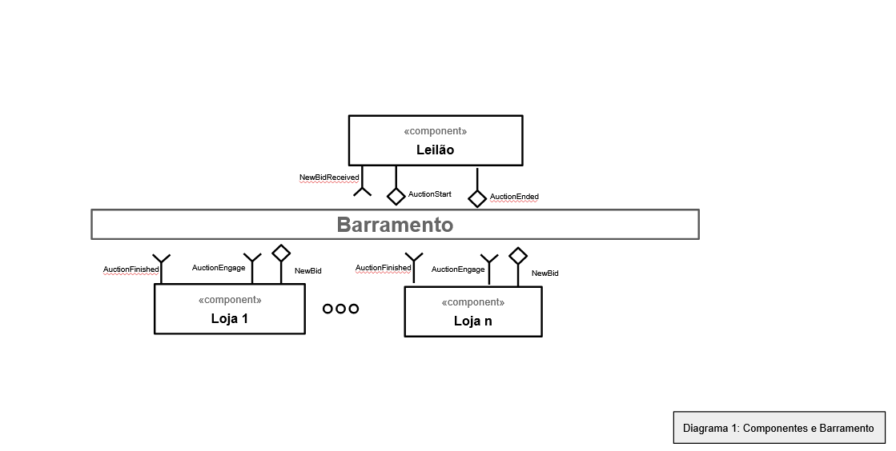

Lab05 - Composição, Serviços e REST

# Aluno
* `André Fagundes Carvalho`

# Bloco 1 - Diagramas relacionados com Leilão Invertido

> * diagrama 1 - componentes e barramento
> 

> * diagrama 2 - interface
> 

> * diagrama 3 - mensagens
> 

# Bloco 2 - Acesso REST via Jupyter

> 

