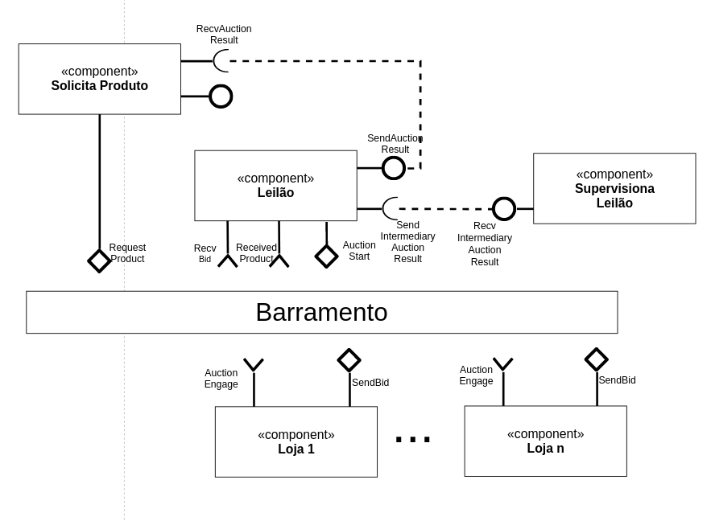
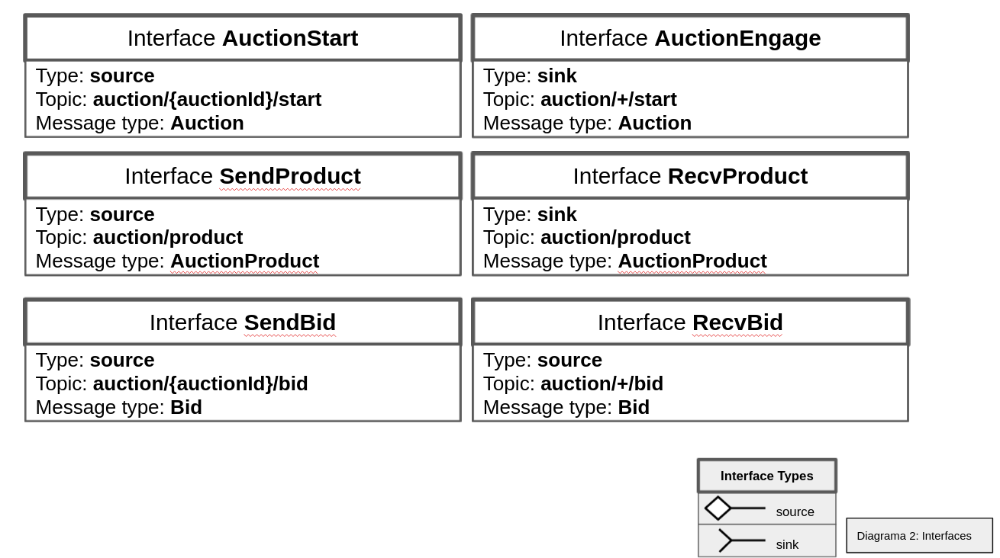
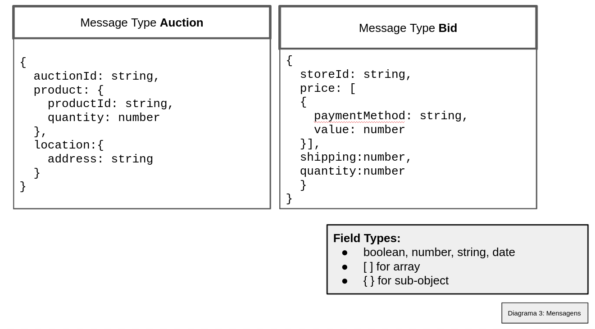
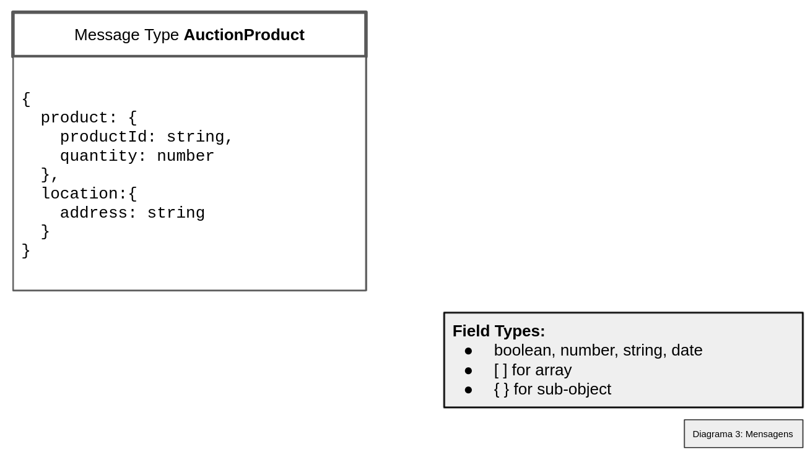

# Modelo para Apresentação do Lab05 - Composição, Serviços e REST

Estrutura de pastas:

~~~
├── README.md  <- arquivo apresentando a tarefa
│
└── images     <- arquivos de imagens usadas no documento
│
└── notebook   <- arquivo do notebook
~~~

# Aluno
* `Felipe Iada Tomitar Vilar`

# Bloco 1 - Diagramas relacionados com Leilão Invertido

# Bloco 2 - Acesso REST via Jupyter

[Link para o notebook](https://github.com/ftomitar/component2learn/blob/master/labs/2021/05-services/solucoes/ftomitar/notebook/lab5-tarefas-ftomitar.ipynb)

