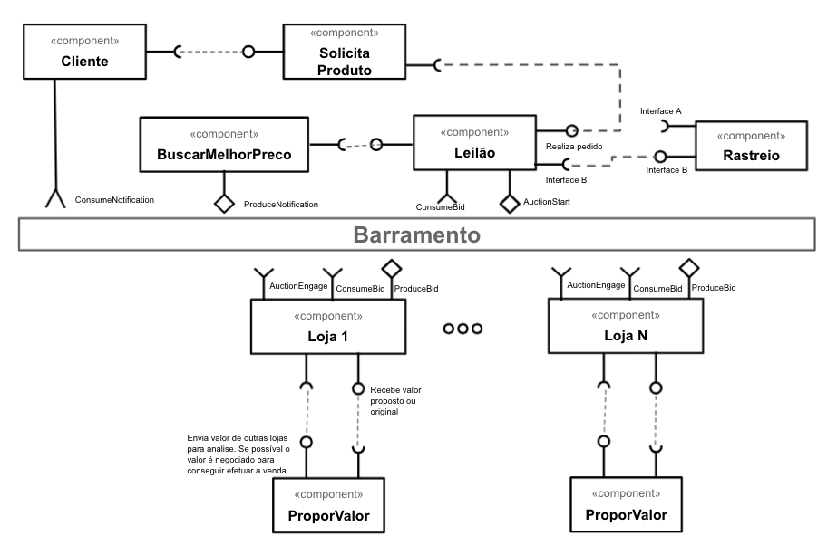
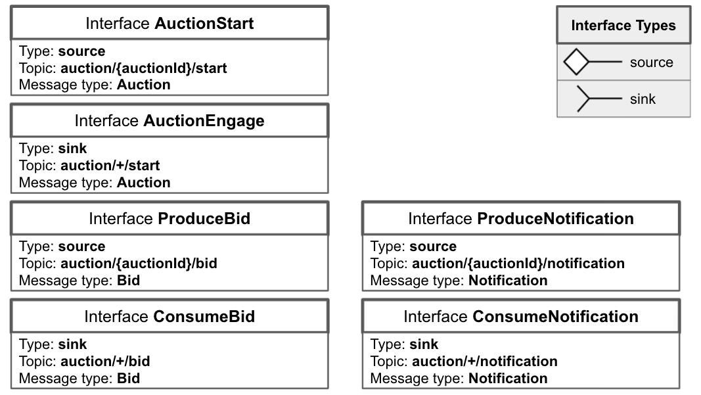
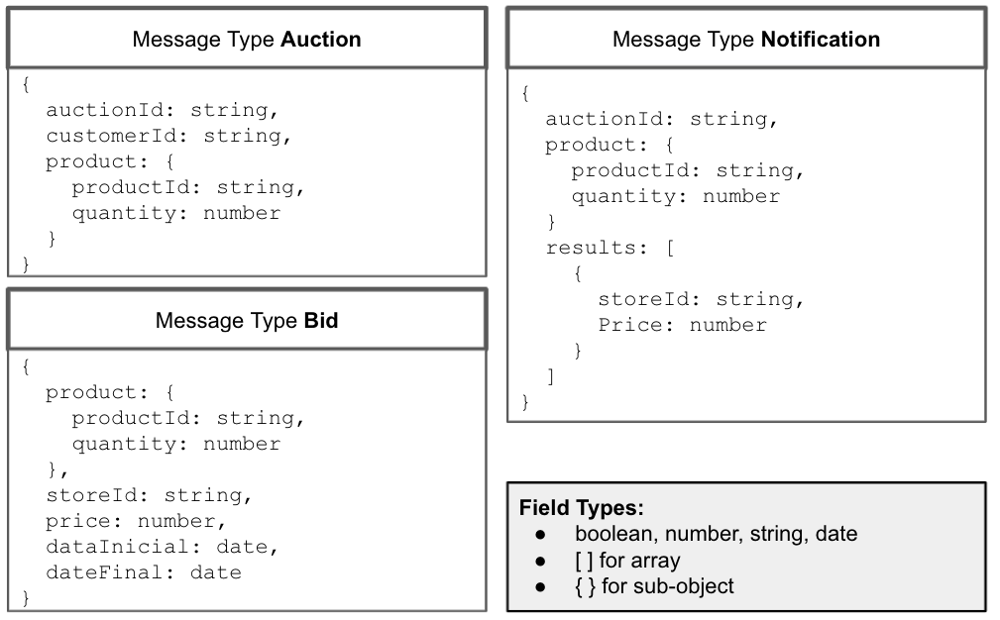

# Modelo para Apresentação do Lab05 - Composição, Serviços e REST

Estrutura de pastas:

~~~
├── README.md  <- arquivo apresentando a tarefa
│
└── images     <- arquivos de imagens usadas no documento
│
└── notebook   <- arquivo do notebook
~~~

# Aluno
* `Hélio De Rosa Junior`

# Bloco 1 - Diagramas relacionados com Leilão Invertido

## Diagrama

## Interfaces

## Mensagens

# Bloco 2 - Acesso REST via Jupyter

[Jupyter notebook](notebook/lab5-tarefas-heliorosajr.ipynb)