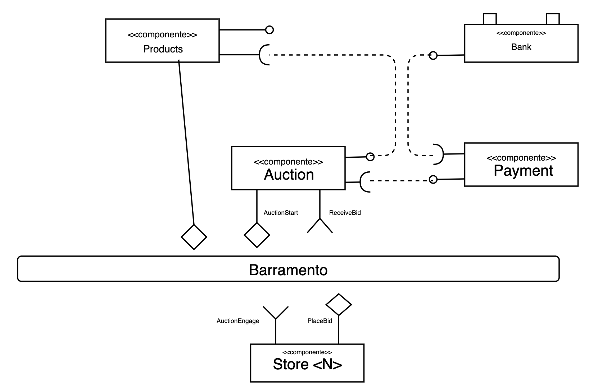
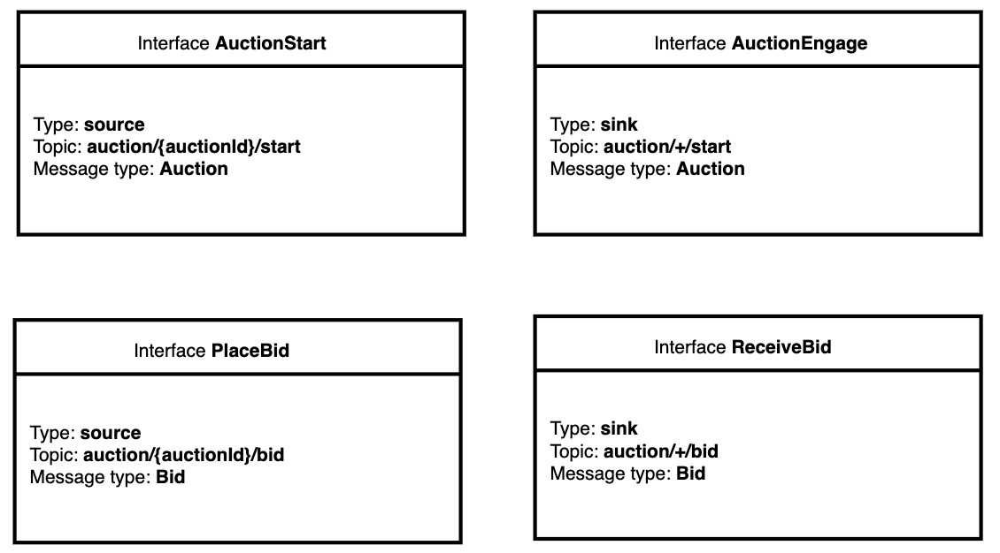

# Modelo para Apresentação do Lab05 - Composição, Serviços e REST

Estrutura de pastas:

# Aluno
* `Tiago Fernandes de Oliveira`

# Bloco 1 - Diagramas relacionados com Leilão Invertido

Barramento:

Interface:

Mensagem:

# Bloco 2 - Acesso REST via Jupyter

[Notebook - Bloco 2.](./notebook/lab5-tarefas.ipynb)
