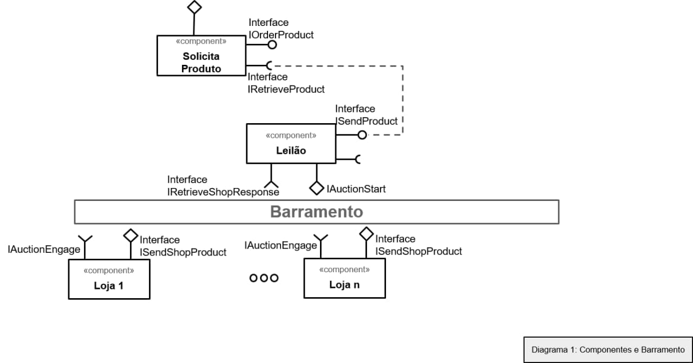
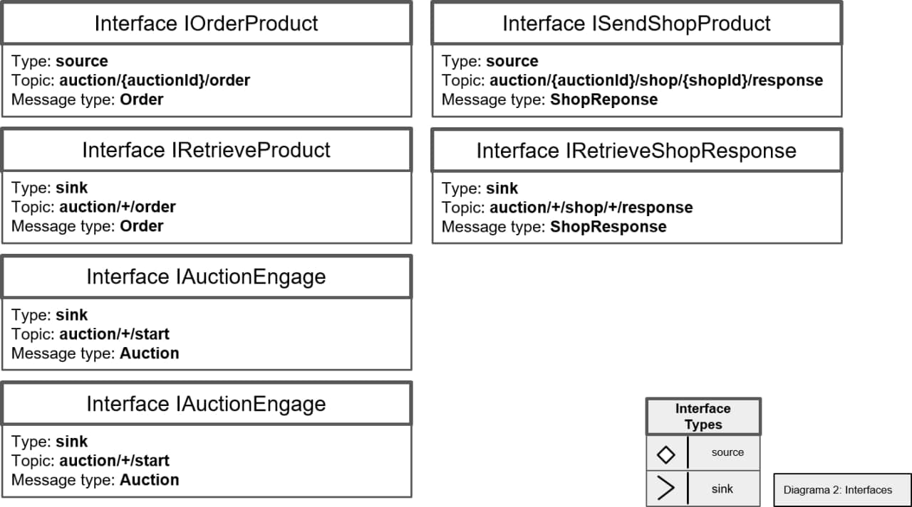
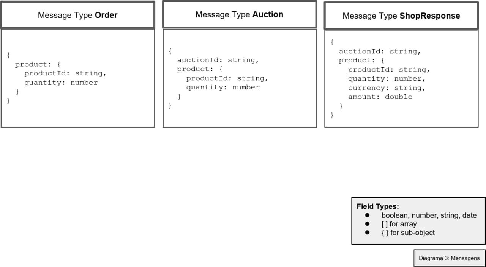

# Modelo para Apresentação do Lab05 - Composição, Serviços e REST

# Aluno
* `Juliana Cardoso Malton`

# Bloco 1 - Diagramas relacionados com Leilão Invertido

> Coloque as imagens PNG de (no mínimo) três diagramas:
> * diagrama 1 - componentes e barramento

> * diagrama 2 - interface

> * diagrama 3 - mensagens

# Bloco 2 - Acesso REST via Jupyter

> * Notebook

