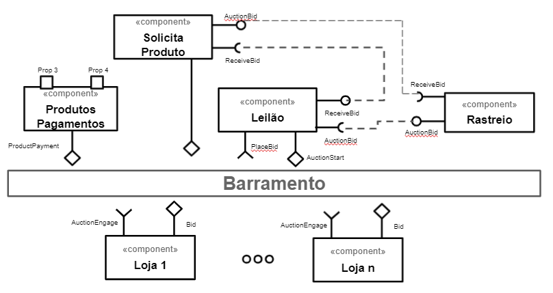
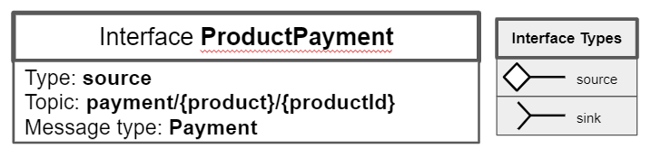
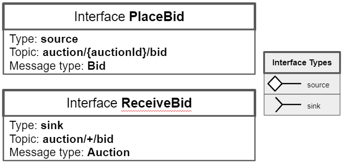
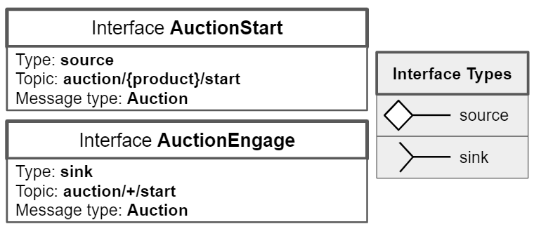
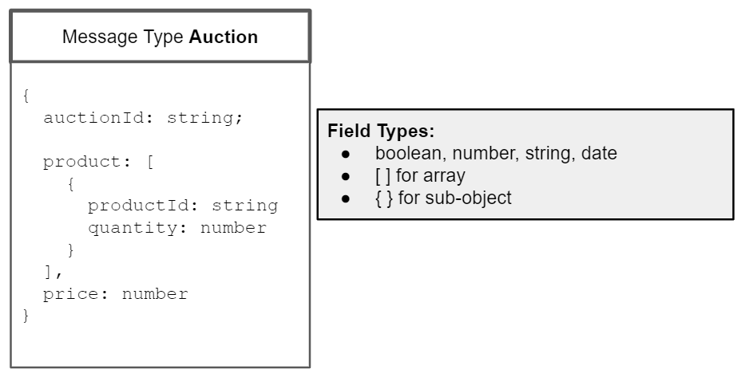
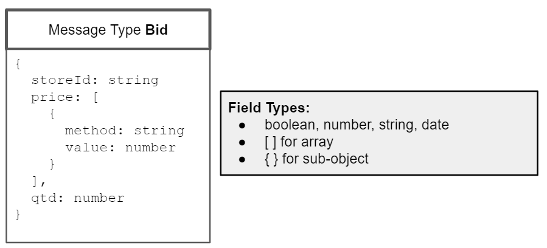
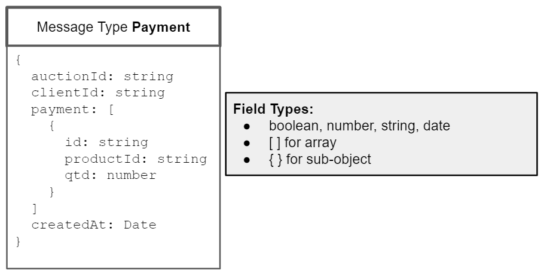

# Modelo para Apresentação do Lab05 - Composição, Serviços e REST

Estrutura de pastas:

```
├── README.md  <- arquivo apresentando a tarefa
│
└── images     <- arquivos de imagens usadas no documento
│
└── notebook   <- arquivo do notebook
```

# Aluno

- `Lucas Franzolin - EX150621`

# Bloco 1 - Diagramas relacionados com Leilão Invertido

> - diagrama 1 - Componentes e barramento
>   
> - diagrama 2 - Interfaces
>     
> - diagrama 3 - Mensagens
>     

# Bloco 2 - Acesso REST via Jupyter

[Notebok das tarefas rest](notebook/lab5-tarefas.ipynb)
