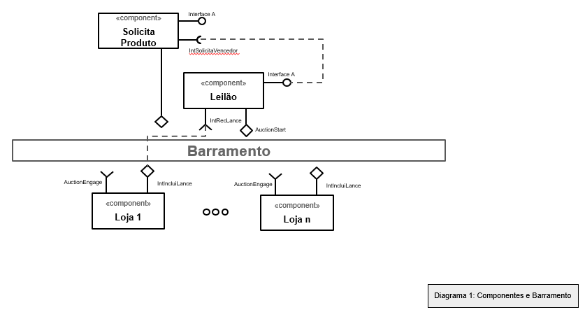

# Apresentação do Lab05 - Composição, Serviços e REST

# Aluno
* Luciano Sávio de Oliveira

# Bloco 1 - Diagramas relacionados com Leilão Invertido

> Imagens PNG de três diagramas:
> * diagrama 1 - componentes e barramento
> 
> 
> * diagrama 2 - interface
>
>
> * diagrama 3 - mensagens

# Bloco 2 - Acesso REST via Jupyter

> Link para o arquivo do notebook com a resolução das quatro tarefas do mesmo:
> > [lab5_tarefas](notebook/lab5_tarefas.ipynb).
