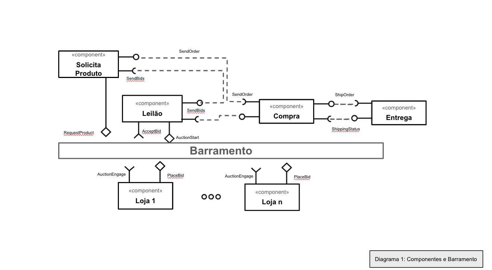
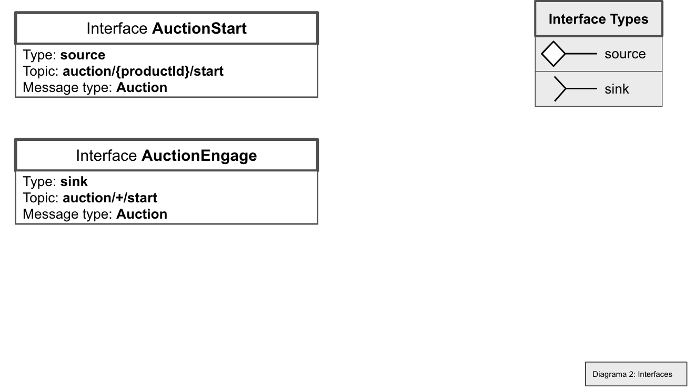
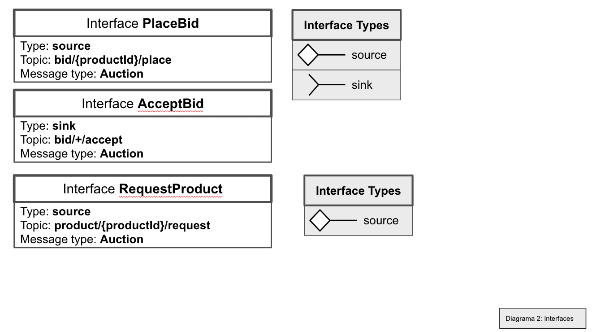
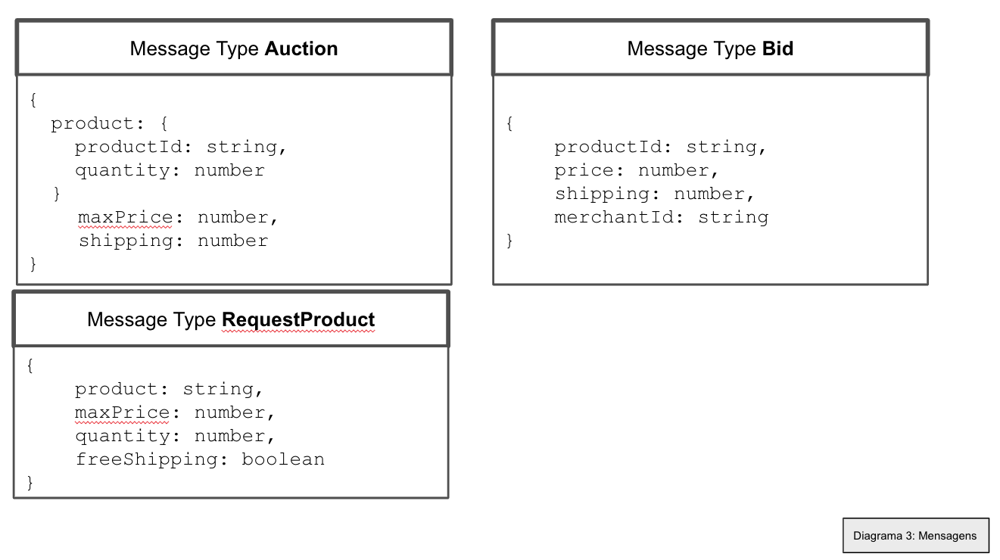

# Apresentação do Lab05 - Composição, Serviços e REST

# Aluno
* `Marina Azevedo Ferreira Soares - EX150301`

# Bloco 1 - Diagramas relacionados com Leilão Invertido

> * diagrama 1 - componentes e barramento

> * diagrama 2 - interface

> * diagrama 3 - mensagens

# Bloco 2 - Acesso REST via Jupyter

[Notebok das tarefas rest](notebook/lab5-tarefas.ipynb)
