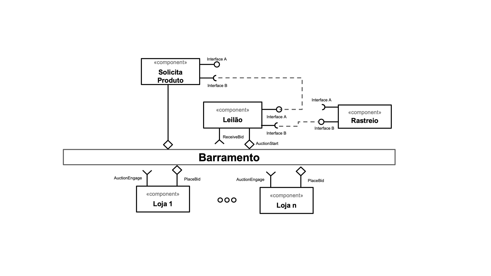
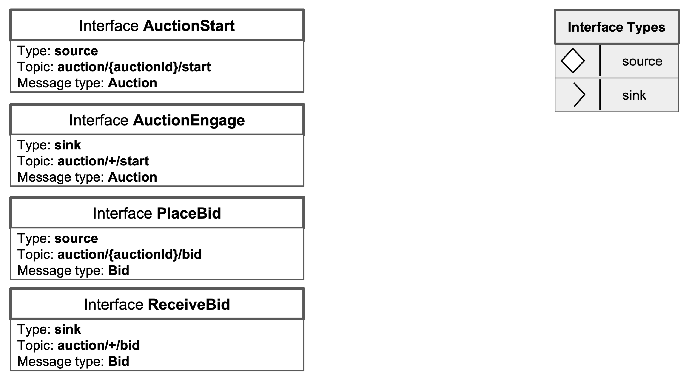
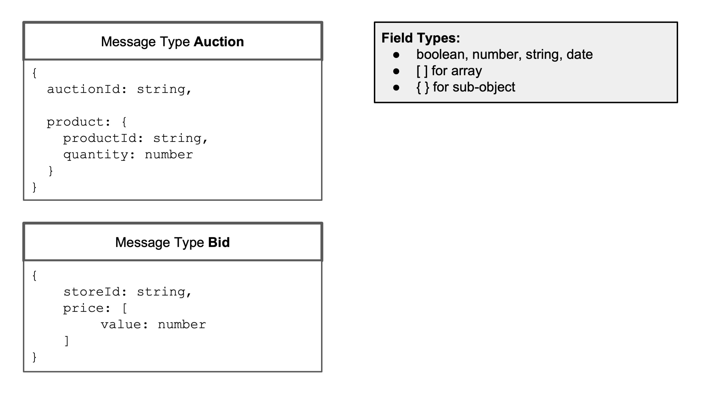

# Modelo para Apresentação do Lab05 - Composição, Serviços e REST

Estrutura de pastas:

~~~
├── README.md  <- arquivo apresentando a tarefa
│
└── images     <- arquivos de imagens usadas no documento
│
└── notebook   <- arquivo do notebook
~~~

# Aluno
* `Renato Fernandes Reis`

# Bloco 1 - Diagramas relacionados com Leilão Invertido

> * Diagrama 1 - Componentes e Barramento
> 

> * Diagrama 2 - Interface
> 

> * Diagrama 3 - Mensagens

# Bloco 2 - Acesso REST via Jupyter

[Download Notebook](notebook/lab5-tarefas.ipynb)

