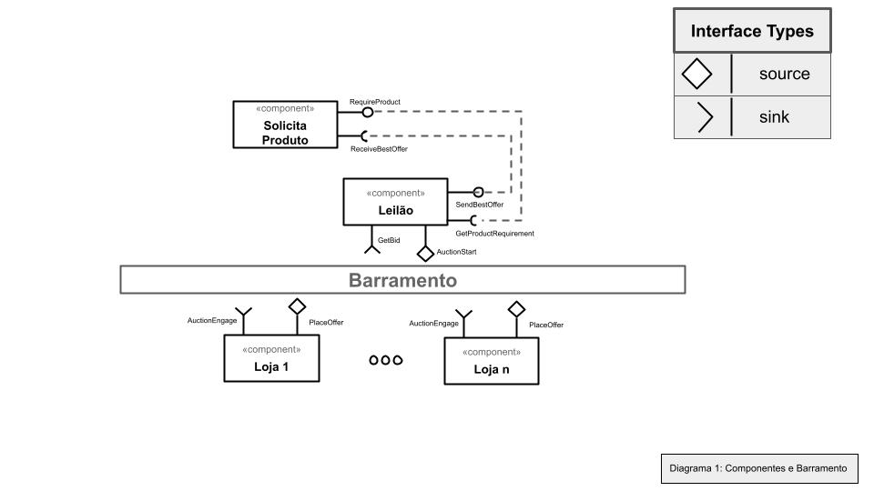
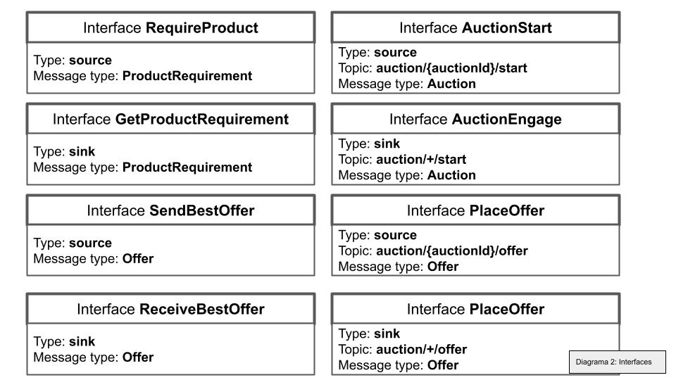
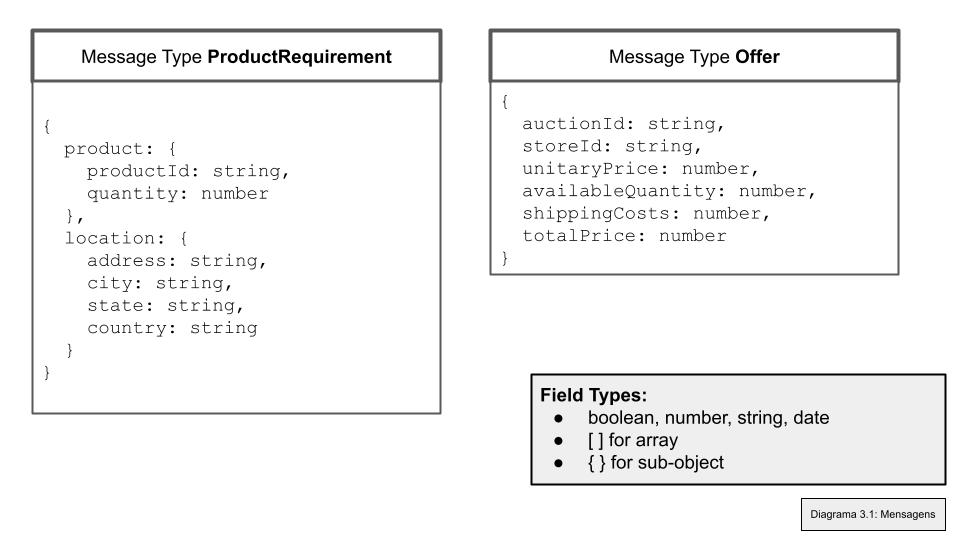
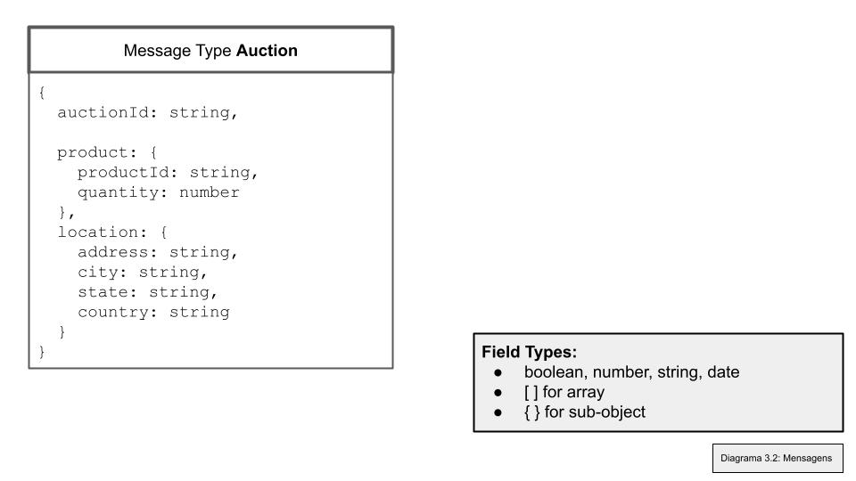

# Aluno
* `Sophia Carvalho Lancini`

# Bloco 1 - Diagramas relacionados com Leilão Invertido

* Diagrama 1: Componentes e barramento

* Diagrama 2: Interface

* Diagrama 3: Mensagens

# Bloco 2 - Acesso REST via Jupyter

A resolução deste bloco está [nesse link](notebook/lab5-tarefas.ipynb).
