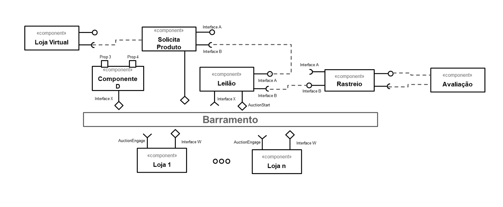
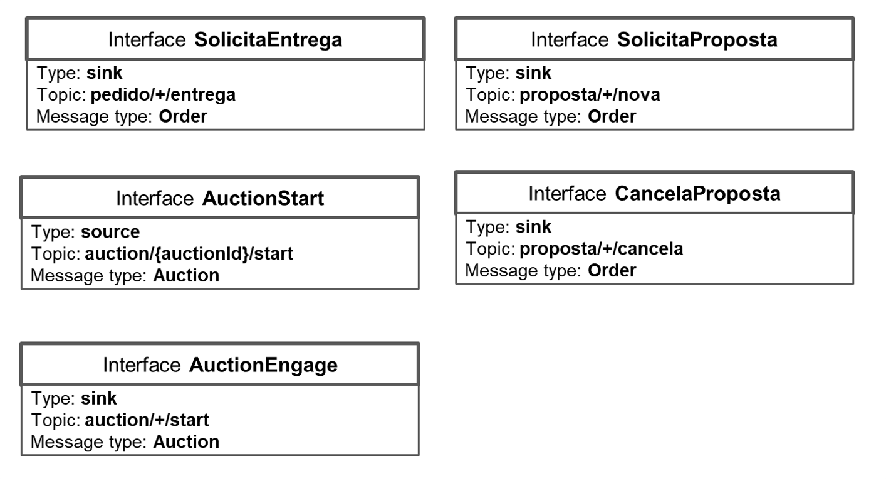
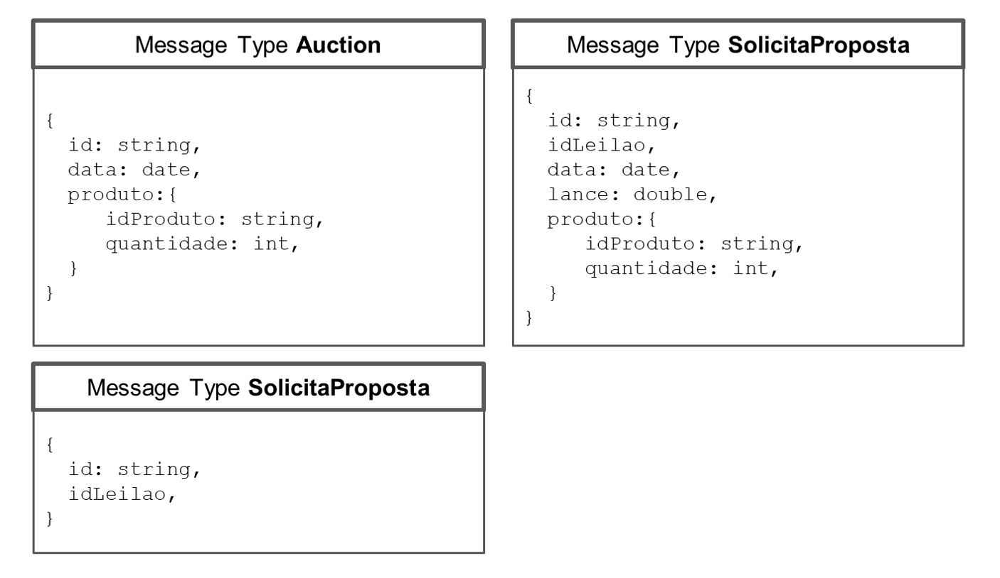

# Modelo para Apresentação do Lab05 - Composição, Serviços e REST

Estrutura de pastas:

~~~
├── README.md  <- arquivo apresentando a tarefa
│
└── images     <- arquivos de imagens usadas no documento
│
└── notebook   <- arquivo do notebook
~~~

# Aluno
* `Vinicius Del Padre - ex150380`

# Bloco 1 - Diagramas relacionados com Leilão Invertido

> * diagrama 1 - componentes e barramento

> * diagrama 2 - interface

> * diagrama 3 - mensagens

# Bloco 2 - Acesso REST via Jupyter

> Coloque um link para o arquivo do notebook com a resolução das quatro tarefas do mesmo, especificadas em `labs/2021/05-services/notebook/lab5-tarefas.ipynb`. Esse arquivo de resolução ficará dentro da pasta `notebook`.
