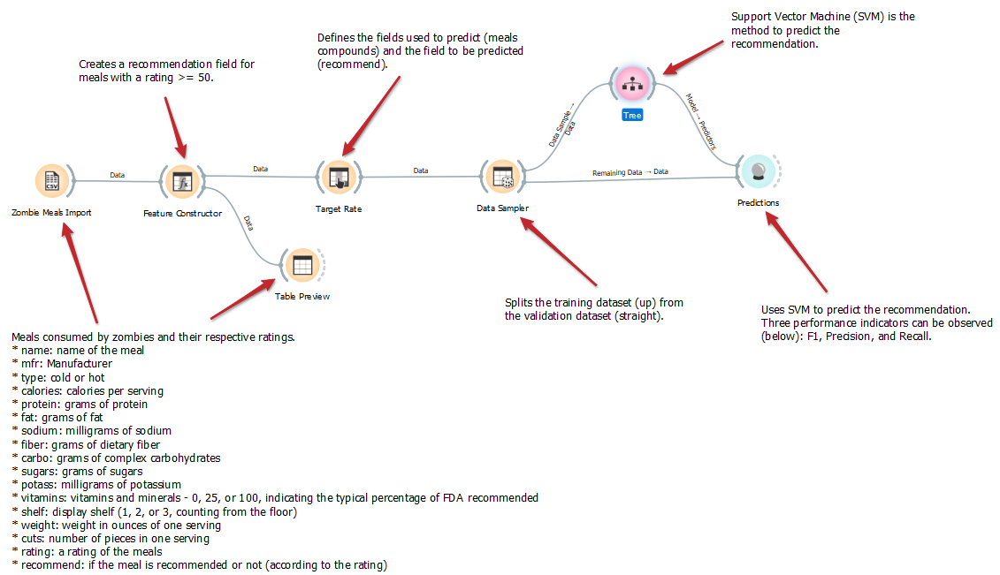

# Aluno
* `Luciano Sávio de Oliveira

# Tarefa 1 - Workflow para Recomendação de Zombie Meals

## Imagem do Projeto
> Alteração do método para Tree.

## Arquivo do Projeto
> Coloque um link para o arquivo em Orange.
[/templates/2021/lab01/](../../../lab01/orange/).
