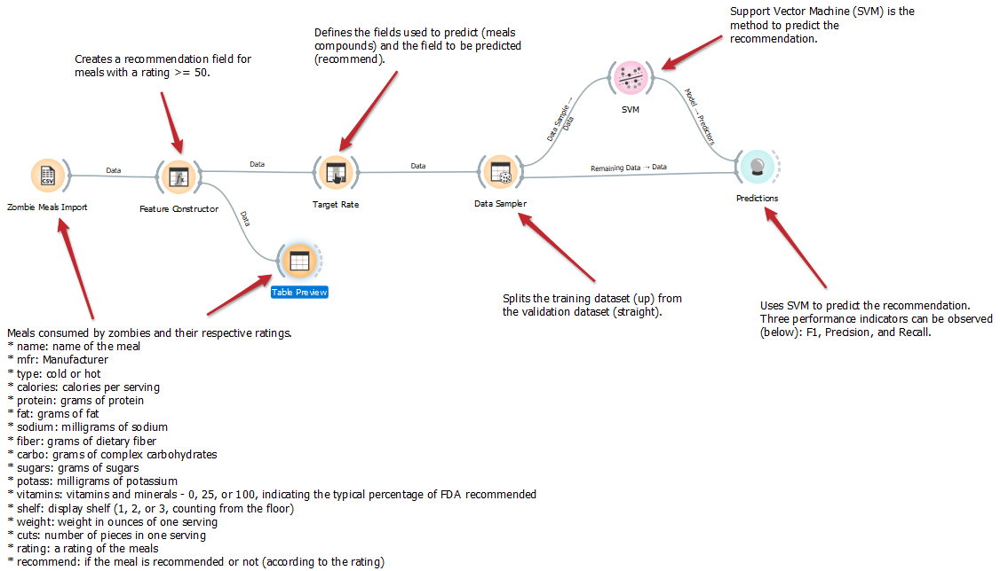

# Aluno
* `Luciano Sávio de Oliveira

# Tarefa 1 - Workflow para Recomendação de Zombie Meals

## Imagens do Projeto
> Alteração do método para Tree. Obs.: Aqui é possível verificar uma queda nos valores de F1, Precision e Recall em relação ao método SVM.

> Alteração do método para Logistic Regression. Obs.: Aqui é possível verificar um aumento nos valores de F1, Precision e Recall em relação ao método SVM.

> Alteração do critério de recomendação mudando a expressão. Obs.: Percebeu-se que ao alterar a expressão para "y" if rating >= 68 else "n", temos um aumento nos valores de F1, Precision e Recall em relação ao método SVM.

> Alteração das features. Obs.: Percebeu-se que ao alterar as features para "y" if fat >= 50 else "n", temos um aumento nos valores de F1, Precision e Recall para método SVM.

## Arquivos do Projeto
> Link para o arquivo em Orange "zombie-meals-tree":
[zombie-meals-tree](lab01/orange/zombie-meals-tree.ows).

> Link para o arquivo em Orange "zombie-meals-logistic-regression":
[zombie-meals-logistic-regression](lab01/orange/zombie-meals-logistic-regression.ows).

> Link para o arquivo em Orange "zombie-meals-recomendacao":
[zombie-meals-recomendacao](lab01/orange/zombie-meals-recomendacao.ows).

> Link para o arquivo em Orange "zombie-meals-features":
[zombie-meals-features](lab01/orange/zombie-meals-features.ows).
