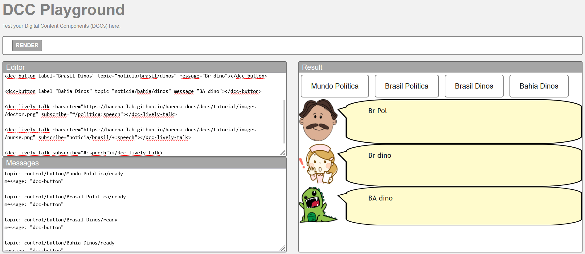
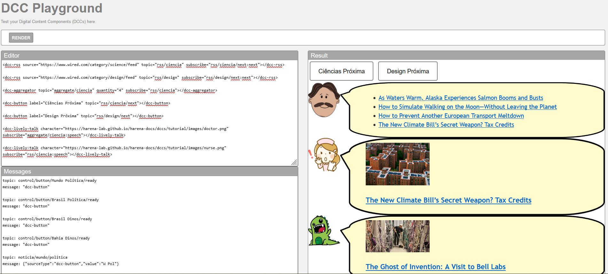
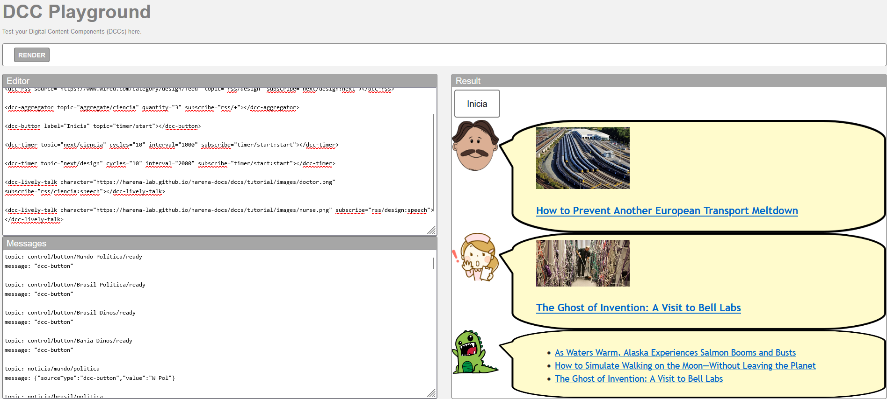

# Modelo para Apresentação do Lab01 - Estilos Arquiteturais

Estrutura de pastas:

~~~
├── README.md  <- arquivo apresentando a tarefa
│
└── images     <- arquivos de imagens usadas no documento
~~~

# Aluno
* Allan Ferreira Fonseca

## Tarefa 1 - Web Components e Tópicos

> Escreva aqui o código da sua composição de componentes Web, como mostra o exemplo a seguir:

~~~html
<dcc-button label="Mundo Política" topic="noticia/mundo/politica" message="W Pol"></dcc-button>

<dcc-button label="Brasil Política" topic="noticia/brasil/politica" message="Br Pol"></dcc-button>

<dcc-button label="Brasil Dinos" topic="noticia/brasil/dinos" message="Br dino"></dcc-button>

<dcc-button label="Bahia Dinos" topic="noticia/bahia/dinos" message="BA dino"></dcc-button>

<dcc-lively-talk character="https://harena-lab.github.io/harena-docs/dccs/tutorial/images/doctor.png" subscribe="#/politica:speech"></dcc-lively-talk>

<dcc-lively-talk character="https://harena-lab.github.io/harena-docs/dccs/tutorial/images/nurse.png" subscribe="noticia/brasil/+:speech"></dcc-lively-talk>

<dcc-lively-talk subscribe="#:speech"></dcc-lively-talk>
~~~

> Acrescente uma imagem da composição em funcionamento, como o exemplo a seguir:

## Tarefa 2 - Web Components e RSS
> Escreva aqui o código da sua composição de componentes Web seguida de uma imagem que captura o funcionamento, como foi feito na tarefa anterior.
~~~html
<dcc-rss source="https://www.wired.com/category/science/feed" topic="rss/ciencia" subscribe="rss/ciencia/next:next"></dcc-rss>

<dcc-rss source="https://www.wired.com/category/design/feed" topic="rss/design" subscribe="rss/design/next:next"></dcc-rss>

<dcc-aggregator topic="aggregate/ciencia" quantity="4" subscribe="rss/ciencia"></dcc-aggregator>

<dcc-button label="Ciências Próxima" topic="rss/ciencia/next"></dcc-button>

<dcc-button label="Design Próxima" topic="rss/design/next"></dcc-button>

<dcc-lively-talk character="https://harena-lab.github.io/harena-docs/dccs/tutorial/images/doctor.png" subscribe="aggregate/ciencia:speech"></dcc-lively-talk>

<dcc-lively-talk character="https://harena-lab.github.io/harena-docs/dccs/tutorial/images/nurse.png" subscribe="rss/ciencia:speech"></dcc-lively-talk>

<dcc-lively-talk subscribe="rss/design:speech"></dcc-lively-talk>
~~~

## Tarefa 3 - Painéis de Mensagens com Timer
> Escreva aqui o código da sua composição de componentes Web seguida de uma imagem que captura o funcionamento, como foi feito na tarefa anterior.
~~~html
<dcc-rss source="https://www.wired.com/category/science/feed" topic="rss/ciencia" subscribe="next/ciencia:next"></dcc-rss>

<dcc-rss source="https://www.wired.com/category/design/feed" topic="rss/design" subscribe="next/design:next"></dcc-rss>

<dcc-aggregator topic="aggregate/ciencia" quantity="3" subscribe="rss/+"></dcc-aggregator>

<dcc-button label="Inicia" topic="timer/start"></dcc-button>

<dcc-timer topic="next/ciencia" cycles="10" interval="1000" subscribe="timer/start:start"></dcc-timer>

<dcc-timer topic="next/design" cycles="10" interval="2000" subscribe="timer/start:start"></dcc-timer>

<dcc-lively-talk character="https://harena-lab.github.io/harena-docs/dccs/tutorial/images/doctor.png" subscribe="rss/ciencia:speech"></dcc-lively-talk>

<dcc-lively-talk character="https://harena-lab.github.io/harena-docs/dccs/tutorial/images/nurse.png" subscribe="rss/design:speech"></dcc-lively-talk>

<dcc-lively-talk subscribe="aggregate/ciencia:speech"></dcc-lively-talk>
~~~

## Tarefa 4 - Web Components Dataflow
> Imagem (`PNG`) do diagrama de componentes (veja exemplo abaixo).

>
> Escreva aqui o parágrafo de breve discussão.
