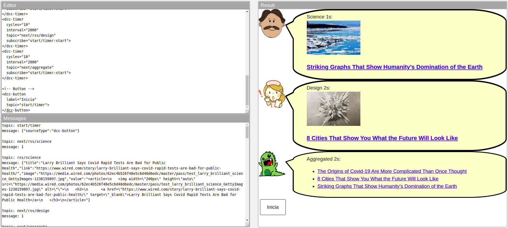

# Modelo para Apresentação do Lab01 - Estilos Arquiteturais

Estrutura de pastas:

~~~
├── README.md  <- arquivo apresentando a tarefa
│
└── images     <- arquivos de imagens usadas no documento
~~~

# Aluno
* `Guilherme Pedrozo Abacherli`

## Tarefa 1 - Web Components e Tópicos

> Código da composição de componentes Web da tarefa 1:
~~~html
<!-- Buttons -->
<dcc-button
  label="Mundo Política"
  topic="noticia/mundo/politica"
  message="Paz internacional!">
</dcc-button>
<dcc-button
  label="Brasil Política"
  topic="noticia/brasil/politica"
  message="Eleições no Brasil!">
</dcc-button>
<dcc-button label="Brasil Dinos"
  topic="noticia/brasil/dinos"
  message="Parque brasileiro com tema Dino!">
</dcc-button>
<dcc-button
  label="Bahia Dinos"
  topic="noticia/bahia/dinos"
  message="Fósseis encontrados na Bahia!">
</dcc-button>

<!-- Characters -->
<dcc-lively-talk
  speech="Eu ouvi sobre: "
  subscribe="noticia/#:speech">
</dcc-lively-talk>
<dcc-lively-talk
  character="https://harena-lab.github.io/harena-docs/dccs/tutorial/images/doctor.png"
  speech="Eu ouvi sobre: "
  subscribe="noticia/+/politica:speech">
</dcc-lively-talk>
<dcc-lively-talk
  character="https://harena-lab.github.io/harena-docs/dccs/tutorial/images/nurse.png"
  speech="Eu ouvi sobre: "
  subscribe="noticia/brasil/+:speech">
</dcc-lively-talk>
~~~

> Imagem da composição da tarefa 1 em funcionamento:

## Tarefa 2 - Web Components e RSS

> Código da composição de componentes Web da tarefa 2:
~~~html
<!-- RSS -->
<dcc-rss
  source="https://www.wired.com/category/science/feed"
  subscribe="next/rss/science:next"
  topic="rss/science">
</dcc-rss>
<dcc-rss
  source="https://www.wired.com/category/design/feed"
  subscribe="next/rss/design:next"
  topic="rss/design">
</dcc-rss>

<!-- Aggregators -->
<dcc-aggregator
  topic="aggregate/science"
  quantity="4"
  subscribe="rss/science">
</dcc-aggregator>
<dcc-aggregator
  topic="aggregate/design"
  quantity="4"
  subscribe="rss/design">
</dcc-aggregator>

<!-- Buttons -->
<dcc-button
  label="Ciências Próxima"
  topic="next/rss/science">
</dcc-button>
<dcc-button
  label="Design Próxima"
  topic="next/rss/design">
</dcc-button>

<!-- Characters -->
<dcc-lively-talk
  character="https://harena-lab.github.io/harena-docs/dccs/tutorial/images/doctor.png"
  speech="News: "
  subscribe="aggregate/science:speech">
</dcc-lively-talk>
<dcc-lively-talk
  character="https://harena-lab.github.io/harena-docs/dccs/tutorial/images/nurse.png"
  speech="News: "
  subscribe="rss/science:speech">
</dcc-lively-talk>
<dcc-lively-talk
  speech="News: "
  subscribe="rss/design:speech">
</dcc-lively-talk>
~~~

> Imagem da composição da tarefa 2 em funcionamento:

## Tarefa 3 - Painéis de Mensagens com Timer

> Código da composição de componentes Web da tarefa 3:
~~~html
<!-- RSS -->
<dcc-rss
  source="https://www.wired.com/category/science/feed"
  subscribe="next/rss/science:next"
  topic="rss/science">
</dcc-rss>
<dcc-rss
  source="https://www.wired.com/category/design/feed"
  subscribe="next/rss/design:next"
  topic="rss/design">
</dcc-rss>

<!-- Aggregator -->
<dcc-aggregator
  topic="aggregate/news"
  quantity="3"
  subscribe="rss/+">
</dcc-aggregator>

<!-- Characters -->
<dcc-lively-talk
  character="https://harena-lab.github.io/harena-docs/dccs/tutorial/images/doctor.png"
  speech="Science 1s: "
  subscribe="rss/science:speech">
</dcc-lively-talk>
<dcc-lively-talk
  character="https://harena-lab.github.io/harena-docs/dccs/tutorial/images/nurse.png"
  speech="Design 2s: "
  subscribe="rss/design:speech">
</dcc-lively-talk>
<dcc-lively-talk
  speech="Aggregated 2s: "
  subscribe="aggregate/news:speech">
</dcc-lively-talk>

<!-- Timers -->
<dcc-timer
  cycles="10"
  interval="1000"
  topic="next/rss/science"
  subscribe="start/timer:start">
</dcc-timer>
<dcc-timer
  cycles="10"
  interval="2000"
  topic="next/rss/design"
  subscribe="start/timer:start">
</dcc-timer>
<dcc-timer
  cycles="10"
  interval="2000"
  topic="next/aggregate"
  subscribe="start/timer:start">
</dcc-timer>

<!-- Button -->
<dcc-button
  label="Inicia"
  topic="start/timer">
</dcc-button>
~~~

> Imagem da composição da tarefa 3 em funcionamento:

## Tarefa 4 - Web Components Dataflow

> Imagem (`PNG`) do diagrama de componentes:

> Parágrafo de breve discussão sobre a tarefa 4:
> Todos os componentes alteram o mesmo tipo de dados, eles têm o mesmo
> contrato de parâmetros, enviam e recebem o mesmo tipo de dados,
> ou seja, "falam a mesma língua", dessa forma são intercambiáveis:
> pode-se adicionar, remover ou alterar os componentes que manipulam esses dados.
>
