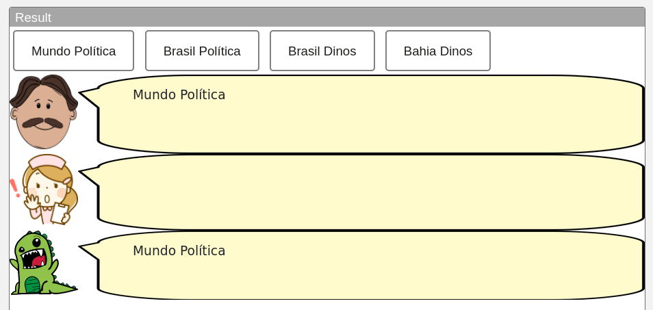
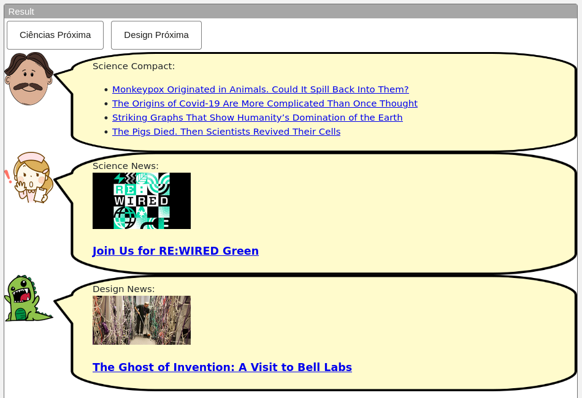
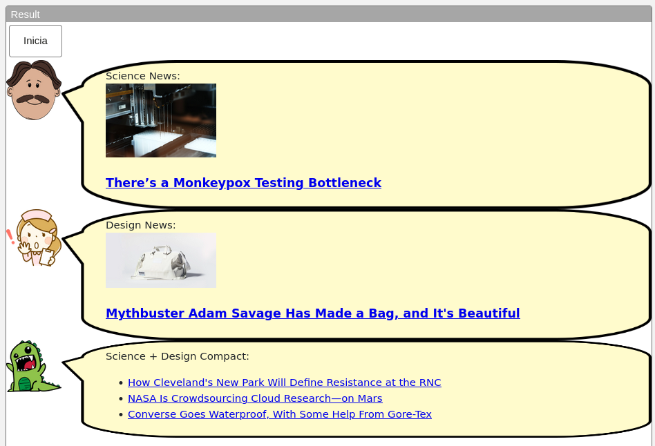
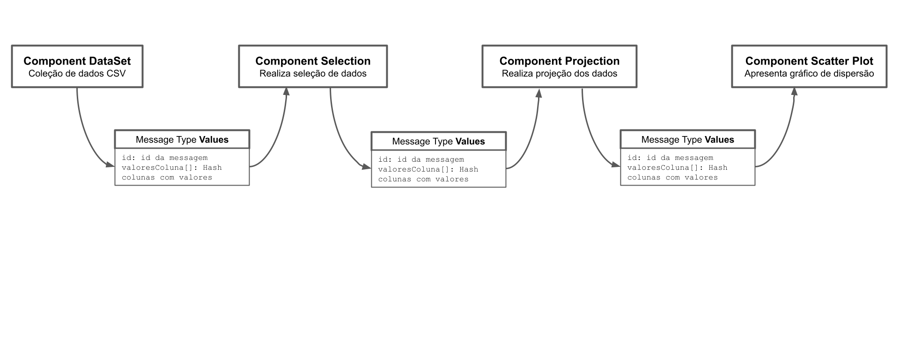

# Lab01 - Estilos Arquiteturais

# Aluno
* `Guilherme Cavassan - RA: 2022601122`

## Tarefa 1 - Web Components e Tópicos
~~~html
<dcc-button label="Mundo Política" topic="noticia/mundo/politica"
message="Mundo Política">
</dcc-button>

<dcc-button label="Brasil Política" topic="noticia/brasil/politica"
message="Brasil Política">
</dcc-button>

<dcc-button label="Brasil Dinos" topic="noticia/brasil/dinos" message="Brasil
Dinos">
</dcc-button>

<dcc-button label="Bahia Dinos" topic="noticia/bahia/dinos" message="Bahia
Dinos">
</dcc-button>

<dcc-lively-talk subscribe="noticia/#/politica:speech"
character="https://harena-lab.github.io/harena-docs/dccs/reference/images/doctor.png">
</dcc-lively-talk>

<dcc-lively-talk subscribe="noticia/brasil/#:speech"
character="https://harena-lab.github.io/harena-docs/dccs/reference/images/nurse.png">
</dcc-lively-talk>

<dcc-lively-talk subscribe="noticia/#:speech" >
</dcc-lively-talk>
~~~

## Tarefa 2 - Web Components e RSS
~~~html
<dcc-rss source="https://www.wired.com/category/science/feed" subscribe="next/rss/sci:next" topic="rss/sci">
</dcc-rss>

<dcc-rss source="https://www.wired.com/category/design/feed" subscribe="next/rss/dsg:next" topic="rss/dsg">
</dcc-rss>

<dcc-aggregator topic="aggregate/sci" quantity="4" subscribe="rss/sci">
</dcc-aggregator>

<dcc-button label="Ciências Próxima" topic="next/rss/sci">
</dcc-button>
<dcc-button label="Design Próxima" topic="next/rss/dsg">
</dcc-button>

<dcc-lively-talk subscribe="aggregate/sci:speech"
speech="Science Compact: "
character="https://harena-lab.github.io/harena-docs/dccs/reference/images/doctor.png">
</dcc-lively-talk>

<dcc-lively-talk subscribe="rss/sci:speech"
speech="Science News: "
character="https://harena-lab.github.io/harena-docs/dccs/reference/images/nurse.png">
</dcc-lively-talk>

<dcc-lively-talk subscribe="rss/dsg:speech"
speech="Design News: ">
</dcc-lively-talk>
~~~

## Tarefa 3 - Painéis de Mensagens com Timer

Adendo: Considerando que o timer de controle está atuando sobre o dcc-rss a cada 1 seg, e o dcc-aggregator está conectado ao barramento e que não existe outra forma de controle de atualização ou renderização seguindo os componentes mencionados no enunciado, não foi encontrado uma forma efetiva de controle de renderização do dcc-lively-talk referente ao Dino, com 3 notícias a cada 2 segundos.

~~~html
<dcc-rss source="https://www.wired.com/category/science/feed" subscribe="next/rss/sci:next" topic="rss/sci">
</dcc-rss>
<dcc-rss source="https://www.wired.com/category/design/feed" subscribe="next/rss/dsg:next" topic="rss/dsg">
</dcc-rss>

<dcc-aggregator topic="aggregate/news" quantity="3" subscribe="rss/#:next">
</dcc-aggregator>

<dcc-timer cycles="10" interval="1000" topic="next/rss/sci" subscribe="start/timer:start">
</dcc-timer>
<dcc-timer cycles="10" interval="1000" topic="next/rss/dsg" subscribe="start/timer:start">
</dcc-timer>

<dcc-button label="Inicia" topic="start/timer">
</dcc-button>

<dcc-lively-talk subscribe="rss/sci:speech"
speech="Science News: "
character="https://harena-lab.github.io/harena-docs/dccs/reference/images/doctor.png">
</dcc-lively-talk>

<dcc-lively-talk subscribe="rss/dsg:speech"
speech="Design News: "
character="https://harena-lab.github.io/harena-docs/dccs/reference/images/nurse.png">
</dcc-lively-talk>

<dcc-lively-talk subscribe="aggregate/news:speech"
speech="Science + Design Compact: ">
</dcc-lively-talk>
~~~

## Tarefa 4 - Web Components Dataflow

