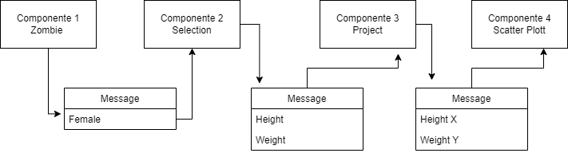

# Modelo para Apresentação do Lab01 - Estilos Arquiteturais

Estrutura de pastas:

~~~
├── README.md  <- arquivo apresentando a tarefa
│
└── images     <- arquivos de imagens usadas no documento
~~~

# Aluno
* `RICHARDSON GUEDES PINHEIRO`

## Tarefa 1 - Web Components e Tópicos

> Escreva aqui o código da sua composição de componentes Web, como mostra o exemplo a seguir:

~~~html
<dcc-button label="Mundo Política" topic="news/world/politic" message="ONU is on crisis with afghanistan">
</dcc-button>

<dcc-button label="Brasil Política" topic="news/brazil/politic" message="Brazil reopens trades">
</dcc-button>

<dcc-button label="Brasil Dinos" topic="news/brazil/dinosaur" message="Brazilian Dinosaur??">
</dcc-button>

<dcc-button label="Bahia Dinos" topic="news/bahia/dinosaur" message="Nordeste Dinousar?">
</dcc-button>

<dcc-lively-talk character="https://harena-lab.github.io/harena-docs/dccs/tutorial/images/doctor.png" speech="I heard about: " subscribe="#/politic:speech">
</dcc-lively-talk>

<dcc-lively-talk character="https://harena-lab.github.io/harena-docs/dccs/tutorial/images/nurse.png" speech="I heard about: " subscribe="news/brazil/#:speech">
</dcc-lively-talk>

<dcc-lively-talk speech="I heard about: " subscribe="news/#:speech">
</dcc-lively-talk>
~~~

> Acrescente uma imagem da composição em funcionamento, como o exemplo a seguir:

## Tarefa 2 - Web Components e RSS
> Escreva aqui o código da sua composição de componentes Web seguida de uma imagem que captura o funcionamento, como foi feito na tarefa anterior.

~~~html
<dcc-rss source="https://www.wired.com/category/science/feed" subscribe="next/ciencia/rss:next" topic="rss/science">
</dcc-rss>

<dcc-aggregator topic="aggregate/science" quantity="3" subscribe="rss/science">
</dcc-aggregator>

<dcc-rss source="https://www.wired.com/category/design/feed" subscribe="next/design/rss:next" topic="rss/design">
</dcc-rss>

<dcc-aggregator topic="aggregate/design" quantity="3" subscribe="rss/design">
</dcc-aggregator>

<dcc-button id="botaoCienciaProxima" label="Ciencia Proxima" topic="next/ciencia/rss">
</dcc-button>

<dcc-button id="botaoDesignProxima" label="Design Proxima" topic="next/design/rss">
</dcc-button>

<dcc-lively-talk character="https://harena-lab.github.io/harena-docs/dccs/tutorial/images/doctor.png" speech="" subscribe="aggregate/science:speech">
</dcc-lively-talk>

<dcc-lively-talk character="https://harena-lab.github.io/harena-docs/dccs/tutorial/images/nurse.png" speech="" subscribe="rss/science:speech">
</dcc-lively-talk>

<dcc-lively-talk speech="" subscribe="rss/design:speech">
</dcc-lively-talk>
~~~

## Tarefa 3 - Painéis de Mensagens com Timer
> Escreva aqui o código da sua composição de componentes Web seguida de uma imagem que captura o funcionamento, como foi feito na tarefa anterior.

~~~html
<dcc-rss source="https://www.wired.com/category/science/feed" subscribe="next/rss/science:next" topic="rss/science">
</dcc-rss>

<dcc-rss source="https://www.wired.com/category/design/feed" subscribe="next/rss/design:next" topic="rss/design">
</dcc-rss>

<dcc-aggregator topic="aggregate" quantity="3">
  <subscribe-dcc topic="rss/science"></subscribe-dcc>
  <subscribe-dcc topic="rss/design"></subscribe-dcc>
</dcc-aggregator>

<dcc-lively-talk character="https://harena-lab.github.io/harena-docs/dccs/tutorial/images/doctor.png" subscribe="+/science:speech">
</dcc-lively-talk>

<dcc-lively-talk character="https://harena-lab.github.io/harena-docs/dccs/tutorial/images/nurse.png" subscribe="+/design:speech">
</dcc-lively-talk>

<dcc-lively-talk subscribe="aggregate:speech">
</dcc-lively-talk>

<dcc-timer cycles="4" interval="1000" topic="next/rss/science" subscribe="timer/start:start">
</dcc-timer>
<dcc-timer cycles="2" interval="2000" topic="next/rss/design" subscribe="timer/start:start">
</dcc-timer>

<dcc-button label="Inicia" topic="timer/start" >
</dcc-button>
~~~

## Tarefa 4 - Web Components Dataflow
> Imagem (`PNG`) do diagrama de componentes (veja exemplo abaixo).

>
> Os campos de female, Height, Weight, Height x, Weight Y passam pora os componentes por messages no barramento. 

