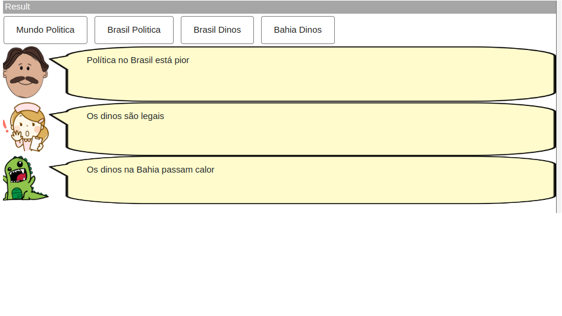
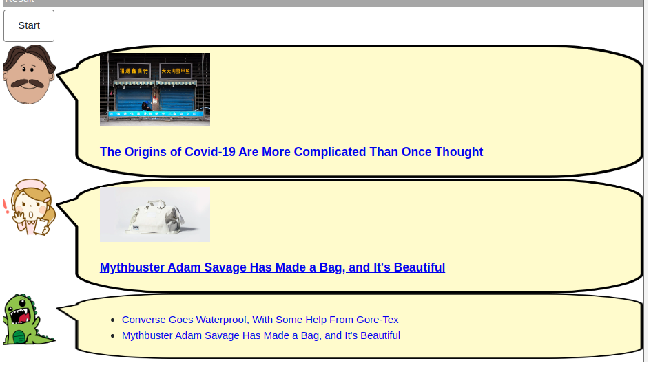
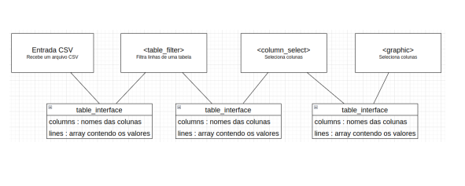

# Modelo para Apresentação do Lab01 - Estilos Arquiteturais

Estrutura de pastas:

~~~
├── README.md  <- arquivo apresentando a tarefa
│
└── images     <- arquivos de imagens usadas no documento
~~~

# Aluno
* `Marcelo Gomes de Vasconcelos`

## Tarefa 1 - Web Components e Tópicos

~~~html
<dcc-button label="Mundo Politica" topic="noticia/mundo/politica" message="Política no mundo está ruim">
</dcc-button>
<dcc-button label="Brasil Politica" topic="noticia/brasil/politica" message="Política no Brasil está pior">
</dcc-button>
<dcc-button label="Brasil Dinos" topic="noticia/brasil/dinos" message="Os dinos são legais">
</dcc-button>
<dcc-button label="Bahia Dinos" topic="noticia/bahia/dinos" message="Os dinos na Bahia passam calor">
</dcc-button>

<dcc-lively-talk character="https://harena-lab.github.io/harena-docs/dccs/tutorial/images/doctor.png" subscribe="noticia/+/politica:speech">
  </dcc-lively-talk>

  <dcc-lively-talk character="https://harena-lab.github.io/harena-docs/dccs/tutorial/images/nurse.png" subscribe="noticia/brasil/#:speech">
  </dcc-lively-talk>

  <dcc-lively-talk  subscribe="noticia/#:speech">
  </dcc-lively-talk>
~~~

## Tarefa 2 - Web Components e RSS

~~~html
<dcc-rss source="https://www.wired.com/category/science/feed" subscribe="next/rss/science:next" topic="rss/science">
</dcc-rss>

<dcc-rss source="https://www.wired.com/category/design/feed" subscribe="next/rss/design:next" topic="rss/design">
</dcc-rss>

<dcc-button label="Ciências Próxima" topic="next/rss/science">
</dcc-button>
<dcc-button label="Design Próxima" topic="next/rss/design">
</dcc-button>

<dcc-aggregator topic="aggregate/science" quantity="4" subscribe="rss/science">
</dcc-aggregator>

<dcc-lively-talk character="https://harena-lab.github.io/harena-docs/dccs/tutorial/images/doctor.png" subscribe="aggregate/science:speech">
  </dcc-lively-talk>

  <dcc-lively-talk character="https://harena-lab.github.io/harena-docs/dccs/tutorial/images/nurse.png" subscribe="rss/science:speech">
  </dcc-lively-talk>

  <dcc-lively-talk  subscribe="rss/design:speech">
  </dcc-lively-talk>
~~~

## Tarefa 3 - Painéis de Mensagens com Timer

~~~html
<dcc-rss source="https://www.wired.com/category/science/feed" subscribe="next/rss/science:next" topic="rss/science">
</dcc-rss>

<dcc-rss source="https://www.wired.com/category/design/feed" subscribe="next/rss/design:next" topic="rss/design">
</dcc-rss>

<dcc-timer interval="1000" subscribe="start/feed:start" topic="next/rss/science">
</dcc-timer>

<dcc-timer interval="2000" subscribe="start/feed:start" topic="next/rss/design">
</dcc-timer>

<dcc-button label="Start" topic="start/feed">
</dcc-button>

<dcc-aggregator topic="aggregate/news" quantity="2" subscribe="rss/#">
</dcc-aggregator>

<dcc-lively-talk character="https://harena-lab.github.io/harena-docs/dccs/tutorial/images/doctor.png" subscribe="rss/science:speech">
  </dcc-lively-talk>

  <dcc-lively-talk character="https://harena-lab.github.io/harena-docs/dccs/tutorial/images/nurse.png" subscribe="rss/design:speech">
  </dcc-lively-talk>

  <dcc-lively-talk  subscribe="aggregate/news:speech">
  </dcc-lively-talk>
~~~

## Tarefa 4 - Web Components Dataflow

Para essa atividade foi pensado em 4 componentes
O primeiro para que receba um CSV o torne uma tabela podendo conter nome das colunas e os valores distribuidos em arrays.
Esse mesmo padrão vai seguir por todos os componentes, apenas sendo modificados seu conteudo mas não sua estrutura.
O componente de filtro é recebe uma tabela e o filtro a ser aplicado e tem como saida uma nova tabela filtrada.
O componente de seleção de colunas recebe uma tabela e a seleção das colunas e tem como saida uma nova tabela com as colunas selecionadas.
O componente de gráfico recebe uma tabela e parametros para a exibição e tem como saida um gráfico.
