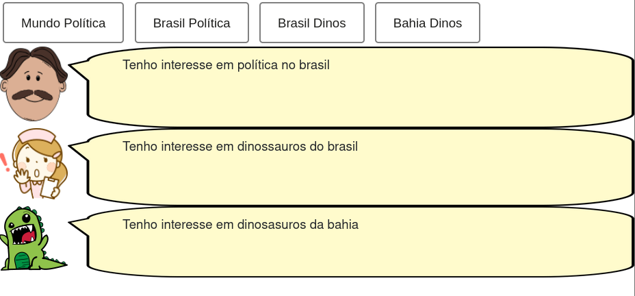
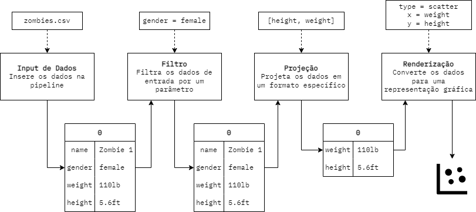

# Aluno
* Tulio Bassaco Bustos

## Tarefa 1 - Web Components e Tópicos

~~~html
<dcc-button label="Mundo Política" topic="noticia/mundo/politica" message="política no mundo"></dcc-button>
<dcc-button label="Brasil Política" topic="noticia/brasil/politica" message="política no brasil"></dcc-button>
<dcc-button label="Brasil Dinos" topic="noticia/brasil/dinos" message="dinossauros do brasil"></dcc-button>
<dcc-button label="Bahia Dinos" topic="noticia/bahia/dinos" message="dinosasuros da bahia"></dcc-button>

<dcc-lively-talk character="https://harena-lab.github.io/harena-docs/dccs/tutorial/images/doctor.png" speech="Tenho interesse em " subscribe="noticia/+/politica:speech"></dcc-lively-talk>

<dcc-lively-talk character="https://harena-lab.github.io/harena-docs/dccs/tutorial/images/nurse.png" speech="Tenho interesse em " subscribe="noticia/brasil/#:speech"></dcc-lively-talk>

<dcc-lively-talk speech="Tenho interesse em " subscribe="noticia/#:speech"></dcc-lively-talk>
~~~

## Tarefa 2 - Web Components e RSS

~~~html
<dcc-rss source="https://www.wired.com/category/science/feed" subscribe="next-science/rss:next" topic="rss/science"></dcc-rss>
<dcc-rss source="https://www.wired.com/category/design/feed" subscribe="next-design/rss:next" topic="rss/design"></dcc-rss>

<dcc-aggregator topic="aggregate/science" quantity="4" subscribe="rss/science"></dcc-aggregator>

<dcc-button label="Ciências Próxima" topic="next-science/rss"></dcc-button>
<dcc-button label="Design Próxima" topic="next-design/rss"></dcc-button>

<dcc-lively-talk character="https://harena-lab.github.io/harena-docs/dccs/tutorial/images/doctor.png" speech="Notícias de ciências" subscribe="aggregate/science:speech"></dcc-lively-talk>

<dcc-lively-talk character="https://harena-lab.github.io/harena-docs/dccs/tutorial/images/nurse.png" speech="Notícia de ciência" subscribe="rss/science:speech"></dcc-lively-talk>

<dcc-lively-talk speech="Notícia de design" subscribe="rss/design:speech"></dcc-lively-talk>
~~~

## Tarefa 3 - Painéis de Mensagens com Timer

~~~html
<dcc-rss source="https://www.wired.com/category/science/feed" subscribe="next-science/rss:next" topic="rss/science"></dcc-rss>
<dcc-rss source="https://www.wired.com/category/design/feed" subscribe="next-design/rss:next" topic="rss/design"></dcc-rss>

<dcc-aggregator topic="aggregate/all" quantity="3" subscribe="rss/#"></dcc-aggregator>

<dcc-timer cycles="10" interval="1000" topic="next-science/rss" subscribe="start/timer:start"></dcc-timer>
<dcc-timer cycles="10" interval="2000" topic="next-design/rss" subscribe="start/timer:start"></dcc-timer>

<dcc-button label="Inicia" topic="start/timer">
</dcc-button>

<dcc-lively-talk character="https://harena-lab.github.io/harena-docs/dccs/tutorial/images/doctor.png" speech="Notícia de ciência" subscribe="rss/science:speech"></dcc-lively-talk>

<dcc-lively-talk character="https://harena-lab.github.io/harena-docs/dccs/tutorial/images/nurse.png" speech="Notícia de design" subscribe="rss/design:speech"></dcc-lively-talk>

<dcc-lively-talk speech="Notícias de ciência e design" subscribe="aggregate/all:speech"></dcc-lively-talk>
~~~

## Tarefa 4 - Web Components Dataflow

A ideia é que cada componente utiliza os dados de entrada, faz algum processamento, e envia o dado processado para o próximo componente na pipeline. É possível incluir, por exemplo, múltiplos filtros ou mesmo retirar todos os filtros. Também é possível incluir na pipeline um componente recém desenvolvido - como exemplo, podemos considerar um componente que calcula o BMI de um zumbi a partir de seu peso e altura.

