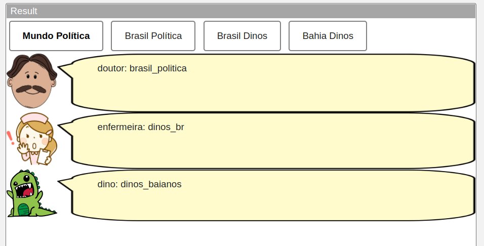
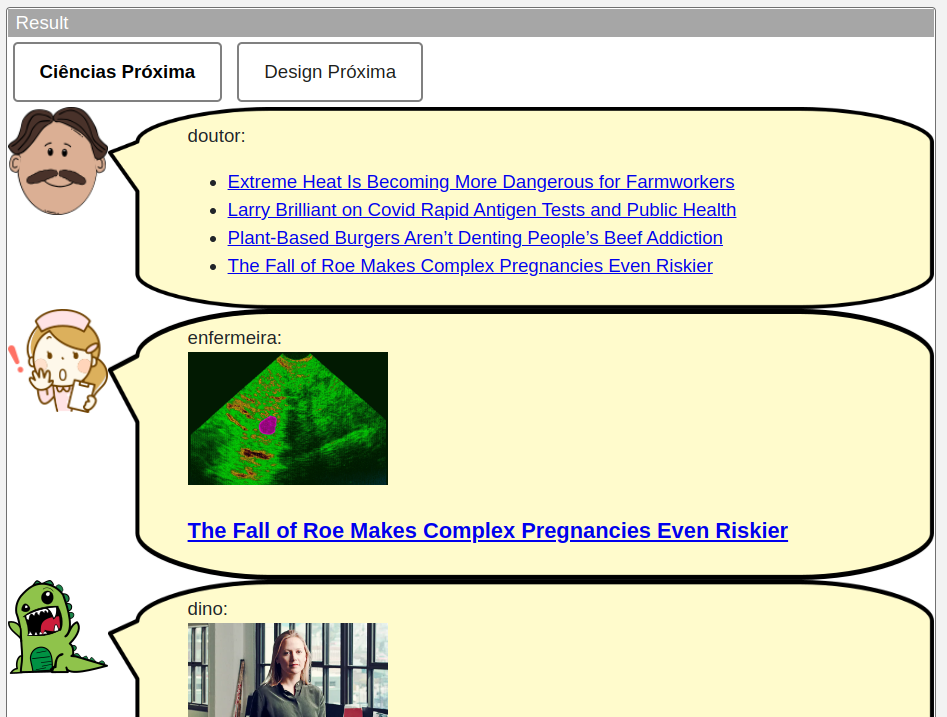
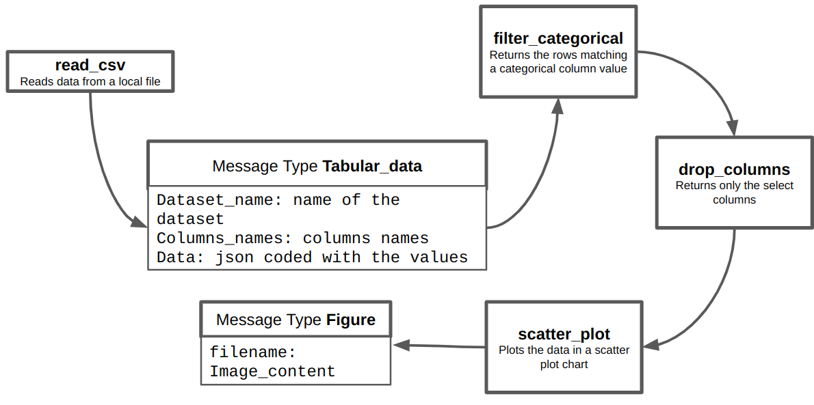

# Modelo para Apresentação do Lab01 - Estilos Arquiteturais

# Aluno
* `Caio Volpato`

## Tarefa 1 - Web Components e Tópicos

> Escreva aqui o código da sua composição de componentes Web, como mostra o exemplo a seguir:

~~~html
<dcc-button label="Mundo Política" topic="noticia/mundo/politica" message="mundo_politica"></dcc-button>

<dcc-button label="Brasil Política" topic="noticia/brasil/politica" message="brasil_politica"></dcc-button>

<dcc-button label="Brasil Dinos" topic="noticia/brasil/dinos" message="dinos_br"></dcc-button>

<dcc-button label="Bahia Dinos" topic="noticia/bahia/dinos" message="dinos_baianos"></dcc-button>

<dcc-lively-talk character="https://harena-lab.github.io/harena-docs/dccs/tutorial/images/doctor.png" speech="doutor: " subscribe="noticia/#/politica:speech"></dcc-lively-talk>

<dcc-lively-talk character="https://harena-lab.github.io/harena-docs/dccs/tutorial/images/nurse.png" speech="enfermeira: " subscribe="noticia/brasil/#:speech"></dcc-lively-talk>

<dcc-lively-talk speech="dino: " subscribe="#:speech"></dcc-lively-talk>
~~~

> Acrescente uma imagem da composição em funcionamento, como o exemplo a seguir:

## Tarefa 2 - Web Components e RSS

~~~html
<dcc-rss source="https://www.wired.com/category/science/feed" subscribe="next/rss/ciencia:next" topic="rss/ciencia"></dcc-rss>

<dcc-button label="Ciências Próxima" topic="next/rss/ciencia" ></dcc-button>

<dcc-rss source="https://www.wired.com/category/design/feed" subscribe="next/rss/design:next" topic="rss/design"></dcc-rss>

<dcc-button label="Design Próxima" topic="next/rss/design" ></dcc-button>

<dcc-aggregator topic="aggregator/science" quantity="4" subscribe="rss/ciencia"></dcc-aggregator>

<dcc-lively-talk character="https://harena-lab.github.io/harena-docs/dccs/tutorial/images/doctor.png" speech="doutor: " subscribe="aggregator/science:speech"></dcc-lively-talk>

<dcc-lively-talk character="https://harena-lab.github.io/harena-docs/dccs/tutorial/images/nurse.png" speech="enfermeira: " subscribe="rss/ciencia:speech"></dcc-lively-talk>

<dcc-lively-talk speech="dino: " subscribe="rss/design:speech"></dcc-lively-talk>
~~~

## Tarefa 3 - Painéis de Mensagens com Timer

~~~html
<dcc-rss source="https://www.wired.com/category/science/feed" subscribe="next/rss/ciencia:next" topic="rss/ciencia"></dcc-rss>

<dcc-rss source="https://www.wired.com/category/design/feed" subscribe="next/rss/design:next" topic="rss/design"></dcc-rss>

<dcc-aggregator topic="aggregator/todos" quantity="4" subscribe="rss/+"></dcc-aggregator>

<dcc-button label="Inicia" topic="inicia/noticias"> </dcc-button>

<dcc-timer cycles="10" interval="1000" topic="next/rss/ciencia" subscribe="inicia/noticias:start"></dcc-timer>

<dcc-timer cycles="10" interval="2000" topic="next/rss/design" subscribe="inicia/noticias:start"></dcc-timer>

<dcc-lively-talk character="https://harena-lab.github.io/harena-docs/dccs/tutorial/images/doctor.png" speech="doutor: " subscribe="rss/ciencia:speech"></dcc-lively-talk>

<dcc-lively-talk character="https://harena-lab.github.io/harena-docs/dccs/tutorial/images/nurse.png" speech="enfermeira: " subscribe="rss/design:speech"></dcc-lively-talk>

<dcc-lively-talk speech="dino: " subscribe="aggregator/todos:speech"></dcc-lively-talk>
~~~

## Tarefa 4 - Web Components Dataflow

> Para esse problema foram pensados 2 tipos de mensagem, um denominado dados tabulares que trafegam os dados no formato tabular e uma tipo figura para representar o grafico.
> Foram pensadas duas operações de manipulação dos dados: uma que filtra os dados baseado em um valor de variavel categorica e uma operação que descarta colunas, mantendo apenas as colunas de interesse.
> Por fim um componente que gera uma figura que representa o grafico de dispersão.
> Esses componentes foram projetados pensados para ser intercambiaveis e reutilizados para outros usos similares.
