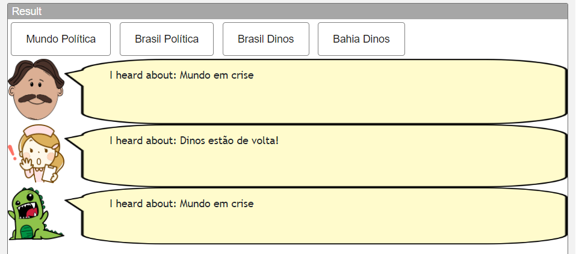
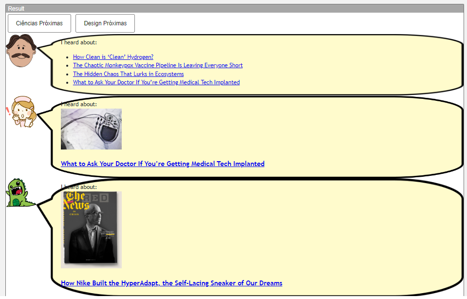
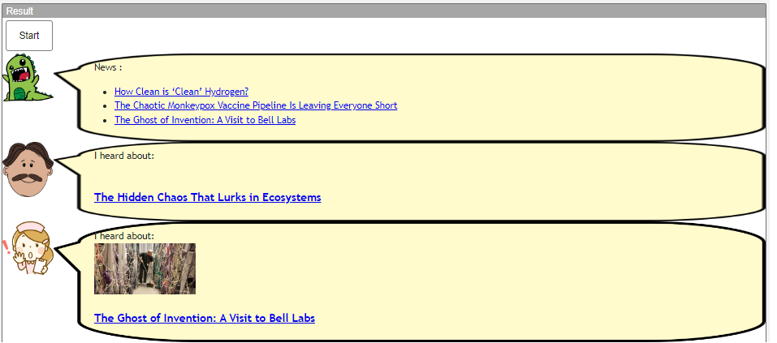
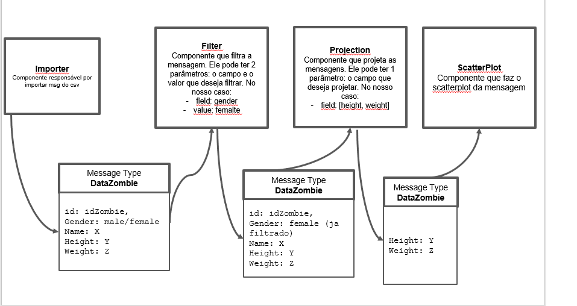

# Modelo para Apresentação do Lab01 - Estilos Arquiteturais

Estrutura de pastas:

~~~
├── README.md  <- arquivo apresentando a tarefa
│
└── images     <- arquivos de imagens usadas no documento
~~~

# Aluno
* `Gabriel Teixeira Callado - RG 45.022.276-7`

## Tarefa 1 - Web Components e Tópicos

> Código da tarefa 1:

~~~html
<dcc-button label="Mundo Política" topic="noticia/mundo/politica" message="Mundo em crise">
</dcc-button>

<dcc-button label="Brasil Política" topic="noticia/brasil/politica" message="Brasil em crise">
</dcc-button>

<dcc-button label="Brasil Dinos" topic="noticia/brasil/dinos" message="Dinos estão de volta!">
</dcc-button>

<dcc-button label="Bahia Dinos " topic="noticia/bahia/dinos" message="O resto do Brasil percebeu a volta dos dinos!">
</dcc-button>

<dcc-lively-talk character="https://harena-lab.github.io/harena-docs/dccs/tutorial/images/doctor.png" speech="I heard about: " subscribe="noticia/+/politica:speech"></dcc-lively-talk>

<dcc-lively-talk character="https://harena-lab.github.io/harena-docs/dccs/tutorial/images/nurse.png" speech="I heard about: " subscribe="noticia/brasil/#:speech">
</dcc-lively-talk>

<dcc-lively-talk speech="I heard about: " subscribe="#:speech"></dcc-lively-talk>
~~~

> Imagem dos componentes em funcionamento:

## Tarefa 2 - Web Components e RSS

> Código da tarefa 2:

~~~html
<dcc-rss source="https://www.wired.com/category/science/feed" subscribe="next/rss/science:next" topic="rss/science"></dcc-rss>

<dcc-button label="Ciências Próximas" topic="next/rss/science"></dcc-button>

<dcc-rss source="https://www.wired.com/category/design/feed" subscribe="next/rss/design:next" topic="rss/design"></dcc-rss>

<dcc-button label="Design Próximas" topic="next/rss/design"></dcc-button>

<dcc-aggregator topic="aggregate/science" quantity="4" subscribe="rss/science">
</dcc-aggregator>

  <dcc-lively-talk character="https://harena-lab.github.io/harena-docs/dccs/tutorial/images/doctor.png" speech="I heard about: " subscribe="aggregate/science:speech"></dcc-lively-talk>

  <dcc-lively-talk character="https://harena-lab.github.io/harena-docs/dccs/tutorial/images/nurse.png" speech="I heard about: " subscribe="rss/science:speech">
  </dcc-lively-talk>

  <dcc-lively-talk speech="I heard about: " subscribe="rss/design:speech"></dcc-lively-talk>

~~~

> Imagem dos componentes em funcionamento:

## Tarefa 3 - Painéis de Mensagens com Timer

> Código da tarefa 3:

~~~html
<dcc-button label="Start" topic="start/feed">
</dcc-button>

<dcc-aggregator topic="aggregate/all" quantity="3" subscribe="rss/#">
</dcc-aggregator>

<dcc-lively-talk speech="News :" subscribe="aggregate/all:speech">
</dcc-lively-talk>

<dcc-rss source="https://www.wired.com/category/science/feed" subscribe="next/rss/science:next" topic="rss/science">
</dcc-rss>

<dcc-timer cycles="20" interval="1000" topic="next/rss/science" subscribe="start/feed:start">
</dcc-timer>

<dcc-lively-talk character="https://harena-lab.github.io/harena-docs/dccs/tutorial/images/doctor.png" speech="I heard about: " subscribe="rss/science:speech"></dcc-lively-talk>

<dcc-rss source="https://www.wired.com/category/design/feed" subscribe="next/rss/design:next" topic="rss/design">
</dcc-rss>

<dcc-lively-talk character="https://harena-lab.github.io/harena-docs/dccs/tutorial/images/nurse.png" speech="I heard about: " subscribe="rss/design:speech">

<dcc-timer cycles="10" interval="2000" topic="next/rss/design" subscribe="start/feed:start">
</dcc-timer>

~~~

> Imagem dos componentes em funcionamento:

## Tarefa 4 - Web Components Dataflow
> Imagem (`PNG`) do diagrama de componentes (veja exemplo abaixo).

>
> No diagrama foi desenhado os diversos componentes web, e as mensagens que entram e saem deles. A ideia é que cada componente web opere sobre a mensagem, alterando seu valor e enviando para o próximo componente através dos atributos de subscribe/tópico como vimos acima.
