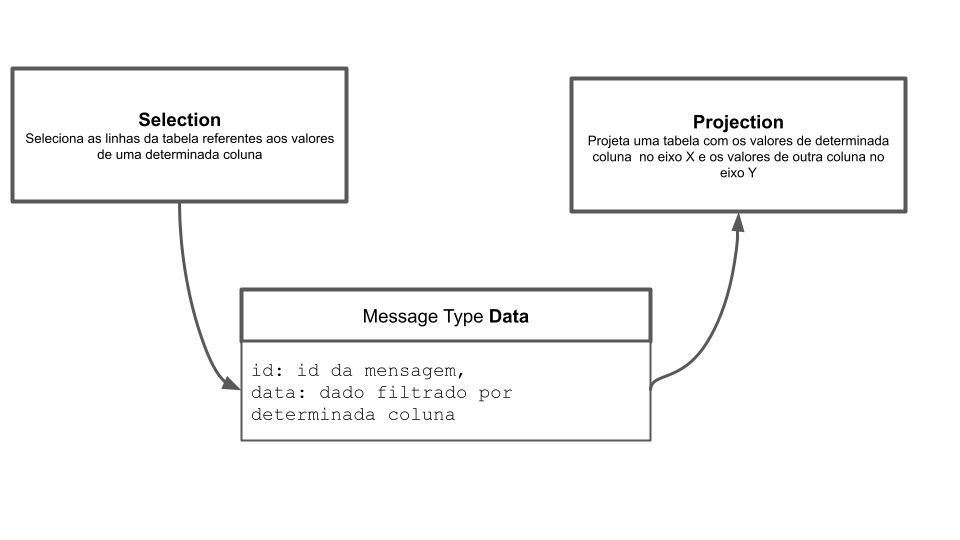

# Modelo para Apresentação do Lab01 - Estilos Arquiteturais

Estrutura de pastas:

~~~
├── README.md  <- arquivo apresentando a tarefa
│
└── images     <- arquivos de imagens usadas no documento
~~~

# Aluno
* `Daniel Salgado Costa`

## Tarefa 1 - Web Components e Tópicos

> Código da composição de componentes Web:

~~~html
<dcc-button label="Mundo Política" topic="noticia/mundo/politica" message="política do mundo">
</dcc-button>
<dcc-button label="Brasil Política" topic="noticia/brasil/politica" message="política do brasil">
</dcc-button>
<dcc-button label="Brasil Dinos" topic="noticia/brasil/dinos" message="dinos do brasil">
</dcc-button>
<dcc-button label="Bahia Dinos" topic="noticia/bahia/dinos" message="dinos da bahia">
</dcc-button>

  <dcc-lively-talk character="https://harena-lab.github.io/harena-docs/dccs/tutorial/images/doctor.png" speech="Eu quero ouvir sobre: " subscribe="noticia/#/politica:speech">
  </dcc-lively-talk>
  <dcc-lively-talk character="https://harena-lab.github.io/harena-docs/dccs/tutorial/images/nurse.png" speech="Eu quero ouvir sobre: " subscribe="noticia/brasil/#:speech">
  </dcc-lively-talk>
  <dcc-lively-talk speech="Eu quero ouvir sobre: " subscribe="noticia/#/#:speech">
  </dcc-lively-talk>
~~~

> Imagem da composição em funcionamento:

## Tarefa 2 - Web Components e RSS
> Código da composição de componentes Web:

~~~html
<dcc-rss source="https://www.wired.com/category/science/feed" subscribe="next/rss/science:next" topic="rss/science">
</dcc-rss>
<dcc-rss source="https://www.wired.com/category/design/feed" subscribe="next/rss/design:next" topic="rss/design">
</dcc-rss>
<dcc-aggregator topic="aggregate/science" quantity="4" subscribe="rss/science">
</dcc-aggregator>

<dcc-lively-talk character="https://harena-lab.github.io/harena-docs/dccs/tutorial/images/doctor.png" speech="Compact: " subscribe="aggregate/science:speech">
</dcc-lively-talk>
<dcc-lively-talk character="https://harena-lab.github.io/harena-docs/dccs/tutorial/images/nurse.png" speech="News: " subscribe="rss/science:speech">
</dcc-lively-talk>
<dcc-lively-talk speech="News: " subscribe="rss/design:speech">
</dcc-lively-talk>

<dcc-button label="Ciências Próxima" topic="next/rss/science">
</dcc-button>
<dcc-button label="Design Próxima" topic="next/rss/design">
</dcc-button>
~~~

> Imagem da composição em funcionamento:

## Tarefa 3 - Painéis de Mensagens com Timer
> Código da composição de componentes Web:

~~~html
<dcc-rss source="https://www.wired.com/category/science/feed" subscribe="next/rss/science:next" topic="rss/science">
</dcc-rss>
<dcc-rss source="https://www.wired.com/category/design/feed" subscribe="next/rss/design:next" topic="rss/design">
</dcc-rss>
<dcc-aggregator topic="aggregate/#" quantity="4" subscribe="rss/#">
</dcc-aggregator>

<dcc-lively-talk character="https://harena-lab.github.io/harena-docs/dccs/tutorial/images/doctor.png" speech="News: " subscribe="rss/science:speech">
</dcc-lively-talk>
<dcc-lively-talk character="https://harena-lab.github.io/harena-docs/dccs/tutorial/images/nurse.png" speech="News: " subscribe="rss/design:speech">
</dcc-lively-talk>
<dcc-lively-talk speech="Compact: " subscribe="aggregate/#:speech">
</dcc-lively-talk>

<dcc-timer cycles="10" interval="1000" topic="next/rss/science" subscribe="start/feed:start">
</dcc-timer>
<dcc-timer cycles="10" interval="2000" topic="next/rss/design" subscribe="start/feed:start">
</dcc-timer>
<dcc-timer cycles="10" interval="2000" topic="next/rss" subscribe="start/feed:start">
</dcc-timer>

<dcc-button label="Start" topic="start/feed">
</dcc-button>
~~~

> Imagem da composição em funcionamento:

## Tarefa 4 - Web Components Dataflow
> Imagem (`PNG`) do diagrama de componentes.

>
> O CSVReader é o componente responsável por criar a tabela a partir dos dados contidos no arquivo CSV. Os dados em forma de tabela serão a mensagem do tipo Data que será enviada ao componente Selection. O componente Selection será reponsável por filtrar as linhas da tabela a partir da seleção do valor de uma determinada coluna da tabela. A mensagem enviada será uma mensagem também do tipo Data mas com os dados filtrados por uma determinada coluna. O componente Projection é reponsável por projetar uma tabela com os valores de determinada coluna no eixo X e de outra coluna no eixo Y. A mensagem enviada contém uma tabela do tipo Data com uma coluna contendo os valores da coordenada X e outra coluna contendo os valores da coordenada Y. Por fim, o componente ScatterPlot recebe a mensagem do Projection para desenhar o gráfico de dispersão usando as coordenadas X e Y das colunas da tabela vinda como mensagem do componente Projection.
