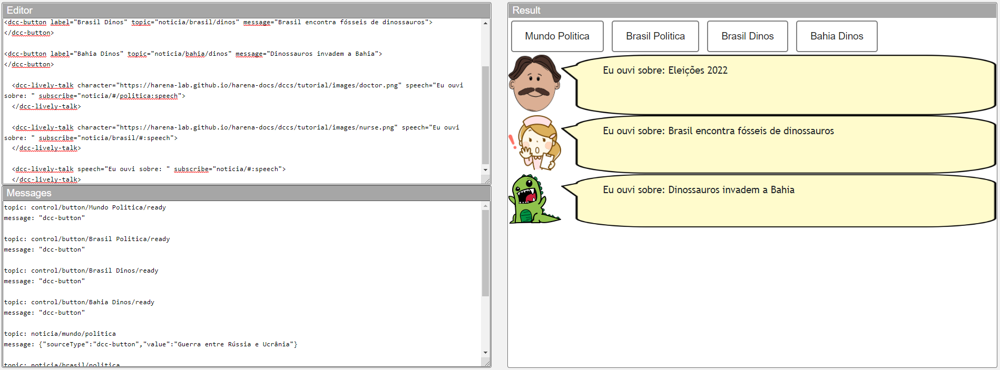
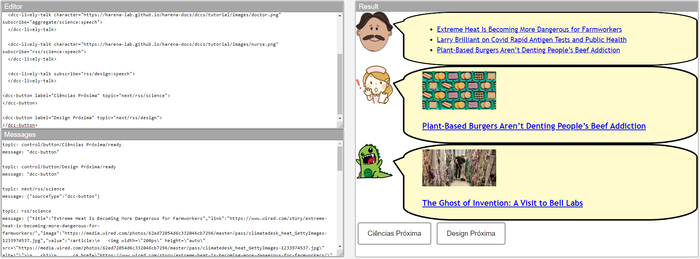
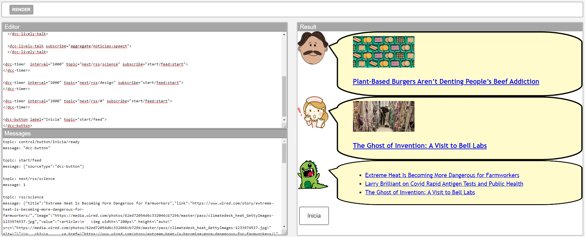
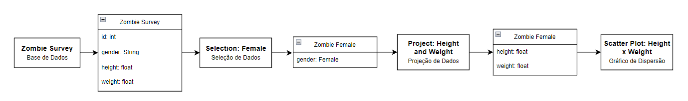

# Modelo para Apresentação do Lab01 - Estilos Arquiteturais

Estrutura de pastas:

~~~
├── README.md  <- arquivo apresentando a tarefa
│
└── images     <- arquivos de imagens usadas no documento
~~~

# Aluno
* `Daniel Francisco Ferreira Lopes`

## Tarefa 1 - Web Components e Tópicos

~~~html
<dcc-button label="Mundo Politica" topic="noticia/mundo/politica" message="Guerra entre Rússia e Ucrânia">
</dcc-button>

<dcc-button label="Brasil Politica" topic="noticia/brasil/politica" message="Eleições 2022">
</dcc-button>

<dcc-button label="Brasil Dinos" topic="noticia/brasil/dinos" message="Brasil encontra fósseis de dinossauros">
</dcc-button>

<dcc-button label="Bahia Dinos" topic="noticia/bahia/dinos" message="Dinossauros invadem a Bahia">
</dcc-button>

  <dcc-lively-talk character="https://harena-lab.github.io/harena-docs/dccs/tutorial/images/doctor.png" speech="Eu ouvi sobre: " subscribe="noticia/#/politica:speech">
  </dcc-lively-talk>

  <dcc-lively-talk character="https://harena-lab.github.io/harena-docs/dccs/tutorial/images/nurse.png" speech="Eu ouvi sobre: " subscribe="noticia/brasil/#:speech">
  </dcc-lively-talk>

  <dcc-lively-talk speech="Eu ouvi sobre: " subscribe="noticia/#:speech">
~~~

## Tarefa 2 - Web Components e RSS

~~~html
<dcc-rss source="https://www.wired.com/category/science/feed" subscribe="next/rss/science:next" topic="rss/science">
</dcc-rss>

<dcc-rss source="https://www.wired.com/category/design/feed" subscribe="next/rss/design:next" topic="rss/design">
</dcc-rss>

<dcc-aggregator topic="aggregate/science" quantity="3" subscribe="rss/science">
</dcc-aggregator>

  <dcc-lively-talk character="https://harena-lab.github.io/harena-docs/dccs/tutorial/images/doctor.png" subscribe="aggregate/science:speech">
  </dcc-lively-talk>

  <dcc-lively-talk character="https://harena-lab.github.io/harena-docs/dccs/tutorial/images/nurse.png" subscribe="rss/science:speech">
  </dcc-lively-talk>

  <dcc-lively-talk subscribe="rss/design:speech">
  </dcc-lively-talk>

<dcc-button label="Ciências Próxima" topic="next/rss/science">
</dcc-button>

<dcc-button label="Design Próxima" topic="next/rss/design">
</dcc-button>
~~~

## Tarefa 3 - Painéis de Mensagens com Timer

~~~html
<dcc-rss source="https://www.wired.com/category/science/feed" subscribe="next/rss/science:next" topic="rss/science">
</dcc-rss>

<dcc-rss source="https://www.wired.com/category/design/feed" subscribe="next/rss/design:next" topic="rss/design">
</dcc-rss>

<dcc-aggregator topic="aggregate/noticias" quantity="3" subscribe="rss/#">
</dcc-aggregator>

  <dcc-lively-talk character="https://harena-lab.github.io/harena-docs/dccs/tutorial/images/doctor.png" subscribe="rss/science:speech">
  </dcc-lively-talk>

  <dcc-lively-talk character="https://harena-lab.github.io/harena-docs/dccs/tutorial/images/nurse.png" subscribe="rss/design:speech">
  </dcc-lively-talk>

  <dcc-lively-talk subscribe="aggregate/noticias:speech">
  </dcc-lively-talk>

<dcc-timer  interval="1000" topic="next/rss/science" subscribe="start/feed:start">
</dcc-timer>

<dcc-timer interval="2000" topic="next/rss/design" subscribe="start/feed:start">
</dcc-timer>

<dcc-timer interval="2000" topic="next/rss/#" subscribe="start/feed:start">
</dcc-timer>

<dcc-button label="Inicia" topic="start/feed">
</dcc-button>
~~~

## Tarefa 4 - Web Components Dataflow

> O primeiro componente da interface é a entrada da base de dados "Zombie Survey" seguido pela mensagem apresentando a base como um todo. O segundo componente é a seleção do gênero feminino dos zumbis seguido da mensagem apresentando os zumbis femininos. O terceiro componente é a projeção de altura e peso dos zumbis femininos seguido da mensagem contento essa projeção. E por fim, o quarto componente é gráfico de disperção gerado a partir da seleção e projeção da interface.
