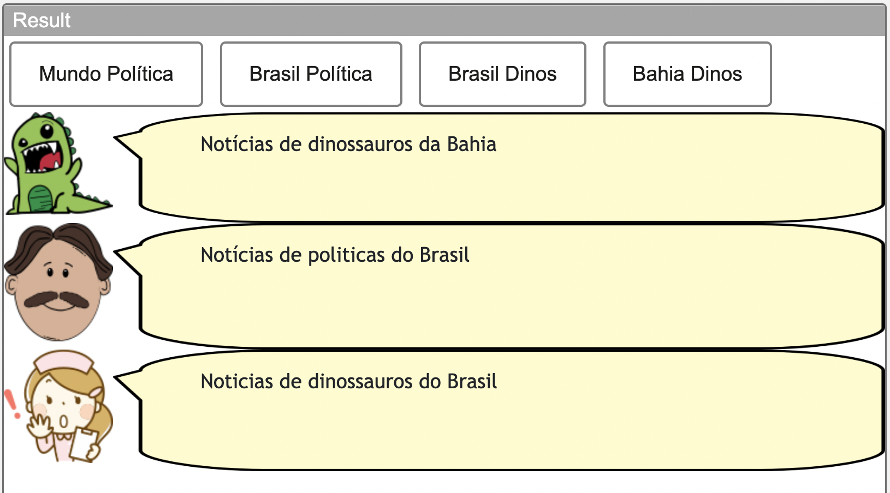
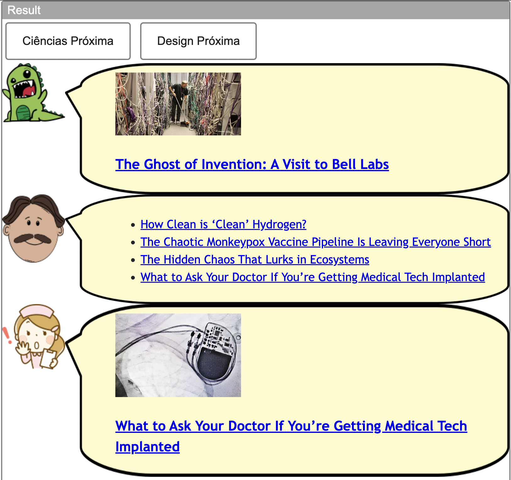
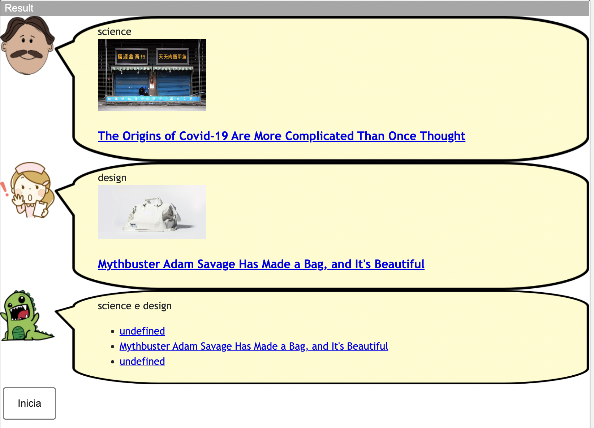
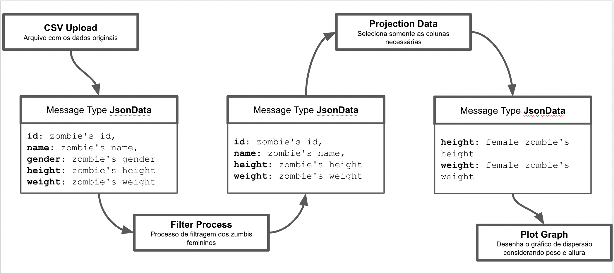

# Aluno

* Edivilson França - RG: 53.165.045-3

## Tarefa 1 - Web Components e Tópicos

~~~html
<dcc-button label="Mundo Política" topic="noticia/mundo/politica" message="Notícias de políticas do mundo"></dcc-button>
<dcc-button label="Brasil Política" topic="noticia/brasil/politica" message="Notícias de politicas do Brasil"></dcc-button>
<dcc-button label="Brasil Dinos" topic="noticia/brasil/dinos" message="Noticias de dinossauros do Brasil"></dcc-button>
<dcc-button label="Bahia Dinos" topic="noticia/bahia/dinos" message="Notícias de dinossauros da Bahia"></dcc-button>

<dcc-lively-talk subscribe="noticia/#:speech"></dcc-lively-talk>
<dcc-lively-talk character="https://harena-lab.github.io/harena-docs/dccs/tutorial/images/doctor.png" subscribe="noticia/#/politica:speech"></dcc-lively-talk>
<dcc-lively-talk character="https://harena-lab.github.io/harena-docs/dccs/tutorial/images/nurse.png" subscribe="noticia/brasil/#:speech"></dcc-lively-talk>
~~~

## Tarefa 2 - Web Components e RSS

> Escreva aqui o código da sua composição de componentes Web seguida de uma imagem que captura o funcionamento, como foi feito na tarefa anterior.

~~~html
<dcc-rss source="https://www.wired.com/category/science/feed" subscribe="next/science/rss:next" topic="rss/science"></dcc-rss>
<dcc-rss source="https://www.wired.com/category/design/feed" subscribe="next/design/rss:next" topic="rss/design"></dcc-rss>

<dcc-aggregator topic="aggregate/science" quantity="4" subscribe="rss/science">
</dcc-aggregator>

<dcc-button label="Ciências Próxima" topic="next/science/rss"></dcc-button>
<dcc-button label="Design Próxima" topic="next/design/rss"></dcc-button>

<dcc-lively-talk subscribe="rss/design:speech"></dcc-lively-talk>
<dcc-lively-talk character="https://harena-lab.github.io/harena-docs/dccs/tutorial/images/doctor.png" subscribe="aggregate/science:speech"></dcc-lively-talk>
<dcc-lively-talk character="https://harena-lab.github.io/harena-docs/dccs/tutorial/images/nurse.png" subscribe="rss/science:speech"></dcc-lively-talk>
~~~

## Tarefa 3 - Painéis de Mensagens com Timer

~~~html
<dcc-rss source="https://www.wired.com/category/science/feed" subscribe="next-science/rss:next" topic="rss/science"></dcc-rss>
<dcc-rss source="https://www.wired.com/category/design/feed" subscribe="next-design/rss:next" topic="rss/design"></dcc-rss>

<dcc-aggregator topic="aggregate/all" quantity="3" subscribe="rss/#"></dcc-aggregator>

<dcc-lively-talk character="https://harena-lab.github.io/harena-docs/dccs/tutorial/images/doctor.png" speech="science" subscribe="rss/science:speech"></dcc-lively-talk>
<dcc-lively-talk character="https://harena-lab.github.io/harena-docs/dccs/tutorial/images/nurse.png" speech="design" subscribe="rss/design:speech"></dcc-lively-talk>
<dcc-lively-talk speech="science e design" subscribe="aggregate/all:speech"></dcc-lively-talk>

<dcc-timer interval="1000" topic="next-science/rss" subscribe="start/timer:start"></dcc-timer>
<dcc-timer interval="2000" topic="next-design/rss" subscribe="start/timer:start"></dcc-timer>
<dcc-timer interval="2000" topic="rss/#" subscribe="start/timer:start"></dcc-timer>

<dcc-button label="Inicia" topic="start/timer"></dcc-button>
~~~

## Tarefa 4 - Web Components Dataflow

>
> No processo de estudo da criação de componentes intercambiáveis, foi considerado que os componentes em geral pudesse receber dados brutos através de um arquivo do tipo CSV não importando quais fossem suas colunas através do componente CSV Upload. O importante para que o componentes consigam ler os dados de entrada é definir um padrão de tipagem assim como o formato JSON conforme escolhido e colocar os dados de saída no mesmo padrão, dessa forma qualquer componente que suporte esse tipo de entrada e saída de dados pode ser utilizado conforme for necessário e fizer sentido no fluxo.
>
