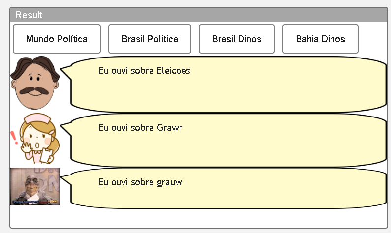
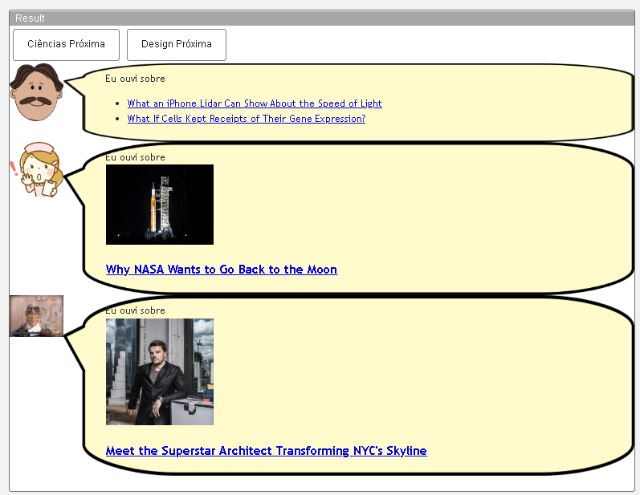
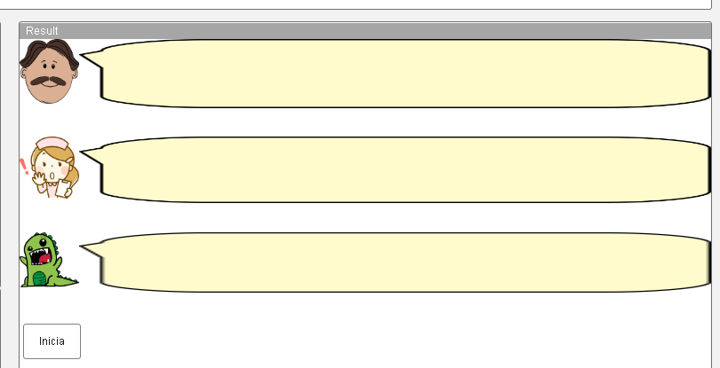
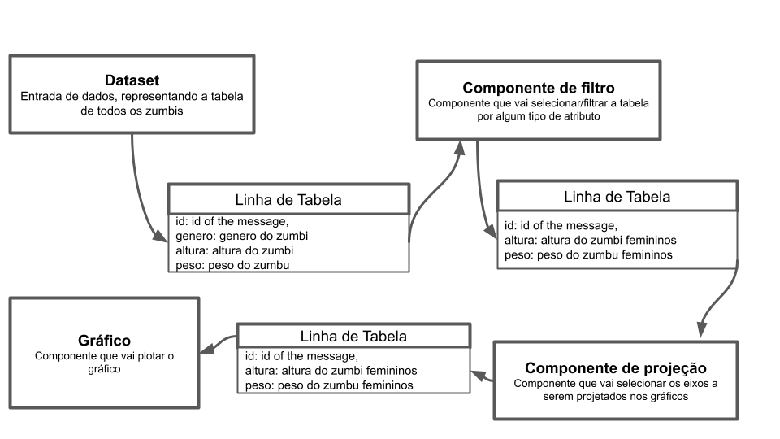

# Aluno
* João Igor dos Santos Pereira

## Tarefa 1 - Web Components e Tópicos

> Escreva aqui o código da sua composição de componentes Web, como mostra o exemplo a seguir:

~~~html
<dcc-button label="Mundo Política"
 topic="noticia/mundo/politica"
 message="G20">
</dcc-button>
<dcc-button label="Brasil Política"
 topic="noticia/brasil/politica"
 message="Eleicoes">
</dcc-button>
<dcc-button label="Brasil Dinos"
 topic="noticia/brasil/dinos"
 message="Grawr">
</dcc-button>
<dcc-button label="Bahia Dinos"
 topic="noticia/bahia/dinos"
 message="grauw">
</dcc-button>

<dcc-lively-talk character="https://harena-lab.github.io/harena-docs/dccs/tutorial/images/doctor.png" speech="Eu ouvi sobre " subscribe="#/politica:speech"></dcc-lively-talk>
<dcc-lively-talk character="https://harena-lab.github.io/harena-docs/dccs/tutorial/images/nurse.png" speech="Eu ouvi sobre " subscribe="#/brasil/#:speech"></dcc-lively-talk>
<dcc-lively-talk character="https://static.wikia.nocookie.net/the-dinosaurs-tv-series/images/7/76/Howardhandupme.jpg" speech="Eu ouvi sobre " subscribe="noticia/#:speech"></dcc-lively-talk>

~~~

## Tarefa 2 - Web Components e RSS
~~~html
 <dcc-rss source="https://www.wired.com/category/science/feed" subscribe="next/rss/science:next" topic="rss/science">
</dcc-rss>

<dcc-aggregator topic="aggregate/science" quantity="2" subscribe="rss/science">
</dcc-aggregator>

<dcc-button label="Ciências Próxima" topic="next/rss/science">
</dcc-button>

<dcc-rss source="https://www.wired.com/category/design/feed" subscribe="next/rss/design:next" topic="rss/design">
</dcc-rss>

<dcc-aggregator topic="aggregate/design" quantity="10" subscribe="rss/design">
</dcc-aggregator>

<dcc-button label="Design Próxima" topic="next/rss/design">
</dcc-button>

<dcc-lively-talk character="https://harena-lab.github.io/harena-docs/dccs/tutorial/images/doctor.png" speech="Eu ouvi sobre " subscribe="aggregate/science:speech"></dcc-lively-talk>
<dcc-lively-talk character="https://harena-lab.github.io/harena-docs/dccs/tutorial/images/nurse.png" speech="Eu ouvi sobre " subscribe="rss/science:speech"></dcc-lively-talk>
<dcc-lively-talk character="https://static.wikia.nocookie.net/the-dinosaurs-tv-series/images/7/76/Howardhandupme.jpg" speech="Eu ouvi sobre " subscribe="rss/design:speech"></dcc-lively-talk>
~~~

## Tarefa 3 - Painéis de Mensagens com Timer

<dcc-rss source="https://www.wired.com/category/science/feed" subscribe="next/rss/science:next" topic="rss/science">
</dcc-rss>

<dcc-rss source="https://www.wired.com/category/design/feed" subscribe="next/rss/design:next" topic="rss/design">
</dcc-rss>

<dcc-aggregator topic="aggregate/noticias" quantity="3" subscribe="rss/#">
</dcc-aggregator>

  <dcc-lively-talk character="https://harena-lab.github.io/harena-docs/dccs/tutorial/images/doctor.png" subscribe="rss/science:speech">
  </dcc-lively-talk>

 

  <dcc-lively-talk character="https://harena-lab.github.io/harena-docs/dccs/tutorial/images/nurse.png" subscribe="rss/design:speech">
  </dcc-lively-talk>

 

  <dcc-lively-talk subscribe="aggregate/noticias:speech">
  </dcc-lively-talk>

<dcc-timer  interval="1000" topic="next/rss/science" subscribe="start/feed:start">
</dcc-timer>

<dcc-timer interval="2000" topic="next/rss/design" subscribe="start/feed:start">
</dcc-timer>

<dcc-timer interval="2000" topic="next/rss/#" subscribe="start/feed:start">
</dcc-timer>

 

<dcc-button label="Inicia" topic="start/feed">
</dcc-button>

## Tarefa 4 - Web Components Dataflow

> Entendo que o primeiro componente represente o dataser ou entrada de dados, a mensagem que ele enviará corresponde a própria informação que ele representa, nesse caso todos os dados de zumbi, escolhi representar a mensagem como uma unica linha da tabela e pensar o dataser como algo dinamico assim como os componentes e mensagens, essa mensagem entre o primeiro e segundo componente teria todos os dados de um zumbi, considerando que a mensagem estou tomando como apenas uma linha, chegaria no segundo componente e seria filtrada, passando ou não para a próxima etapa de acordo com o atributo selecionado neste componente, na mesma lógica seguiriamos para a projeção e plot, sendo sempre uma linha de tabela, passando ou não pelo bloco de acordo com suas configuração e mudando sua quantidade de atributos também.
