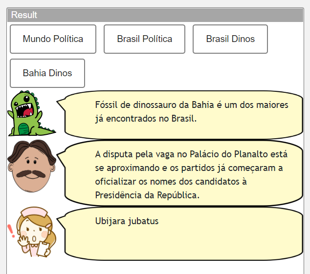
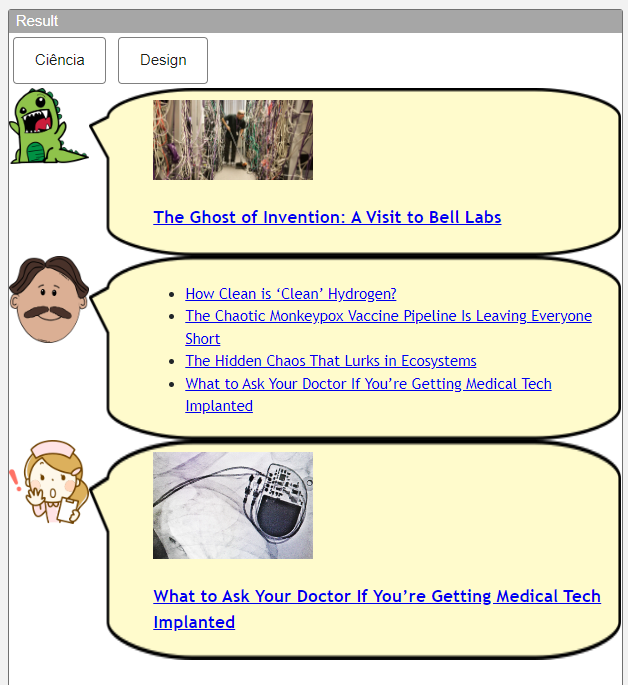
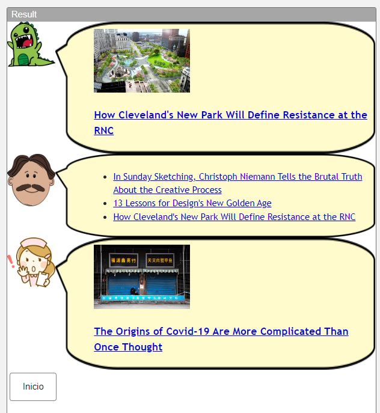
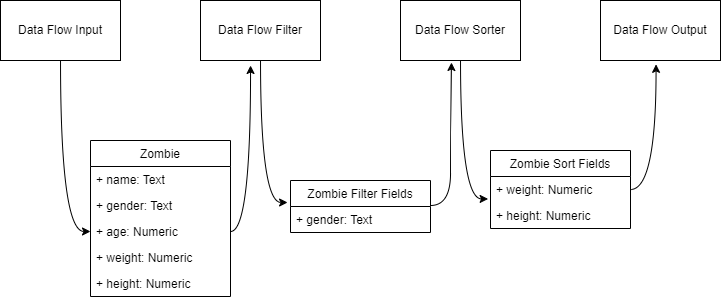

# Modelo para Apresentação do Lab01 - Estilos Arquiteturais

# Aluno

- Julia Giorgi Martin

## Tarefa 1 - Web Components e Tópicos

```html
<dcc-button
  id="power"
  label="Mundo Política"
  topic="noticia/mundo/politica"
  message="Aviões de guerra chineses voltam a sobrevoar Taiwan"
></dcc-button>

<dcc-button
  id="power"
  label="Brasil Política"
  topic="noticia/brasil/politica"
  message="A disputa pela vaga no Palácio do Planalto está se aproximando e os partidos já começaram a oficializar os nomes dos candidatos à Presidência da República."
></dcc-button>

<dcc-button
  id="power"
  label="Brasil Dinos"
  topic="noticia/brasil/dinos"
  message="Ubijara jubatus"
></dcc-button>

<dcc-button
  id="power"
  label="Bahia Dinos"
  topic="noticia/bahia/dinos"
  message="Fóssil de dinossauro da Bahia é um dos maiores já encontrados no Brasil."
></dcc-button>

<dcc-lively-talk subscribe="noticia/+/+:speech"> </dcc-lively-talk>

<dcc-lively-talk
  character="https://harena-lab.github.io/harena-docs/dccs/tutorial/images/doctor.png"
  subscribe="noticia/+/politica:speech"
>
</dcc-lively-talk>

<dcc-lively-talk
  character="https://harena-lab.github.io/harena-docs/dccs/tutorial/images/nurse.png"
  subscribe="noticia/brasil/+:speech"
>
</dcc-lively-talk>
```



## Tarefa 2 - Web Components e RSS

```html
<dcc-rss
  source="https://www.wired.com/category/science/feed"
  subscribe="ciencia/rss:next"
  topic="rss/science"
>
</dcc-rss>

<dcc-rss
  source="https://www.wired.com/category/design/feed"
  subscribe="design/rss:next"
  topic="rss/design"
>
</dcc-rss>

<dcc-aggregator topic="aggregate/science" quantity="4" subscribe="rss/science">
</dcc-aggregator>

<dcc-button label="Ciência" topic="ciencia/rss"> </dcc-button>

<dcc-button label="Design" topic="design/rss"> </dcc-button>

<dcc-lively-talk subscribe="rss/design:speech"> </dcc-lively-talk>

<dcc-lively-talk
  character="https://harena-lab.github.io/harena-docs/dccs/tutorial/images/doctor.png"
  subscribe="aggregate/science:speech"
>
</dcc-lively-talk>

<dcc-lively-talk
  character="https://harena-lab.github.io/harena-docs/dccs/tutorial/images/nurse.png"
  subscribe="rss/science:speech"
>
</dcc-lively-talk>
```



## Tarefa 3 - Painéis de Mensagens com Timer

```html
<dcc-rss
  source="https://www.wired.com/category/science/feed"
  subscribe="nextScience/rss:next"
  topic="rss/science"
>
</dcc-rss>

<dcc-rss
  source="https://www.wired.com/category/design/feed"
  subscribe="nextDesign/rss:next"
  topic="rss/design"
>
</dcc-rss>

<dcc-aggregator topic="aggregate/news" quantity="3" subscribe="rss/#">
</dcc-aggregator>

<dcc-lively-talk subscribe="rss/design:speech"> </dcc-lively-talk>

<dcc-lively-talk
  character="https://harena-lab.github.io/harena-docs/dccs/tutorial/images/doctor.png"
  subscribe="aggregate/news:speech"
>
</dcc-lively-talk>

<dcc-lively-talk
  character="https://harena-lab.github.io/harena-docs/dccs/tutorial/images/nurse.png"
  subscribe="rss/science:speech"
>
</dcc-lively-talk>

<dcc-timer interval="1000" topic="nextScience/rss" subscribe="start/feed:start">
</dcc-timer>

<dcc-timer interval="2000" topic="nextDesign/rss" subscribe="start/feed:start">
</dcc-timer>

<dcc-timer
  interval="2000"
  topic="nextAgregado/rss"
  subscribe="start/feed:start"
>
</dcc-timer>

<dcc-button label="Inicio" topic="start/feed"> </dcc-button>
```



## Tarefa 4 - Web Components Dataflow

<br> 
<p><b>Feito por:</b> Nicole e Júlia</p>

<p>Inicialmente um fluxo de dados é inputado no componente "Data Flow Input", nele todos os dados são iterados de forma interna no sistema, sem que o usuário tenha ciência de todos os elementos que estão inseridos. Após passar pelo componente de entrada, um segundo componente é acionado com a finalidade de filtrar elementos que contenha apenas zombies do gênero femenino, passando o fluxo de dados para o próximo "step" Ao chegar no componente de ordenação, o fluxo de dados começa a ser iterado novamente e sendo ordenado de acordo com seu peso e altura, seguindo a prioridade respectivamente. Por fim, o fluxo de dados é enviado para um componente de exibição onde os dados serão traduzidos para um gráfico que seja visualmente agradável de interpretar para o usuário</p>

<br>


