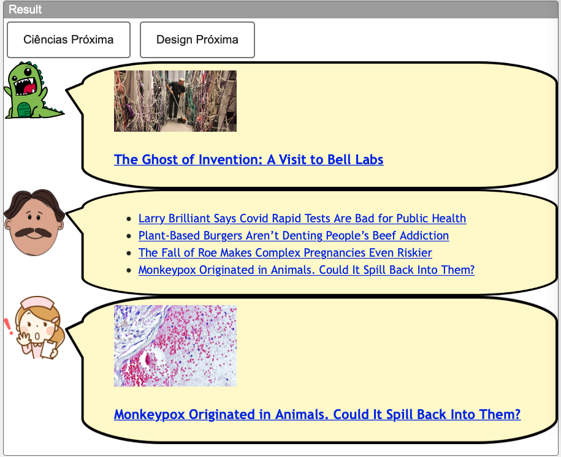

# Aluno
* Leonardo Machado Moscardo. RA: EX161698

## Tarefa 1 - Web Components e Tópicos

~~~html
<dcc-button label="Mundo Política" topic="noticia/mundo/politica" message="Mundo Política - noticia/mundo/politica">
</dcc-button>

<dcc-button label="Brasil Política" topic="noticia/brasil/politica" message="Brasil Política - noticia/brasil/politica">
</dcc-button>

<dcc-button label="Brasil Dinos" topic="noticia/brasil/dinos" message="Brasil Dinos - noticia/brasil/dinos">
</dcc-button>

<dcc-button label="Bahia Dinos" topic="noticia/bahia/dinos" message="Bahia Dinos - noticia/bahia/dinos">
</dcc-button>

<dcc-lively-talk subscribe="noticia/#:speech">
</dcc-lively-talk>

<dcc-lively-talk character="https://harena-lab.github.io/harena-docs/dccs/tutorial/images/doctor.png" subscribe="noticia/#/politica:speech">
</dcc-lively-talk>

<dcc-lively-talk character="https://harena-lab.github.io/harena-docs/dccs/tutorial/images/nurse.png" subscribe="#/brasil/#:speech">
</dcc-lively-talk>
~~~

## Tarefa 2 - Web Components e RSS
~~~html
<dcc-rss source="https://www.wired.com/category/science/feed" subscribe="next/science/rss:next" topic="rss/science">
</dcc-rss>

<dcc-rss source="https://www.wired.com/category/design/feed" subscribe="next/design/rss:next" topic="rss/design">
</dcc-rss>

<dcc-aggregator topic="aggregate/science" quantity="4" subscribe="rss/science">
</dcc-aggregator>

<dcc-button label="Ciências Próxima" topic="next/science/rss">
</dcc-button>

<dcc-button label="Design Próxima" topic="next/design/rss">
</dcc-button>

<dcc-lively-talk subscribe="rss/design:speech">
</dcc-lively-talk>

<dcc-lively-talk character="https://harena-lab.github.io/harena-docs/dccs/tutorial/images/doctor.png"
                 subscribe="aggregate/science:speech">
</dcc-lively-talk>

<dcc-lively-talk character="https://harena-lab.github.io/harena-docs/dccs/tutorial/images/nurse.png"
                 subscribe="rss/science:speech">
</dcc-lively-talk>
~~~

## Tarefa 3 - Painéis de Mensagens com Timer
~~~html
<dcc-rss source="https://www.wired.com/category/science/feed" subscribe="next-science/rss:next" topic="rss/science">
</dcc-rss>

<dcc-rss source="https://www.wired.com/category/design/feed" subscribe="next-design/rss:next" topic="rss/design">
</dcc-rss>

<dcc-aggregator topic="aggregate/all" quantity="3" subscribe="rss/#">
</dcc-aggregator>

<dcc-timer cycles="10" interval="1000" topic="next-science/rss" subscribe="start/timer:start">
</dcc-timer>
<dcc-timer cycles="10" interval="2000" topic="next-design/rss" subscribe="start/timer:start">
</dcc-timer>
<dcc-timer cycles="10" interval="2000" topic="rss/#" subscribe="start/timer:start">
</dcc-timer>

<dcc-button label="Inicia" topic="start/timer">
</dcc-button>

<dcc-lively-talk speech="science e design" subscribe="aggregate/all:speech">
</dcc-lively-talk>

<dcc-lively-talk character="https://harena-lab.github.io/harena-docs/dccs/tutorial/images/doctor.png" speech="science"
                 subscribe="rss/science:speech">
</dcc-lively-talk>

<dcc-lively-talk character="https://harena-lab.github.io/harena-docs/dccs/tutorial/images/nurse.png" speech="design"
                 subscribe="rss/design:speech">
</dcc-lively-talk>
~~~

## Tarefa 4 - Web Components Dataflow

> Para que os componentes sejam intercambiáveis, eles precisam receber e enviar messagens seguindo sempre o mesmo schema. Dessa forma, eles sempre conseguirão ler e processar as messagens independente de quem as emitiu. No exemplo do enunciado, o componente de leitura CSV lê o arquivo e emite uma mensagem do tipo zumbi para cada linha do arquivo. Todos os zumbis seguirâo o mesmo schema das colunas do arquivo. O componente de filtro recebe as mensagem mas só passa a diante as mensagens em que o zumbi for do gênero feminino. O componente de projeção recebe os zumbis do gênero feminino e limpa todos os campos a não ser altura e peso. O componente de criação do gráfico também recebe zumbis e monta o gráfico de altura x peso.
> 
> Dessa forma podemos remover componentes como por exemplo tirar o componente de projeção. Nesse caso, o componente de filtro enviaria mensagens de zumbis direto para o componente de criação de gráfico, que usaria apenas a altura e o peso para montar o gráfico. 
> 
> Podemos trocar o componente de filtro com o de projeção e também não afeta a conectividade entre os componentes. Nesse caso o componente de leitura CSV enviaria os zumbis para o componente de projeção, que limparia os dados dos zumbis a não ser altura e peso e enviaria para o componente de filtro. Como nenhum dos zumbis recebidos pelo componente de filtro é do gênero feminino, ele não passaria nenhuma mensagem a diante para o componente de criação de gráfico. O fluxo nessa caso seria interrompido por uma questão lógica, mas, ainda assim, todos os componentes sabem se comunicar entre si.
