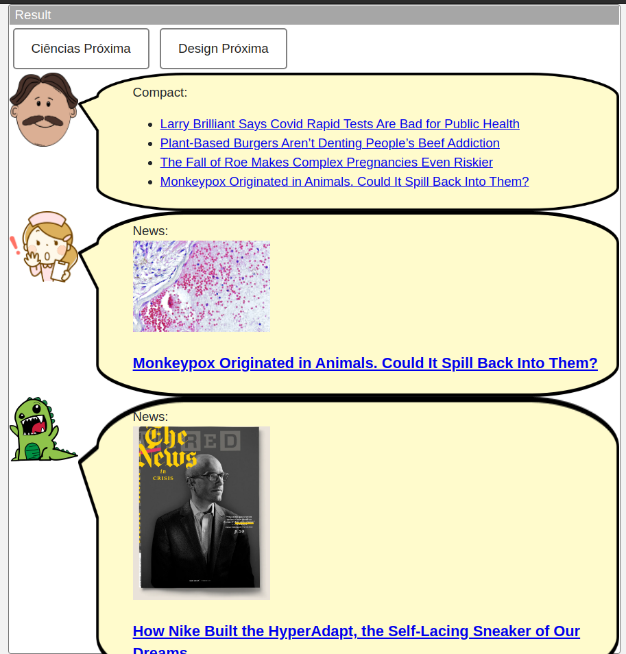
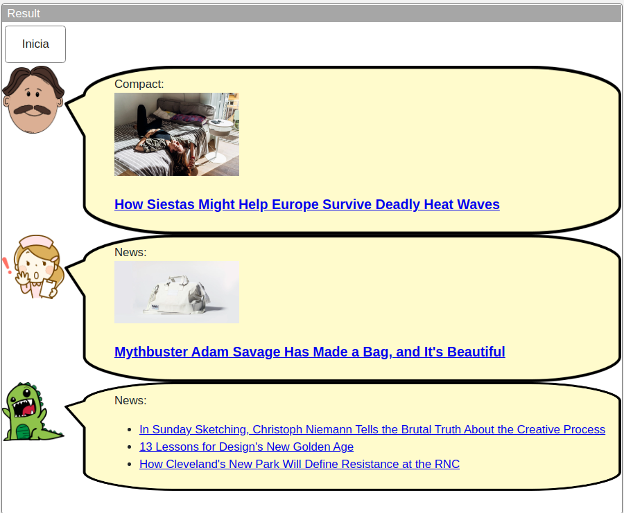

# Aluno
* `Luís Filipe Menten Gomes de Soutello`

## Tarefa 1 - Web Components e Tópicos

~~~html
<dcc-button
        label="Mundo Política"
        topic="noticia/mundo/politica"
        message="Notícia sobre políticas mundiais"
>
</dcc-button>
<dcc-button
        label="Brasil Política"
        topic="noticia/brasil/politica"
        message="Notícia sobre políticas brasileiras"
>
</dcc-button>
<dcc-button
        label="Brasil Dinos"
        topic="noticia/brasil/dinos"
        message="Notícia sobre dinossauros brasileiros"
>
</dcc-button>
<dcc-button
        label="Bahia Dinos"
        topic="noticia/bahia/dinos"
        message="Notícia sobre dinossuros baianos"
>
</dcc-button>

<dcc-lively-talk speech="I heard about: " subscribe="noticia/#:speech">
</dcc-lively-talk>
<dcc-lively-talk
        character="https://harena-lab.github.io/harena-docs/dccs/tutorial/images/doctor.png"
        speech="I heard about: "
        subscribe="noticia/+/politica:speech"
>
</dcc-lively-talk>
<dcc-lively-talk
        character="https://harena-lab.github.io/harena-docs/dccs/tutorial/images/nurse.png"
        speech="I heard about: "
        subscribe="noticia/brasil/#:speech"
>
</dcc-lively-talk>

~~~

## Tarefa 2 - Web Components e RSS

~~~html
<dcc-rss
  source="https://www.wired.com/category/science/feed"
  subscribe="next/rss/science:next"
  topic="rss/science"
>
</dcc-rss>

<dcc-rss
  source="https://www.wired.com/category/design/feed"
  subscribe="next/rss/design:next"
  topic="rss/design"
>
</dcc-rss>

<dcc-aggregator topic="aggregate/science" quantity="4" subscribe="rss/science">
</dcc-aggregator>

<dcc-button label="Ciências Próxima" topic="next/rss/science"> </dcc-button>

<dcc-button label="Design Próxima" topic="next/rss/design"> </dcc-button>

<dcc-lively-talk
  character="https://harena-lab.github.io/harena-docs/dccs/tutorial/images/doctor.png"
  speech="Compact: "
  subscribe="aggregate/science:speech"
>
</dcc-lively-talk>

<dcc-lively-talk
  character="https://harena-lab.github.io/harena-docs/dccs/tutorial/images/nurse.png"
  speech="News: "
  subscribe="rss/science:speech"
>
</dcc-lively-talk>

<dcc-lively-talk speech="News: " subscribe="rss/design:speech">
</dcc-lively-talk>
~~~

## Tarefa 3 - Painéis de Mensagens com Timer

~~~html
<dcc-rss
        source="https://www.wired.com/category/science/feed"
        subscribe="next/rss/science:next"
        topic="rss/science"
>
</dcc-rss>

<dcc-rss
        source="https://www.wired.com/category/design/feed"
        subscribe="next/rss/design:next"
        topic="rss/design"
>
</dcc-rss>

<dcc-aggregator topic="aggregate/all" quantity="3" subscribe="rss/+">
</dcc-aggregator>

<dcc-button label="Inicia" topic="start/feed"> </dcc-button>

<dcc-timer
        cycles="10"
        interval="1000"
        topic="next/rss/science"
        subscribe="start/feed:start"
>
</dcc-timer>

<dcc-timer
        cycles="10"
        interval="2000"
        topic="next/rss/design"
        subscribe="start/feed:start"
>
</dcc-timer>

<dcc-lively-talk
        character="https://harena-lab.github.io/harena-docs/dccs/tutorial/images/doctor.png"
        speech="Compact: "
        subscribe="rss/science:speech"
>
</dcc-lively-talk>

<dcc-lively-talk
        character="https://harena-lab.github.io/harena-docs/dccs/tutorial/images/nurse.png"
        speech="News: "
        subscribe="rss/design:speech"
>
</dcc-lively-talk>

<dcc-lively-talk speech="News: " subscribe="aggregate/all:speech">
</dcc-lively-talk>
~~~

## Tarefa 4 - Web Components Dataflow
> Imagem (`PNG`) do diagrama de componentes (veja exemplo abaixo).

>
> Escreva aqui o parágrafo de breve discussão.
