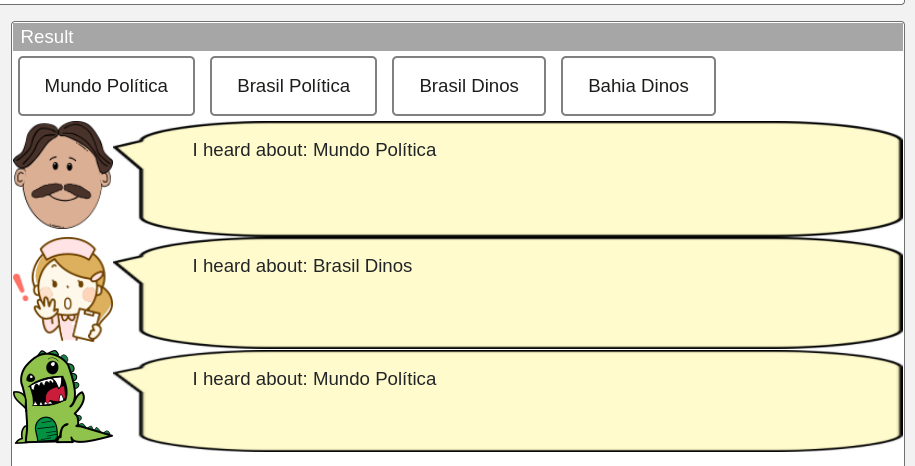
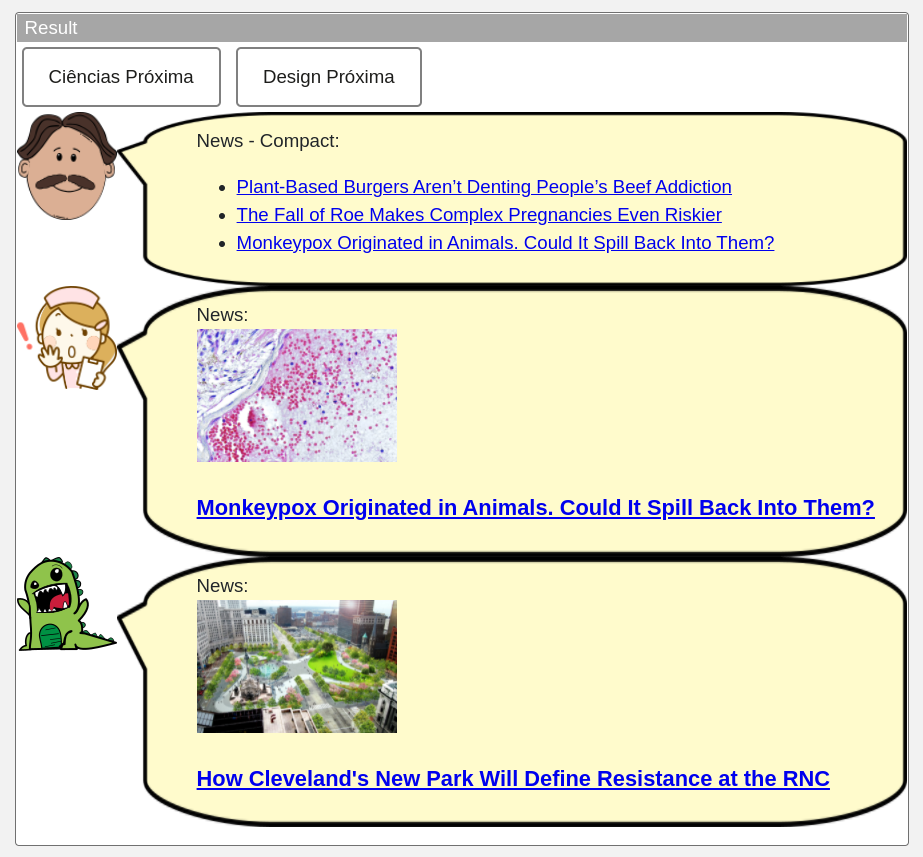
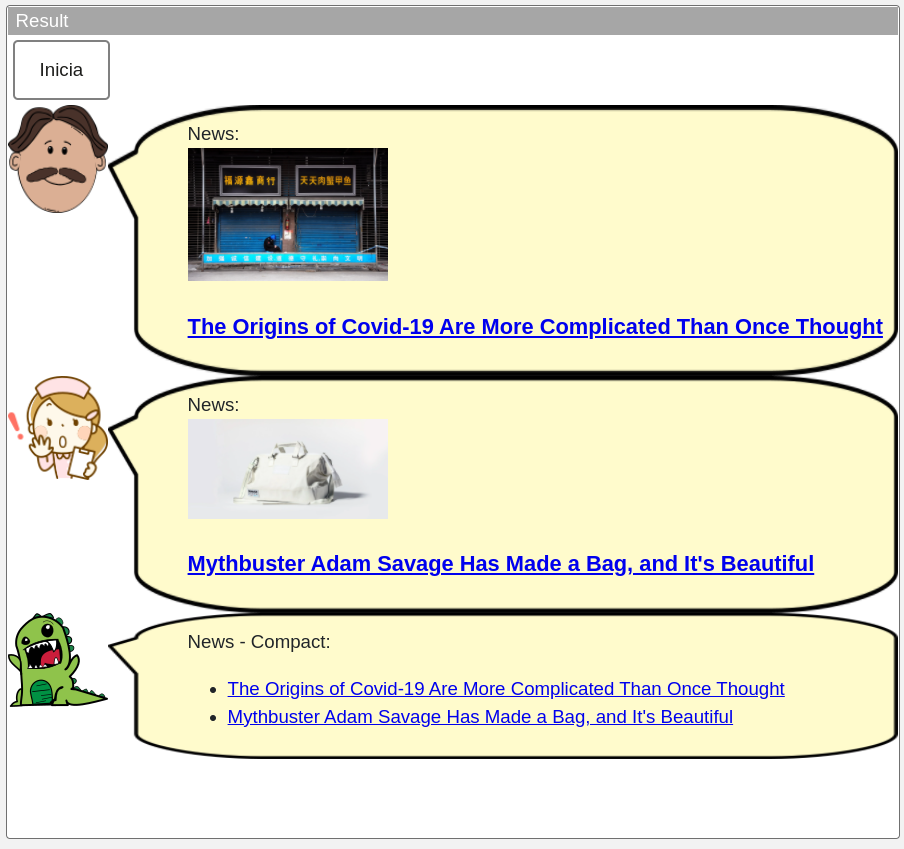

# Aluno
* `Fabiano Louzada Cesario`

## Tarefa 1 - Web Components e Tópicos

> Escreva aqui o código da sua composição de componentes Web, como mostra o exemplo a seguir:

~~~html
<dcc-button label="Mundo Política" topic="noticia/mundo/politica" message="Mundo Política">
</dcc-button>

<dcc-button label="Brasil Política" topic="noticia/brasil/politica" message="Brasil Política">
</dcc-button>

<dcc-button label="Brasil Dinos" topic="noticia/brasil/dinos" message="Brasil Dinos">
</dcc-button>

<dcc-button label="Bahia Dinos" topic="noticia/bahia/dinos" message="Bahia Dinos">
</dcc-button>

<dcc-lively-talk character="https://harena-lab.github.io/harena-docs/dccs/tutorial/images/doctor.png" speech="I heard about: " subscribe="noticia/+/politica:speech">
</dcc-lively-talk>

<dcc-lively-talk character="https://harena-lab.github.io/harena-docs/dccs/tutorial/images/nurse.png" speech="I heard about: " subscribe="noticia/brasil/#:speech">
</dcc-lively-talk>

<dcc-lively-talk speech="I heard about: " subscribe="noticia/#:speech">
</dcc-lively-talk>
~~~

## Tarefa 2 - Web Components e RSS

~~~html
<dcc-rss source="https://www.wired.com/category/science/feed"subscribe="science/next/rss:next" topic="rss/science"></dcc-rss>

<dcc-rss source="https://www.wired.com/category/design/feed" subscribe="design/next/rss:next" topic="rss/design"></dcc-rss>

<dcc-button label="Ciências Próxima" topic="science/next/rss"></dcc-button>

<dcc-button label="Design Próxima" topic="design/next/rss"></dcc-button>

<dcc-aggregator topic="aggregate/science" quantity="3" subscribe="rss/science"></dcc-aggregator>

<dcc-lively-talk character="https://harena-lab.github.io/harena-docs/dccs/tutorial/images/doctor.png" speech="News - Compact: " subscribe="aggregate/science:speech"></dcc-lively-talk>

<dcc-lively-talk character="https://harena-lab.github.io/harena-docs/dccs/tutorial/images/nurse.png" speech="News: " subscribe="rss/science:speech"></dcc-lively-talk>

<dcc-lively-talk speech="News: " subscribe="rss/design:speech"></dcc-lively-talk>
~~~

## Tarefa 3 - Painéis de Mensagens com Timer

~~~html
<dcc-button label="Inicia" topic="start/feed"></dcc-button>

<dcc-rss source="https://www.wired.com/category/science/feed" subscribe="science/next/rss:next" topic="rss/science"></dcc-rss>

<dcc-lively-talk character="https://harena-lab.github.io/harena-docs/dccs/tutorial/images/doctor.png" speech="News: " subscribe="rss/science:speech"></dcc-lively-talk>

<dcc-timer cycles="10" interval="1000" topic="science/next/rss" subscribe="start/feed:start"></dcc-timer>

<dcc-rss source="https://www.wired.com/category/design/feed" subscribe="design/next/rss:next" topic="rss/design"></dcc-rss>

<dcc-lively-talk character="https://harena-lab.github.io/harena-docs/dccs/tutorial/images/nurse.png" speech="News: " subscribe="rss/design:speech"></dcc-lively-talk>

<dcc-timer cycles="10" interval="2000" topic="design/next/rss" subscribe="start/feed:start"></dcc-timer>

<dcc-aggregator topic="aggregate" quantity="2" subscribe="rss/#"></dcc-aggregator>

<dcc-timer cycles="10" interval="2000" topic="aggregatedtimer/next/rss" subscribe="start/feed:start"></dcc-timer>

<dcc-rss source="https://www.wired.com/category/science/feed" subscribe="aggregatedtimer/next/rss:next" topic="rss/science"></dcc-rss>
<dcc-rss source="https://www.wired.com/category/design/feed" subscribe="aggregatedtimer/next/rss:next" topic="rss/design"></dcc-rss>

<dcc-lively-talk speech="News - Compact: " subscribe="aggregate:speech"></dcc-lively-talk>
~~~

## Tarefa 4 - Web Components Dataflow

> ...
