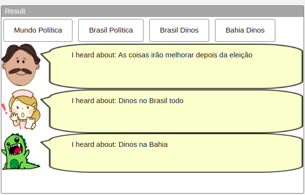
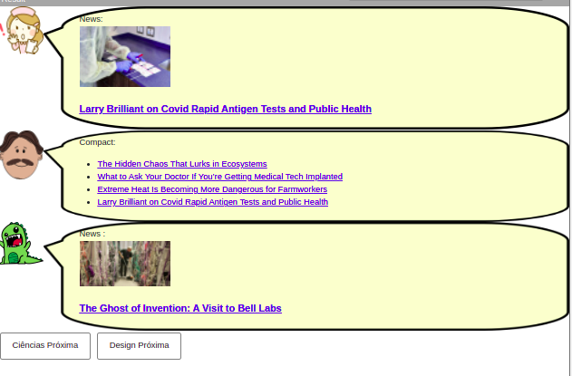
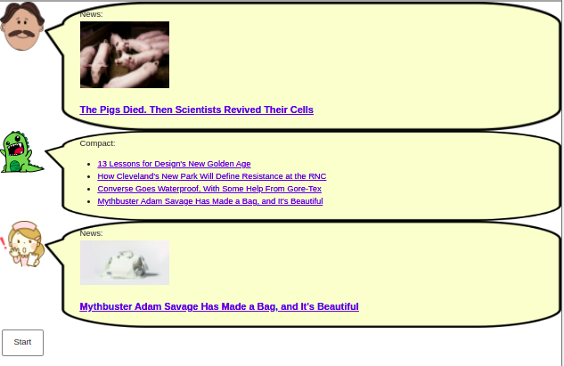
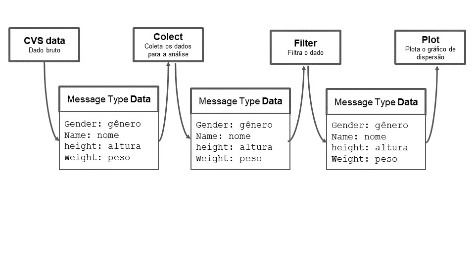

# Lab01 - Estilos Arquiteturais

# Aluno
* `Mayara Ferreira Fernandes`

## Tarefa 1 - Web Components e Tópicos

~~~html
<dcc-button label="Mundo Política" topic="noticia/mundo/politica" message="Política Mundial">
</dcc-button>

<dcc-button label="Brasil Política" topic="noticia/brasil/politica" message="As coisas irão melhorar depois da eleição">
</dcc-button>

<dcc-button label="Brasil Dinos" topic="noticia/brasil/dinos" message="Dinos no Brasil todo">
</dcc-button>

<dcc-button label="Bahia Dinos" topic="noticia/bahia/dinos" message="Dinos na Bahia">
</dcc-button>

<dcc-lively-talk character="https://harena-lab.github.io/harena-docs/dccs/tutorial/images/doctor.png" speech="I heard about: " subscribe="noticia/#/politica:speech">
</dcc-lively-talk>

<dcc-lively-talk character="https://harena-lab.github.io/harena-docs/dccs/tutorial/images/nurse.png" speech="I heard about: " subscribe="noticia/brasil/#:speech">
</dcc-lively-talk>

<dcc-lively-talk speech="I heard about: " subscribe="#:speech">
</dcc-lively-talk>
~~~

## Tarefa 2 - Web Components e RSS

~~~html
<dcc-rss source="https://www.wired.com/category/science/feed" subscribe="science/rss:next" topic="rss/science">
</dcc-rss>

<dcc-rss source="https://www.wired.com/category/design/feed" subscribe="design/rss:next" topic="rss/design">
</dcc-rss>

<dcc-aggregator topic="aggregate/science" quantity="4" subscribe="rss/science">
</dcc-aggregator>

<dcc-lively-talk character="https://harena-lab.github.io/harena-docs/dccs/tutorial/images/nurse.png" speech="News: " subscribe="rss/science:speech">
</dcc-lively-talk>

<dcc-lively-talk character="https://harena-lab.github.io/harena-docs/dccs/tutorial/images/doctor.png" speech="Compact: " subscribe="aggregate/science:speech">
</dcc-lively-talk>

<dcc-lively-talk speech="News :" subscribe="rss/design:speech">
</dcc-lively-talk>

<dcc-button label="Ciências Próxima" topic="science/rss">
</dcc-button>

<dcc-button label="Design Próxima" topic="design/rss">
</dcc-button>
~~~

## Tarefa 3 - Painéis de Mensagens com Timer

~~~html
<dcc-rss source="https://www.wired.com/category/science/feed" subscribe="science/rss:next" topic="rss/science">
</dcc-rss>

<dcc-rss source="https://www.wired.com/category/design/feed" subscribe="design/rss:next" topic="rss/design">
</dcc-rss>

<dcc-aggregator topic="aggregate/science" quantity="4" subscribe="rss/#">
</dcc-aggregator>

<dcc-lively-talk character="https://harena-lab.github.io/harena-docs/dccs/tutorial/images/doctor.png" speech="News: " subscribe="rss/science:speech">
</dcc-lively-talk>

<dcc-lively-talk speech="Compact: " subscribe="aggregate/science:speech">
</dcc-lively-talk>

<dcc-lively-talk character="https://harena-lab.github.io/harena-docs/dccs/tutorial/images/nurse.png" speech="News: " subscribe="rss/design:speech">
</dcc-lively-talk>

<dcc-button label="Start" topic="start/timer">
</dcc-button>

<dcc-timer cycles="10" interval="1000" topic="science/rss" subscribe="start/timer:start">
</dcc-timer>

<dcc-timer cycles="10" interval="2000" topic="design/rss" subscribe="start/timer:start">
</dcc-timer>
~~~

## Tarefa 4 - Web Components Dataflow

Realizado em dupla: Giuliana Cirelli e Mayara Fernandes
Organizamos projetar ou plotar o resultado no gráfico de disperção. Para obtermos componentes intercambiáveis, precisamos de dados padronizados. Ou seja, o input e o output de cada componente da interface deve ser o mesmo.
