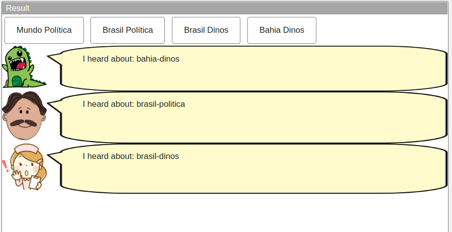
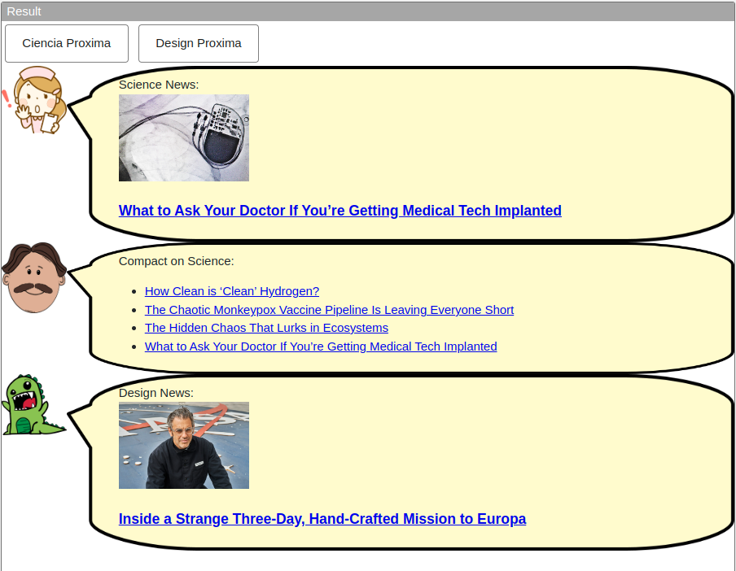
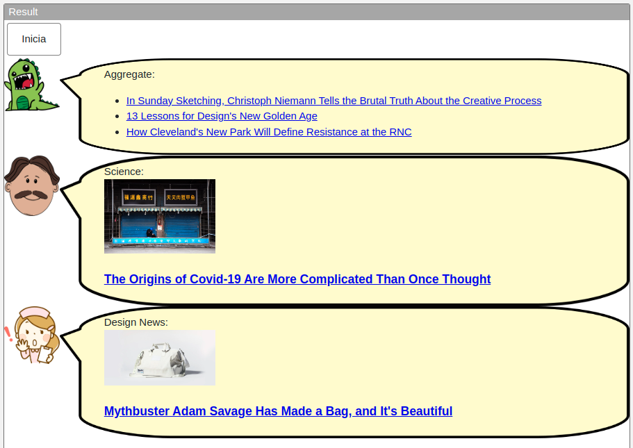
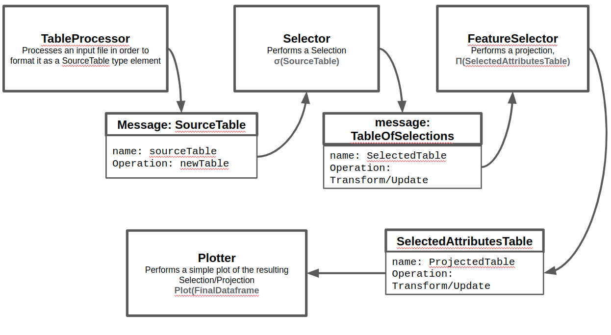

# Lab01 - Estilos Arquiteturais

Estrutura de pastas:

~~~
├── README.md  <- arquivo apresentando a tarefa
│
└── images     <- arquivos de imagens usadas no documento
~~~

# Aluno
* `Daniel Pinheiro Cunha` (ex164437)

## Tarefa 1 - Web Components e Tópicos

> Escreva aqui o código da sua composição de componentes Web, como mostra o exemplo a seguir:

~~~html
<dcc-button label="Mundo Política" topic="noticia/mundo/politica" message="mundo-politica">
</dcc-button>

<dcc-button label="Brasil Política" topic="noticia/brasil/politica" message="brasil-politica">
</dcc-button>

<dcc-button label="Brasil Dinos" topic="noticia/brasil/dinos" message="brasil-dinos">
</dcc-button>

<dcc-button label="Bahia Dinos" topic="noticia/bahia/dinos" message="bahia-dinos">
</dcc-button>

<dcc-lively-talk speech="I heard about: " subscribe="#/+:speech">
  </dcc-lively-talk>

<dcc-lively-talk character="https://harena-lab.github.io/harena-docs/dccs/tutorial/images/doctor.png" speech="I heard about: " subscribe="#/politica:speech">
  </dcc-lively-talk>

<dcc-lively-talk character="https://harena-lab.github.io/harena-docs/dccs/tutorial/images/nurse.png" speech="I heard about: " subscribe="noticia/brasil/+:speech">
</dcc-lively-talk>

~~~

> Acrescente uma imagem da composição em funcionamento, como o exemplo a seguir:

## Tarefa 2 - Web Components e RSS

~~~html
<dcc-rss source="https://www.wired.com/category/science/feed" subscribe="next/science:next" topic="rss/science">
</dcc-rss>

<dcc-button label="Ciencia Proxima" topic="next/science">
</dcc-button>

<dcc-rss source="https://www.wired.com/category/design/feed" subscribe="next/design:next" topic="rss/design">
</dcc-rss>

<dcc-button label="Design Proxima" topic="next/design">
</dcc-button>

<dcc-aggregator topic="aggregate/science" quantity="4" subscribe="rss/science">
</dcc-aggregator>

<dcc-lively-talk character="https://harena-lab.github.io/harena-docs/dccs/tutorial/images/nurse.png" speech="Science News: " subscribe="rss/science:speech">
</dcc-lively-talk>

<dcc-lively-talk character="https://harena-lab.github.io/harena-docs/dccs/tutorial/images/doctor.png" speech="Compact on Science: " subscribe="aggregate/science:speech">
</dcc-lively-talk>

<dcc-lively-talk speech="Design News: " subscribe="rss/design:speech" speech="Design: News: ">
  </dcc-lively-talk>

~~~
> Acrescente uma imagem da composição em funcionamento, como o exemplo a seguir:

## Tarefa 3 - Painéis de Mensagens com Timer

~~~html
<dcc-rss source="https://www.wired.com/category/science/feed" subscribe="next/science:next" topic="rss/science">
</dcc-rss>

<dcc-rss source="https://www.wired.com/category/design/feed" subscribe="next/design:next" topic="rss/design">
</dcc-rss>

<dcc-button label="Inicia" topic="start/timer">
</dcc-button>

<dcc-timer cycles="10" interval="2000" topic="next/design" subscribe="start/timer:start">
</dcc-timer>

<dcc-timer cycles="10" interval="1000" topic="next/science" subscribe="start/timer:start">
</dcc-timer>

<dcc-timer cycles="10" interval="2000" topic="aggregate/rss" subscribe="start/timer:start">
</dcc-timer>

<dcc-aggregator topic="aggregate/news" quantity="3" subscribe="rss/#">
</dcc-aggregator>

<dcc-lively-talk speech="Aggregate: " subscribe="aggregate/news:speech">
  </dcc-lively-talk>

<dcc-lively-talk character="https://harena-lab.github.io/harena-docs/dccs/tutorial/images/doctor.png" speech="Science: " subscribe="rss/science:speech">
</dcc-lively-talk>

<dcc-lively-talk character="https://harena-lab.github.io/harena-docs/dccs/tutorial/images/nurse.png" speech="Design News: " subscribe="rss/design:speech">
</dcc-lively-talk>

~~~
> Acrescente uma imagem da composição em funcionamento, como o exemplo a seguir:

## Tarefa 4 - Web Components Dataflow
> 
>
> Os componentes podem ser considerados intercambiáveis neste caso, pois o tipo da mensagem que entra e sai de cada componente é do mesmo tipo, ou seja, uma tabela. A intercambiabilidade de componentes está fortemente associada aos tipos de entrada e saída de cada componente. Neste caso, todos são tabelas, até a entrada do último componente(Plotter)
