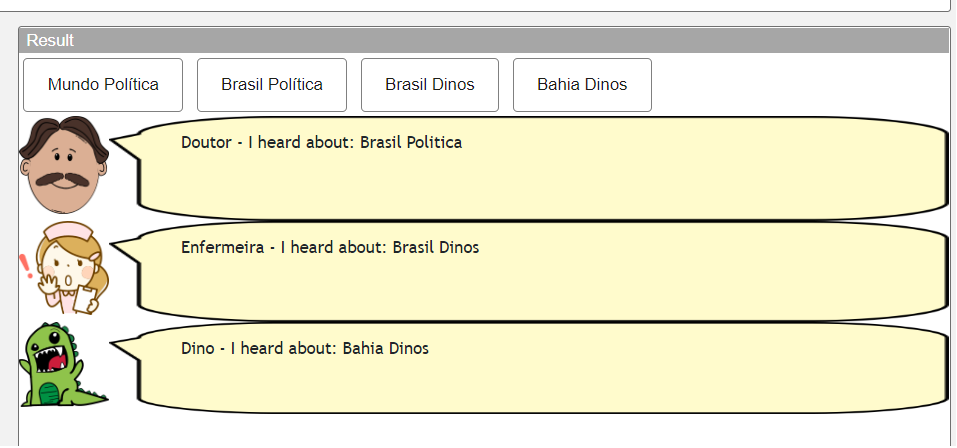
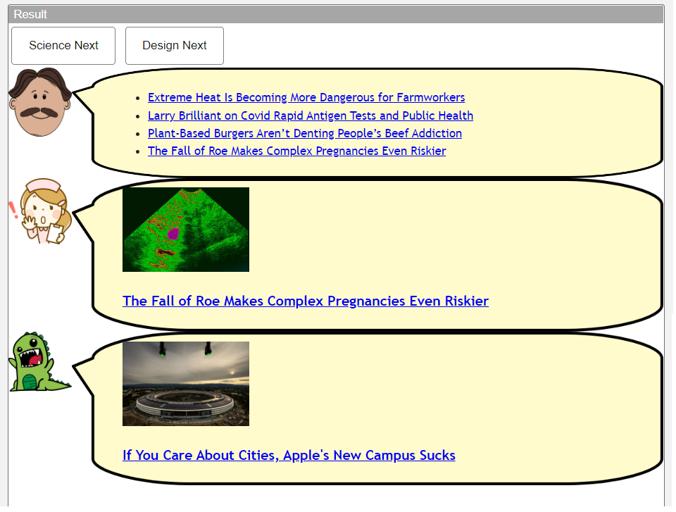
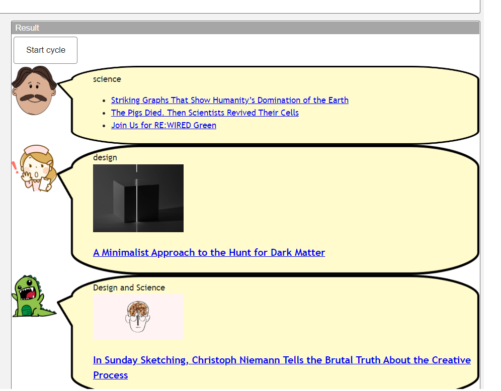

# Modelo para Apresentação do Lab01 - Estilos Arquiteturais

Estrutura de pastas:

~~~
├── README.md  <- arquivo apresentando a tarefa
│
└── images     <- arquivos de imagens usadas no documento
~~~

# Aluno
* `Rafael Gonçalves Vastag - RG: 52107309-1`

## Tarefa 1 - Web Components e Tópicos

> Escreva aqui o código da sua composição de componentes Web, como mostra o exemplo a seguir:

~~~html
<dcc-button label="Mundo Política" topic="noticia/mundo/politica" message="Mundo Politica">
</dcc-button>

<dcc-button label="Brasil Política" topic="noticia/brasil/politica" message="Brasil Politica">
</dcc-button>

<dcc-button label="Brasil Dinos" topic="noticia/brasil/dinos" message="Brasil Dinos">
</dcc-button>

<dcc-button label="Bahia Dinos" topic="noticia/bahia/dinos" message="Bahia Dinos">
</dcc-button>

<dcc-lively-talk character="https://harena-lab.github.io/harena-docs/dccs/tutorial/images/doctor.png" speech="Doutor - I heard about: " subscribe="#/politica:speech">
</dcc-lively-talk>

<dcc-lively-talk character="https://harena-lab.github.io/harena-docs/dccs/tutorial/images/nurse.png" speech="Enfermeira - I heard about: " subscribe="#/brasil/#:speech">
</dcc-lively-talk>

<dcc-lively-talk speech="Dino - I heard about: " subscribe="noticia/#:speech">
</dcc-lively-talk>
~~~

> Acrescente uma imagem da composição em funcionamento, como o exemplo a seguir:

## Tarefa 2 - Web Components e RSS
~~~html
<dcc-rss source="https://www.wired.com/category/science/feed" topic="science" subscribe="next/science/rss:next"></dcc-rss>
<dcc-rss source="https://www.wired.com/category/design/feed"  topic="design" subscribe="next/design/rss:next"></dcc-rss>

<dcc-aggregator topic="aggregate/science" quantity="4" subscribe="science"></dcc-aggregator>

<dcc-button label="Science Next" topic="next/science/rss"></dcc-button>
<dcc-button label="Design Next" topic="next/design/rss"></dcc-button>

<dcc-lively-talk character="https://harena-lab.github.io/harena-docs/dccs/tutorial/images/doctor.png" 
      subscribe="aggregate/science:speech">
</dcc-lively-talk>

<dcc-lively-talk character="https://harena-lab.github.io/harena-docs/dccs/tutorial/images/nurse.png"
      subscribe="science:speech">
</dcc-lively-talk>
<dcc-lively-talk subscribe="design:speech"></dcc-lively-talk>
~~~~

## Tarefa 3 - Painéis de Mensagens com Timer

~~~html
<dcc-rss source="https://www.wired.com/category/science/feed" topic="science" subscribe="next-science:next"></dcc-rss>
<dcc-rss source="https://www.wired.com/category/design/feed"  topic="design" subscribe="next-design:next"></dcc-rss>

<dcc-aggregator topic="aggregate/all" quantity="3" subscribe="science"></dcc-aggregator>

<dcc-timer cycles="10" interval="1000" topic="next-science" subscribe="timer:start"></dcc-timer>
<dcc-timer cycles="10" interval="2000" topic="next-design" subscribe="timer:start"></dcc-timer>
<dcc-timer cycles="10" interval="2000" topic="#" subscribe="timer:start"></dcc-timer>

<dcc-button label="Start cycle" topic="timer"></dcc-button>

<dcc-lively-talk speech="science" character="https://harena-lab.github.io/harena-docs/dccs/tutorial/images/doctor.png" 
      subscribe="aggregate/all:speech">
</dcc-lively-talk>

<dcc-lively-talk speech="design" character="https://harena-lab.github.io/harena-docs/dccs/tutorial/images/nurse.png"
      subscribe="science:speech">
</dcc-lively-talk>
<dcc-lively-talk speech="Design and Science" subscribe="design:speech"></dcc-lively-talk>
~~~

## Tarefa 4 - Web Components Dataflow
> Imagem (`PNG`) do diagrama de componentes (veja exemplo abaixo).

>
> Escreva aqui o parágrafo de breve discussão.
