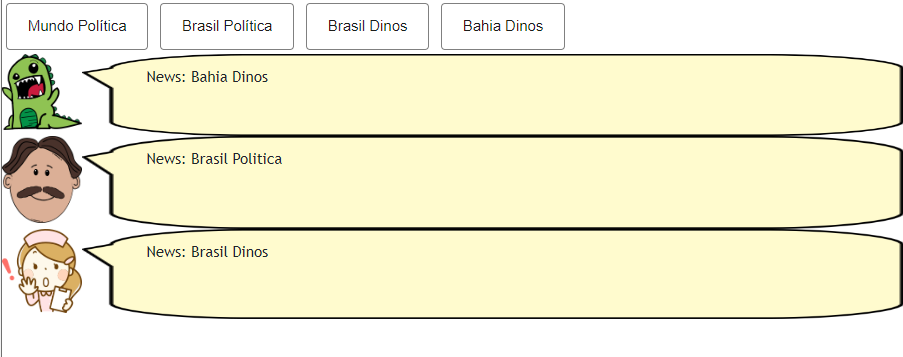
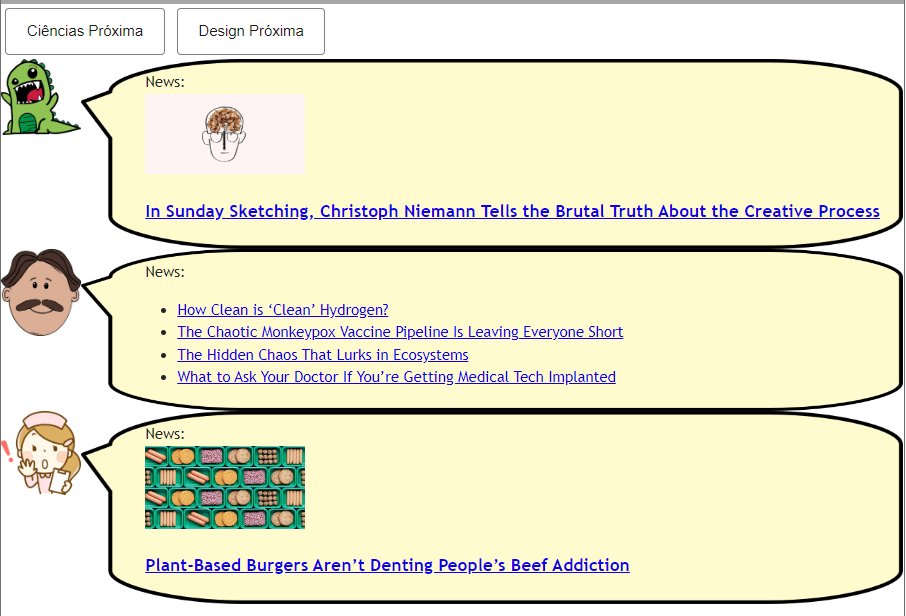
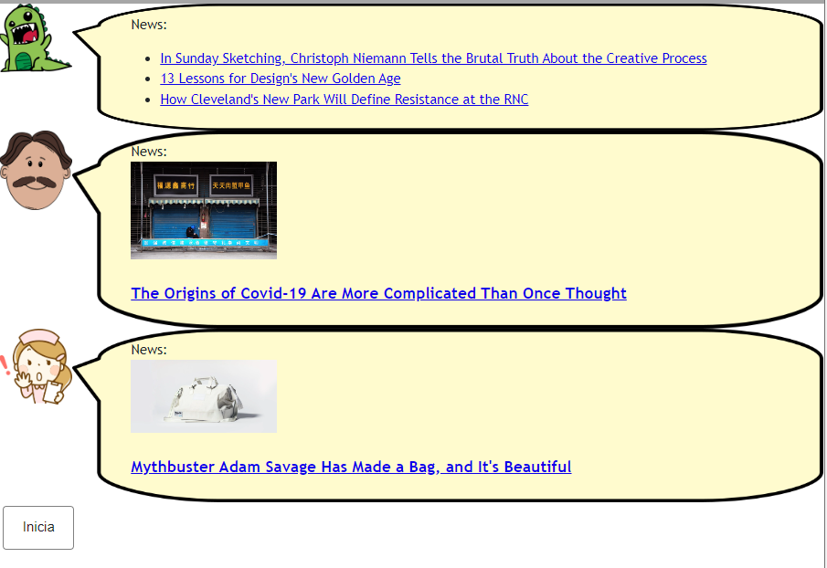
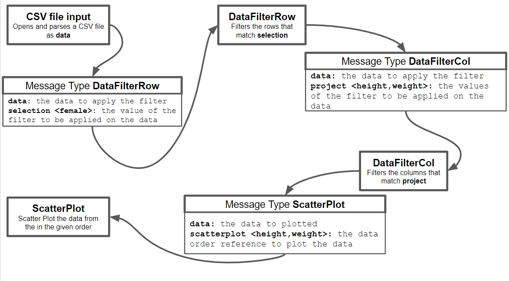

# Modelo para Apresentação do Lab01 - Estilos Arquiteturais

Estrutura de pastas:

~~~
├── README.md  <- arquivo apresentando a tarefa
│
└── images     <- arquivos de imagens usadas no documento
~~~

# Aluno
* `Raul Mendes de Souza`

## Tarefa 1 - Web Components e Tópicos

~~~html
<dcc-button label="Mundo Política" topic="noticia/mundo/politica" message="Mundo Politica"></dcc-button>
<dcc-button label="Brasil Política" topic="noticia/brasil/politica" message="Brasil Politica"></dcc-button>
<dcc-button label="Brasil Dinos" topic="noticia/brasil/dinos" message="Brasil Dinos"></dcc-button>
<dcc-button label="Bahia Dinos" topic="noticia/bahia/dinos" message="Bahia Dinos"></dcc-button>

<dcc-lively-talk speech="News: " subscribe="#:speech">
</dcc-lively-talk>

<dcc-lively-talk character="https://harena-lab.github.io/harena-docs/dccs/tutorial/images/doctor.png" speech="News: " subscribe="+/+/politica:speech">
</dcc-lively-talk>

<dcc-lively-talk character="https://harena-lab.github.io/harena-docs/dccs/tutorial/images/nurse.png" speech="News: " subscribe="+/brasil/+:speech">
</dcc-lively-talk>
~~~

## Tarefa 2 - Web Components e RSS
~~~html
<dcc-button label="Mundo Política" topic="noticia/mundo/politica" message="Mundo Politica"></dcc-button>
<dcc-button label="Brasil Política" topic="noticia/brasil/politica" message="Brasil Politica"></dcc-button>
<dcc-button label="Brasil Dinos" topic="noticia/brasil/dinos" message="Brasil Dinos"></dcc-button>
<dcc-button label="Bahia Dinos" topic="noticia/bahia/dinos" message="Bahia Dinos"></dcc-button>

<dcc-lively-talk speech="News: " subscribe="#:speech">
</dcc-lively-talk>

<dcc-lively-talk character="https://harena-lab.github.io/harena-docs/dccs/tutorial/images/doctor.png" speech="News: " subscribe="+/+/politica:speech">
</dcc-lively-talk>

<dcc-lively-talk character="https://harena-lab.github.io/harena-docs/dccs/tutorial/images/nurse.png" speech="News: " subscribe="+/brasil/+:speech">
</dcc-lively-talk>
~~~

## Tarefa 3 - Painéis de Mensagens com Timer
~~~html
<dcc-rss
  source="https://www.wired.com/category/science/feed"
  subscribe="next/rss/science:next"
  topic="rss/science">
</dcc-rss>

<dcc-rss
  source="https://www.wired.com/category/design/feed"
  subscribe="next/rss/design:next"
  topic="rss/design">
</dcc-rss>

<dcc-aggregator
  topic="aggregate/any"
  quantity="3"
  subscribe="rss/+">
</dcc-aggregator>

<dcc-lively-talk
  speech="News: "
  subscribe="aggregate/any:speech">
</dcc-lively-talk>

<dcc-lively-talk
  character="https://harena-lab.github.io/harena-docs/dccs/tutorial/images/doctor.png"
  speech="News: "
  subscribe="rss/science:speech">
</dcc-lively-talk>

<dcc-lively-talk
  character="https://harena-lab.github.io/harena-docs/dccs/tutorial/images/nurse.png"
  speech="News: "
  subscribe="rss/design:speech">
</dcc-lively-talk>

<dcc-timer
  cycles="10"
  interval="1000"
  topic="next/rss/science"
  subscribe="start/feed:start">
</dcc-timer>

<dcc-timer
  cycles="10"
  interval="2000"
  topic="next/rss/design"
  subscribe="start/feed:start">
</dcc-timer>

<dcc-timer
  cycles="10"
  interval="2000"
  topic="next/aggregate/any"
  subscribe="start/feed:start">
</dcc-timer>

<dcc-button
  label="Inicia"
  topic="start/feed">
</dcc-button>
~~~

## Tarefa 4 - Web Components Dataflow

~~~ raw
A interface está organizada pela distribuição de componentes que trabalham com 'data'. Portanto, a ordem apresentada no diagrama não é mandatória para que o objetivo
seja atingido. Filtros podem ser alterados, outros formatos de entrada de dados podem ser adicionados caso exportem os dados como 'data' e outras projeções que
aceitem 'data' podem ser utilizadas.
CSV file input realiza o parseamento de um arquivo CSV e exporta seus dados como 'data'. 
DataFilterRow é um componente que recebe e exporta 'data' após filtrar as linhas de acordo com o valor de 'selection'. 
DataFilterCol é um componente que recebe e exporta 'data' após filtrar as colunas de acordo com o valor de 'project'. 
ScatterPlot cria um gráfico de dispersão com 'data' de acordo com os valores indicados em 'scatterplot'.
~~~
