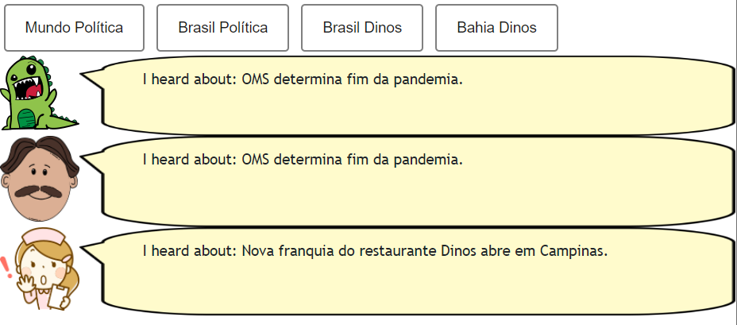
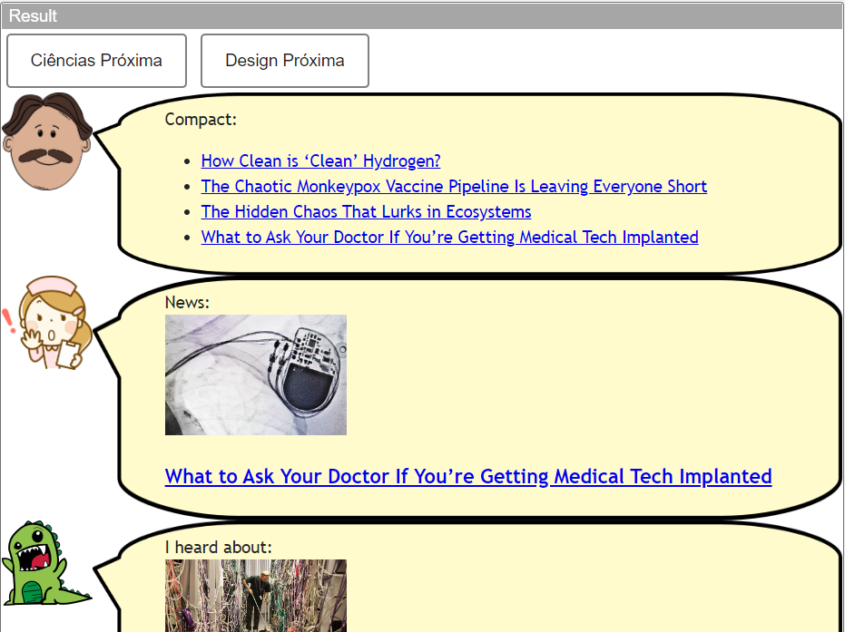
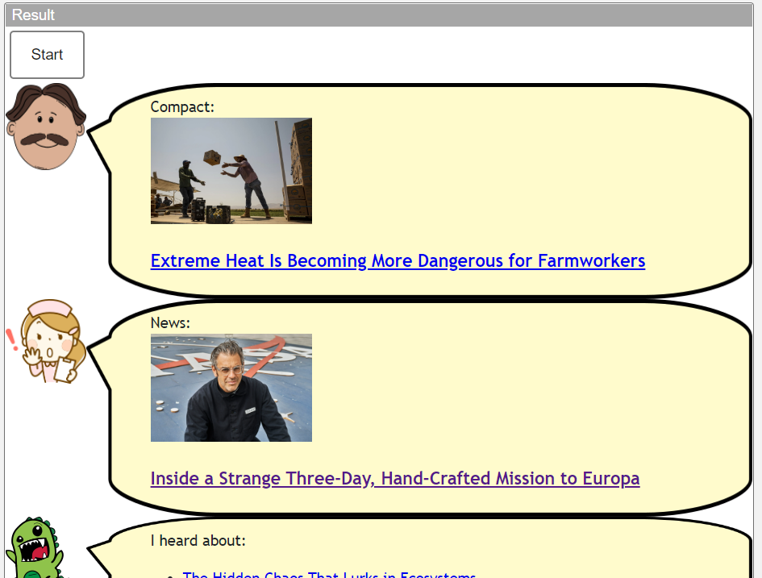
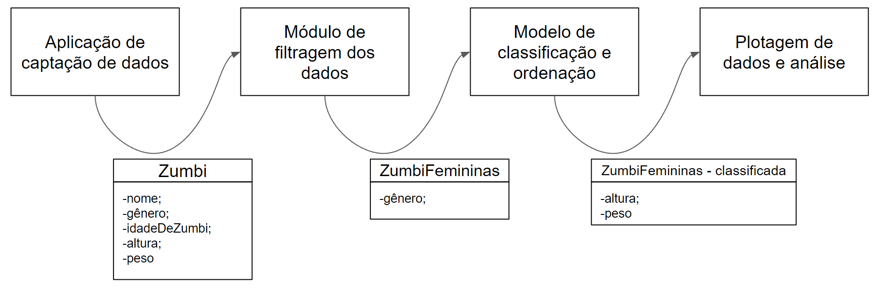

# Modelo para Apresentação do Lab01 - Estilos Arquiteturais

Estrutura de pastas:

~~~
├── README.md  <- arquivo apresentando a tarefa
│
└── images     <- arquivos de imagens usadas no documento
~~~

# Aluno
* `Thiago Silva de Souza`

## Tarefa 1 - Web Components e Tópicos

~~~html
<dcc-button label="Mundo Política" topic="noticia/mundo/politica" message="OMS determina fim da pandemia."></dcc-button>

<dcc-button label="Brasil Política" topic="noticia/brasil/politica" message="Bolsonaro perde eleições no 1º turno."></dcc-button>

<dcc-button label="Brasil Dinos" topic="noticia/brasil/dinos" message="Nova franquia do restaurante Dinos abre em Campinas."></dcc-button>

<dcc-button label="Bahia Dinos" topic="noticia/bahia/dinos" message="Restaurante Dinos lança prato de acarajé."></dcc-button>

<dcc-lively-talk speech="I heard about: " subscribe="noticia/#:speech"></dcc-lively-talk>

<dcc-lively-talk character="https://harena-lab.github.io/harena-docs/dccs/tutorial/images/doctor.png" speech="I heard about: " subscribe="+/+/politica:speech"></dcc-lively-talk>

<dcc-lively-talk character="https://harena-lab.github.io/harena-docs/dccs/tutorial/images/nurse.png" speech="I heard about: " subscribe="+/brasil/#:speech"></dcc-lively-talk>
~~~

## Tarefa 2 - Web Components e RSS

~~~html
<dcc-rss source="https://www.wired.com/category/science/feed" subscribe="next/science/rss:next" topic="rss/science"></dcc-rss>

<dcc-rss source="https://www.wired.com/category/design/feed" subscribe="next/design/rss:next" topic="rss/design"></dcc-rss>

<dcc-aggregator topic="aggregate/science" quantity="4" subscribe="rss/science"></dcc-aggregator>

<dcc-button label="Ciências Próxima" topic="next/science/rss"></dcc-button>

<dcc-button label="Design Próxima" topic="next/design/rss"></dcc-button>

<dcc-lively-talk character="https://harena-lab.github.io/harena-docs/dccs/tutorial/images/doctor.png" speech="Compact: " subscribe="aggregate/science:speech"></dcc-lively-talk>

<dcc-lively-talk character="https://harena-lab.github.io/harena-docs/dccs/tutorial/images/nurse.png" speech="News: " subscribe="rss/science:speech"></dcc-lively-talk>

<dcc-lively-talk speech="I heard about: " subscribe="rss/design:speech"></dcc-lively-talk>
~~~

## Tarefa 3 - Painéis de Mensagens com Timer

~~~html
<dcc-rss source="https://www.wired.com/category/science/feed" subscribe="next/science:next" topic="rss/science"></dcc-rss>

<dcc-rss source="https://www.wired.com/category/design/feed" subscribe="next/design:next" topic="rss/design"></dcc-rss>

<dcc-aggregator topic="aggregate/news" quantity="3" subscribe="rss/#"></dcc-aggregator>

<dcc-timer cycles="10" interval="1000" topic="next/science" subscribe="start/timer:start"></dcc-timer>

<dcc-timer cycles="5" interval="2000" topic="next/design" subscribe="start/timer:start"></dcc-timer>

<dcc-button label="Start" topic="start/timer"></dcc-button>

<dcc-lively-talk character="https://harena-lab.github.io/harena-docs/dccs/tutorial/images/doctor.png" speech="Compact: " subscribe="rss/science:speech"></dcc-lively-talk>

<dcc-lively-talk character="https://harena-lab.github.io/harena-docs/dccs/tutorial/images/nurse.png" speech="News: " subscribe="rss/design:speech"></dcc-lively-talk>

<dcc-lively-talk speech="I heard about: " subscribe="aggregate/news:speech"></dcc-lively-talk>
~~~

## Tarefa 4 - Web Components Dataflow

> O ponto inicial da arquitetura é uma aplicação responsável por fazer a captação dos dados que serão futuramente classificados, nela os dados vem com diversos parâmetros. Com os dados em posse, um sistema de filtragem faz a separação destes dados, deixando somente os indivíduos do gênero feminino. Após a filtragem do gênero, os dados resultantes são inseridos no modelo de classificação. Após a classificação finalizada uma estrutura de dados será gerada, e poderá ser utilizada para inserção no módulo responsável pela plotagem e  análise dos dados retornados.
