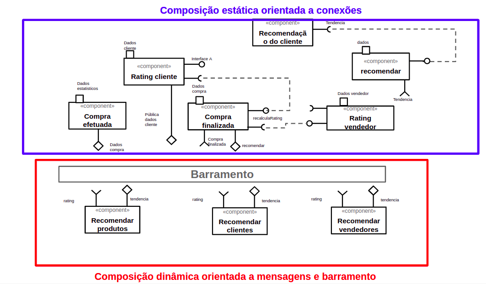

# Modelo para Apresentação do Lab01 - Estilos Arquiteturais

Estrutura de pastas:

~~~
├── README.md  <- arquivo apresentando a tarefa
│
└── images     <- arquivos de imagens usadas no documento
~~~

# Aluno
* `Flavia Machado Vilar`

## Tarefa 1 - Dados para Treinamento e Recomendação

> Coloque a lista de campos como itens e subitens, conforme exemplo a seguir:
>
### Treinamento
* Entidade Categoria
  * id
  * nome

* Entidade Subcategoria
  * id
  * categoria_id
  * nome  

* Entidade Produto
  * id
  * nome
  * categoria_id
  * subcategoria_id
  *rating

* Entidade tendencia
  * id
  * categoria_id
  * subcategoria_id
  * habiliada
  

### Recomendação
* Entidade Cliente
  * id
  * faixa_valor_preferida
  * perfil

* Entidade Compra
  * id
  * produtos
  * cliente_id
  
* Entidade Vendedor
  * id
  * rating
  * categorias
  * subcategorias
  * perfil

## Tarefa 2 - Breve descrição de Composições Dinâmica e Estática

> Escreva duas breves descrições, conforme exemplos a seguir:
>
### Composição Dinâmica
> A composição dinâmica incorpora o barramento de mensagem qu alimentará sob demanda as recomendações com base nas variações de tendêcia, rating do cliente e do vendedor. É formada pela troca de dados relacionados a venda, quando a compra é finalizada, é disparado efeitos para as recomendações e com isso de forma dinâmica novas recomendações são feitas com base no que foi recebido.
### Composição Estática
> Aqui vem a breve descrição.

## Tarefa 3 - Composição para Treinamento e Recomendação

> A composição estática tem a atribuição de interfaces de identificação do Cliente e Vendedor, analisando seus perfi e com isso é possivel entender qual serão as melhores indicaçoes.

>

