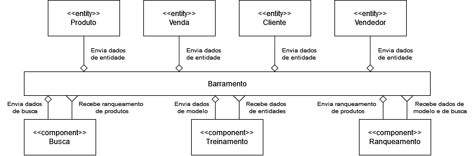

# Modelo para Apresentação do Lab01 - Estilos Arquiteturais

Estrutura de pastas:

~~~
├── README.md  <- arquivo apresentando a tarefa
│
└── images     <- arquivos de imagens usadas no documento
~~~

# Aluno
* `Allan Ferreira Fonseca`

## Tarefa 1 - Dados para Treinamento e Recomendação

> Coloque a lista de campos como itens e subitens, conforme exemplo a seguir:
>
### Treinamento
* Produto
  * Descrição
  * Preço
  * Estado
  * Cor
  * Marca
  * Tamanho
  * Classificação
* Venda
  * Produtos
  * Quantidade
  * Pagamento
  * Cupom
* Cliente
  * Sexo
  * Idade
  * Compras
* Vendedor
  * Status
  * Vendas
  * Classificação

### Recomendação
* Produto
  * Descrição
  * Preço
  * Estado
  * Cor
  * Marca
  * Tamanho
  * Classificação
* Venda
  * Produtos
  * Quantidade
  * Pagamento
  * Cupom
  * Frete
  * Prazo de entrega
* Cliente
  * Sexo
  * Idade
  * Compras
  * Endereço
  * Buscas
* Vendedor
  * Status
  * Vendas
  * Endereço
  * Classificação

## Tarefa 2 - Breve descrição de Composições Dinâmica e Estática

> Escreva duas breves descrições, conforme exemplos a seguir:
>
### Composição Dinâmica
O módulo de ranqueamento vai ser a porção dinâmica do sistema de recomendação pois recebe dados mais variados dependentes do perfil do consumidor que está sendo avaliado no ranqueamento.
### Composição Estática
O módulo de aprendizado contínuo será estático pois o conjunto de dados que utilizará para o aprendizado será estruturado da mesma maneira a cada iteração, assim como o seu output para o módulo de ranqueamento de uma maneira que dados individuais dos consumidores e produtos não devem ser.

## Tarefa 3 - Composição para Treinamento e Recomendação

> Coloque a imagem PNG do diagrama, conforme exemplo a seguir:
>

