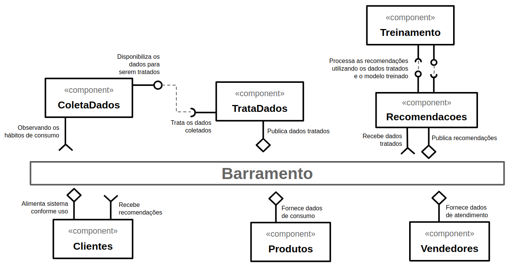

# Lab02 - Aprendizagem de Máquina no Brechó Online

Estrutura de pastas:

~~~
├── README.md  <- arquivo apresentando a tarefa
│
└── images     <- arquivos de imagens usadas no documento
~~~

# Aluno
* `Guilherme Pedrozo Abacherli`

## Tarefa 1 - Dados para Treinamento e Recomendação

> Coloque a lista de campos como itens e subitens, conforme exemplo a seguir:

### Treinamento
- Cliente
  - <ins>dataNascimento</ins>: (faixa etária, infantil, jovens, adultos, idosos, etc
  - <ins>genero</ins>: produtos preferidos por homens/mulheres
  - <ins>localizacao</ins>: historico de compra de habitantes da regiao, se for fria recomenda casacos, se for quente recomenda roupas de praia, etc

- Produto
  - <ins>avaliacao</ins>: se for muito mal avaliado não recomenda
  - <ins>preco</ins>: se o cliente está disposto a pagar mais ou menos
  - <ins>estado</ins>: se o cliente aceita produtos usados ou prefere novos
  - <ins>garantia</ins>: se o produto tem garantia ou não

- Vendedor
  - <ins>localizacao</ins>: se o vendedor está próximo do cliente
  - <ins>avaliacao</ins>: se o vendedor tem um bom histórico de atendimento
  - <ins>velocidadeEntrega</ins>: se prepara e entrega de rapidamente

### Recomendação
- Cliente
  - <ins>dataNascimento</ins>: (faixa etária, infantil, jovens, adultos, idosos, etc
  - <ins>genero</ins>: produtos preferidos por homens/mulheres
  - <ins>localizacao</ins>: historico de compra de habitantes da regiao, se for fria recomenda casacos, se for quente recomenda roupas de praia, etc

- Produto
  - <ins>avaliacao</ins>: se for muito mal avaliado não recomenda
  - <ins>preco</ins>: se o cliente está disposto a pagar mais ou menos
  - <ins>estado</ins>: se o cliente aceita produtos usados ou prefere novos
  - <ins>garantia</ins>: se o produto tem garantia ou não

- Vendedor
  - <ins>localizacao</ins>: se o vendedor está próximo do cliente
  - <ins>avaliacao</ins>: se o vendedor tem um bom histórico de atendimento
  - <ins>velocidadeEntrega</ins>: se prepara e entrega de rapidamente

## Tarefa 2 - Breve descrição de Composições Dinâmica e Estática

### Composição Dinâmica
> Os componentes de entrada, alimentação da aprendizagem, podem ser dinâmicos,
> pois a aprendizagem pode evoluir durante o tempo de vida do sistema, e estes sendo
> dinâmicos permitem que a aprendizagem permaneça atualizada, conforme novos campos surgem por exemplo.
> A coleta de dados pode ser dinâmica, pois os dados são fornecidos de forma assíncrona.
### Composição Estática
> Os componentes de saída seriam estáticos conforme as visualizações que o administrador
> do sistema deseja manter para as análises posteriores. A conexão das pipes pode ser mais estática, pois os dados são tratados de forma síncrona.

## Tarefa 3 - Composição para Treinamento e Recomendação

> Imagem PNG do diagrama:

