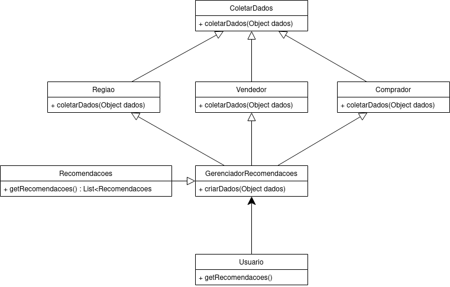

# Aluno
* `Alejandro Boidi Rico`

## Tarefa 1 - Dados para Treinamento e Recomendação

> Coloque a lista de campos como itens e subitens, conforme exemplo a seguir:
>
### Treinamento
* Produto
    - Range Preco
    - Regiao
    - tipo produto

* Comprador
    - Interesses
    - Preferencia com vendedor
    - Preço mínimo
    - Preço máximo

* Vendedor
    - Tipos de produtos
    - Regiao
    - Confiabilidade (score de vendas)

### Recomendação
* Regiao
    - Vendedor
    - Produto
    - Preco
* Produto
    - Categoria
    - Preco
    - Regiao
    - Vendedor

## Tarefa 2 - Breve descrição de Composições Dinâmica e Estática

> Escreva duas breves descrições, conforme exemplos a seguir:
>
A parte dinamica é backend. Em grande parte, tudo que envolve lógica, regras de negócio, I/O podem ser componentes a serem inseridos no sistemas através da interface comum que denomina apenas o objetivo, não "como fazer".
Estática é a camada mais alta, a que chega mais perto do usuário ou que determina o flow do sistema. Esta normalmente é mais difícil de se tornar dinamica já que controla fluxo ou o que imprime para usuário.

Dinamica: Treinamento do sistema, coleta de informações
Treinamento em si pode ser dinamico e o resultado final é estatica
Estatico: Recomendação é a forma final.

## Tarefa 3 - Composição para Treinamento e Recomendação

