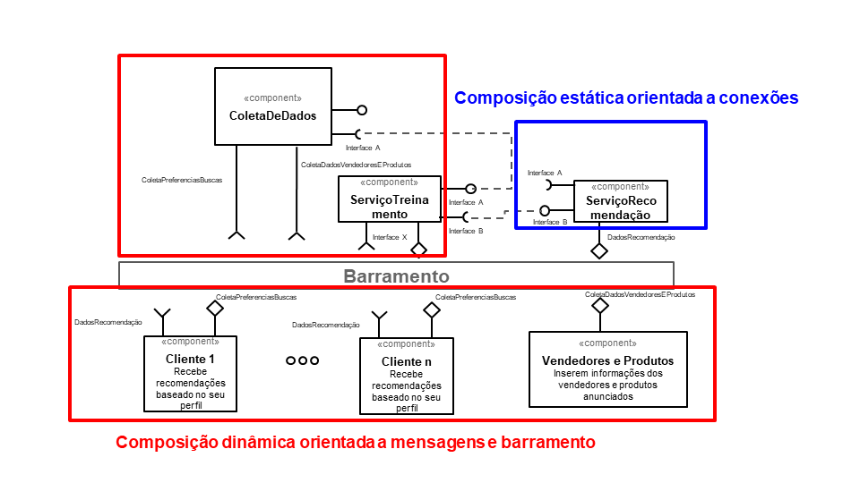

# Lab02- Estilos Arquiteturais

# Aluno
* `Giuliana Cirelli - RG 29.418.252-4`

## Tarefa 1 - Dados para Treinamento e Recomendação

> Coloque a lista de campos como itens e subitens, conforme exemplo a seguir:
>
### Treinamento
* Clinte
  * genero
  * gasto_ultimas_compras
  * idade
  * ultimas_buscas
  * score_bancario
  * localização (pais, estado e município)
  
* Produto
  * avaliação
  * valor
  * quantidade_vendida
  * perfil_comprador
  
* Vendedor
  * avaliação/qualificação
  * perfil_do_vendedor
  * quantidade_vendas_realizadas
  * localização (pais, estado e município)
  
### Recomendação 
* Produto
  * mais_vistos
  * mais_procurados
  * promoções
  
* Vendedor
  * mais_proximo_do_cliente
  
## Tarefa 2 - Breve descrição de Composições Dinâmica e Estática

> Escreva duas breves descrições, conforme exemplos a seguir:
>
### Composição Dinâmica

Os serviços de treinamento são dinâmicos, pois a avaliação dos produtos, dos vendedores, o modelo usado (árvore de decisão, redes neurais, etc) pode ser visto como uma caixa preta e muda constantemente.

### Composição Estática

Os serviços de recomendações são estáticos, pois a coleta de dados, o tratamento de dados usados para o ranqueamento precisa de uma estabilidade, não podem mudar o tempo todo.

## Tarefa 3 - Composição para Treinamento e Recomendação

