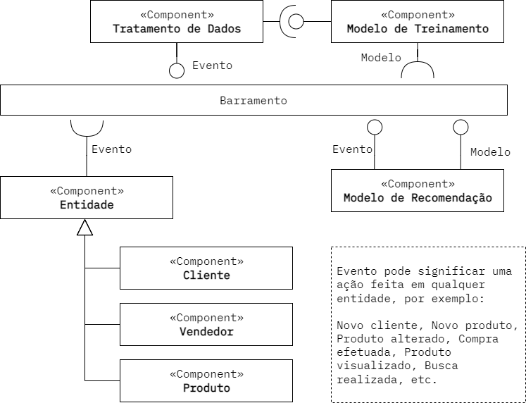

# Aluno
* Tulio Bassaco Bustos

## Tarefa 1 - Dados para Treinamento e Recomendação

### Treinamento
* Comprador
  * Origem do acesso
  * Buscas realizadas
  * Gênero
  * Localização
  * Data de Nascimento
  * Valor médio dos produtos comprados
* Produto
  * Nome
  * Categoria
  * Avaliação média
  * Preço
  * Quantidade vendida
* Loja/Vendedor
  * Localização
  * Avaliação média
  * Quantidade de vendas

### Recomendação
* Comprador
  * Origem do acesso
  * Buscas realizadas
  * Gênero
  * Localização
  * Data de Nascimento
  * Valor médio dos produtos comprados
* Produto
  * Nome
  * Categoria
  * Avaliação média
  * Preço
  * Quantidade vendida
* Loja/Vendedor
  * Localização
  * Avaliação média
  * Quantidade de vendas

## Tarefa 2 - Breve descrição de Composições Dinâmica e Estática

### Composição Dinâmica

* Métricas utilizadas - buscas feitas na plataforma, origem do acesso do cliente à plataforma, etc.
* Dados da plataforma - Novos clientes/lojas/produtos entram e saem da plataforma a todo momento.
* Árvore de categorias de produtos.
* Campanhas e promoções.

### Composição Estática

* Geração de dados de métrica, os cálculos não precisam ser alterados, e portanto podem ser estáticos.
* A própria plataforma, referente à sua arquitetura e interface gráfica.

## Tarefa 3 - Composição para Treinamento e Recomendação

