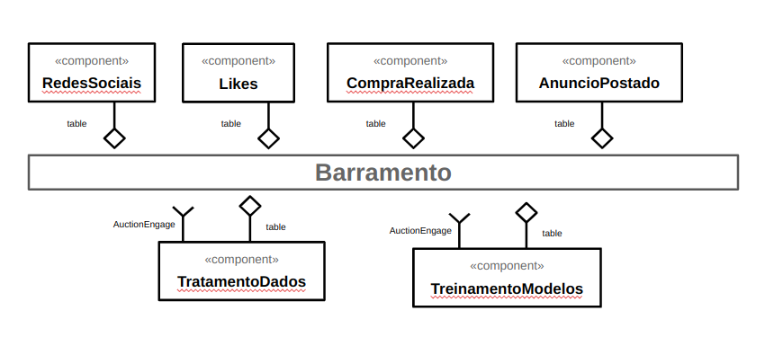

# Modelo para Apresentação do Lab01 - Estilos Arquiteturais

# Aluno
* `Caio Volpato`

## Tarefa 1 - Dados para Treinamento e Recomendação

> Coloque a lista de campos como itens e subitens, conforme exemplo a seguir:
>
### Treinamento

* Entidade produto
  * campo carinho
  * campo genero_comprador
  * campo idade_comprador
  * campo localizacao_comprador
  * campo compras_anteriores_comprador
  * campo data
* Entidade desconto
  * campo comprador
  * campo data
  * campo localização
  * campo quantidade

### Recomendação

* Entidade produto
  * campo carinho
  * campo genero_comprador
  * campo idade_comprador
  * campo localizacao_comprador
  * campo compras_anteriores_comprador
  * campo data
* Entidade desconto
  * campo comprador
  * campo data
  * campo localização
  * campo quantidade

## Tarefa 2 - Breve descrição de Composições Dinâmica e Estática

> Escreva duas breves descrições, conforme exemplos a seguir:

### Composição Dinâmica

> Mensagens trocadas entre usuários deve ser modeladas de forma dinâmica pois as mesmas são geradas a qualquer momento, de forma assíncrona.
> Similarmente os likes em produtos se comporta da mesma forma.

### Composição Estática

> Processo de treinamento dos modelos preditivos deve ser feita de forma estática, pois pode ser feita de forma periódica com os dados mais recentes.
> Similarmente o processo de geração de métricas e dashboards tem o mesmo tratamento.

## Tarefa 3 - Composição para Treinamento e Recomendação

