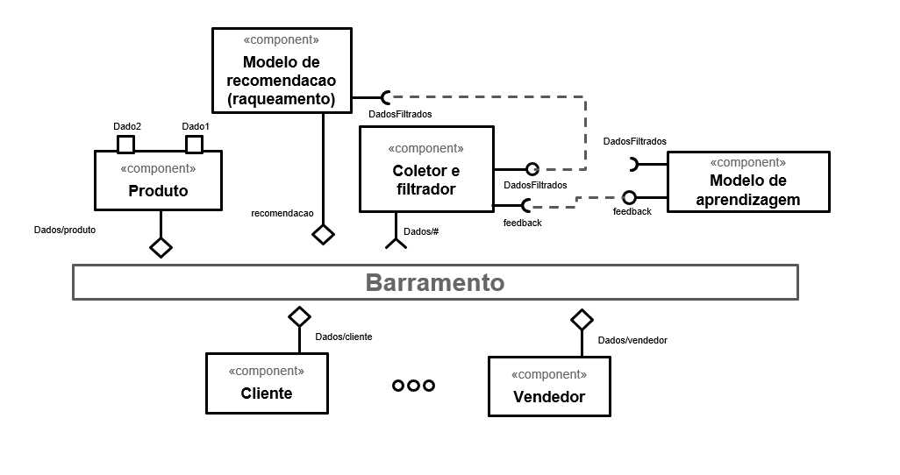

# Modelo para Apresentação do Lab01 - Estilos Arquiteturais

# Aluno
* `Gabriel Teixeira Callado - RG 45.022.276-7`

## Tarefa 1 - Dados para Treinamento e Recomendação

> Coloque a lista de campos como itens e subitens, conforme exemplo a seguir:
>
### Treinamento do módulo de aprendizagem constante:

Acredito que as três entidades principais são cliente, vendedor e o produto deste vendedor. Levantei os campos pertinentes de cada entidade que poderiam ser usados para o treinamento por serem fatores que afetam a escolha de compra do usuário - e, portanto, deveriam afetar o modelo de recomendação.

* Entidade cliente
  * endereço (clientes de mesmo local devem ter algum tipo de similaridade de gosto)
  * sexo
  * idade
  * histórico de compras

* Entidade vendedor
  * endereço (relevante para o frete - vendedor mais perto do cliente tende a vender mais por ser mais barato)
  * histórico de vendas

*   Entidade produto
  * categoria
  * preço
  * cor
  * marca
  * nome
  * qtde de vendas
  * avaliação geral

### Recomendação

Para a recomendação, temos como input o cliente. Deste modo, temos apenas esta entidade mas com diversos campos:

* Entidade cliente
  * endereço (clientes de mesmo local devem ter algum tipo de similaridade de gosto)
  * sexo
  * idade
  * histórico de compras

## Tarefa 2 - Breve descrição de Composições Dinâmica e Estática

Os componentes são para o treinamento e a recomendação são:
* Dados das entidades cliente + vendedor + produto (dinâmico) 
* coletor e filtrador (estático)  -> uma caixinha para cada
* camadas de modelos (estático) -> uma caixinha para cada
* ranqueamento (estático)

> Escreva duas breves descrições, conforme exemplos a seguir:
>
### Composição Dinâmica
> Acredito que os dados das entidades cliente + vendedor + produto devem ser dinâmicos pois podem ser inseridos, trocados ou excluídos à qualquer momento.
### Composição Estática
> Acredito que a parte de ranquemaneto deve ser estática pois, independente do que ocorre com os componentes anteriores, ela deve existir e ranquear as opções das recomendações pros usuários.

## Tarefa 3 - Composição para Treinamento e Recomendação

> Diagrama:
>

