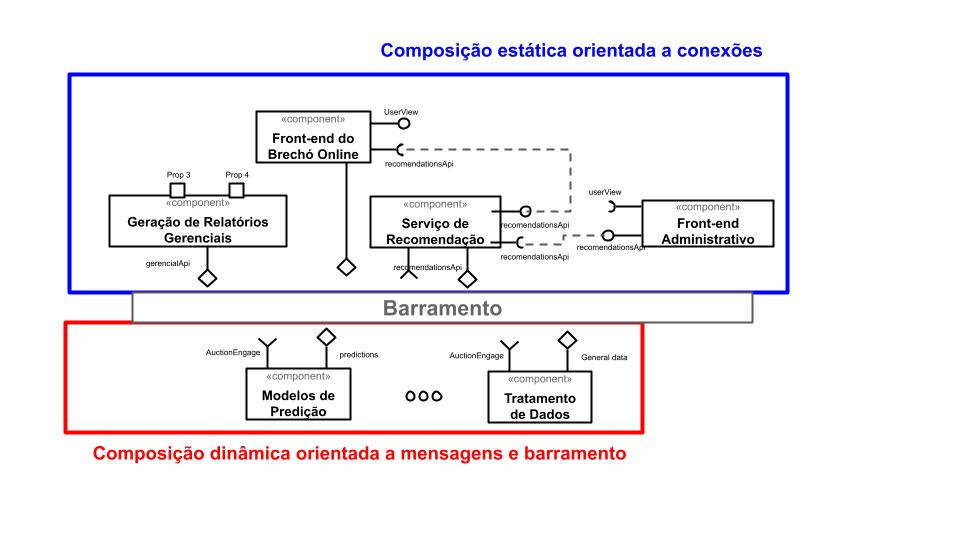

# Modelo para Apresentação do Lab01 - Estilos Arquiteturais

Estrutura de pastas:

~~~
├── README.md  <- arquivo apresentando a tarefa
│
└── images     <- arquivos de imagens usadas no documento
~~~

# Aluno
* `Claudio Augusto Pereira Rolim`

## Tarefa 1 - Dados para Treinamento e Recomendação

> Coloque a lista de campos como itens e subitens, conforme exemplo a seguir:
>
### Treinamento
* Comprador
    * id
    * produtos comprados
    * valor dos produtos comprados
    

* Vendedor 
    * id
    * produtos vendidos
    * valor dos produtos vendidos
    * tempo para ser vendidos
    * número de visualizações por produto

* Produtos 
    * id
    * valor
    * número de visualizaçãoes
    * tempo para ser vendido
    * produtos nunca comprados
    

### Recomendação

* Produtos
    * visualizações
    * perfil dos usuários que visualiza
    * cruzamento de perfil entre os usuários que visualizam
    * compras
    * perfil dos usuários que compram
    * cruzamento de perfil que entre usuários que compram 
    
* Lista de favoritos
    * produtos favoritados
    * preços dos produtos favoritados
    * perfil dos usuários que favoritam
    

## Tarefa 2 - Breve descrição de Composições Dinâmica e Estática

> Escreva duas breves descrições, conforme exemplos a seguir:
>
### Composição Dinâmica

> Produtos comprados e produtos precisam se combinar de forma dinâmica porque são dados que são modificados constantamente e só se mantém relevantes se também forem permitidos entrar e sair da composição a qualquer momento 

> O Chat entre compradores e vendedores também devem compor a parte dos componentes que são representados de forma dinâmica, pelos os mesmos motivos apresentados acima

### Composição Estática    

> A geração de relatórios é um processo em que componentes se combinam de forma estática, porque obedece um roteiro pré-definido baseados em pré-requisitos definidos previamente pela gerência do brechó

> Similarmente os componentes que forem integrados diretamente com uma interface de usuários finais (não especializados no modelo, como analistas administrativos) também deve ter composição estática, porque serão previamente definidos e uma forma que faça sentido para estes usuários não especializados

## Tarefa 3 - Composição para Treinamento e Recomendação

> Coloque a imagem PNG do diagrama, conforme exemplo a seguir:
>
