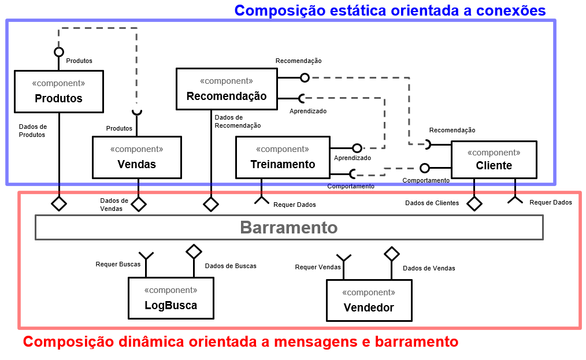

# Modelo para Apresentação do Lab02 - Aprendizagem de Máquina no Brechó Online

Estrutura de pastas:

~~~
├── README.md  <- arquivo apresentando a tarefa
│
└── images     <- arquivos de imagens usadas no documento
~~~

# Aluno
* `Daniel Francisco Ferreira Lopes`

## Tarefa 1 - Dados para Treinamento e Recomendação

> Coloque a lista de campos como itens e subitens, conforme exemplo a seguir:
>
### Treinamento
* Cliente
  * idade
  * genero
  * interesses
  * ultimosAcessos
  * regiao
* Venda
  * produto
  * quantidade
  * preco
* LogBusca
  * descricao
  * data

### Recomendação
* Produto
  * descricao
  * categoria
  * valor
  * marca
  * estadoProduto

* Vendedor
  * maisVendidos
  * nicho

## Tarefa 2 - Breve descrição de Composições Dinâmica e Estática

> Escreva duas breves descrições, conforme exemplos a seguir:
>
### Composição Dinâmica
> Os componentes dinâmicos são compostos por Vendedor, LogBusca. Visto que seus atributos não são necessariamente essenciais para a aprendizagem e recomendação de produtos à clientes. Um Vendedor pode vender diversos tipos de produtos e não pertencer a um nicho especifico de interesse do cliente. O LogBusca pode apresentar interesses situacionais do cliente.
### Composição Estática
> Os componentes estáticos são compostos por Produto, Cliente e Venda. Visto que Produto e Cliente possuem atributos essenciais para apredizagem e recomendação dos produto e sem os dados da compra finalizada é dificil definir um perfil do que realmente o Cliente tem comprado.

## Tarefa 3 - Composição para Treinamento e Recomendação

> Coloque a imagem PNG do diagrama, conforme exemplo a seguir:
>

