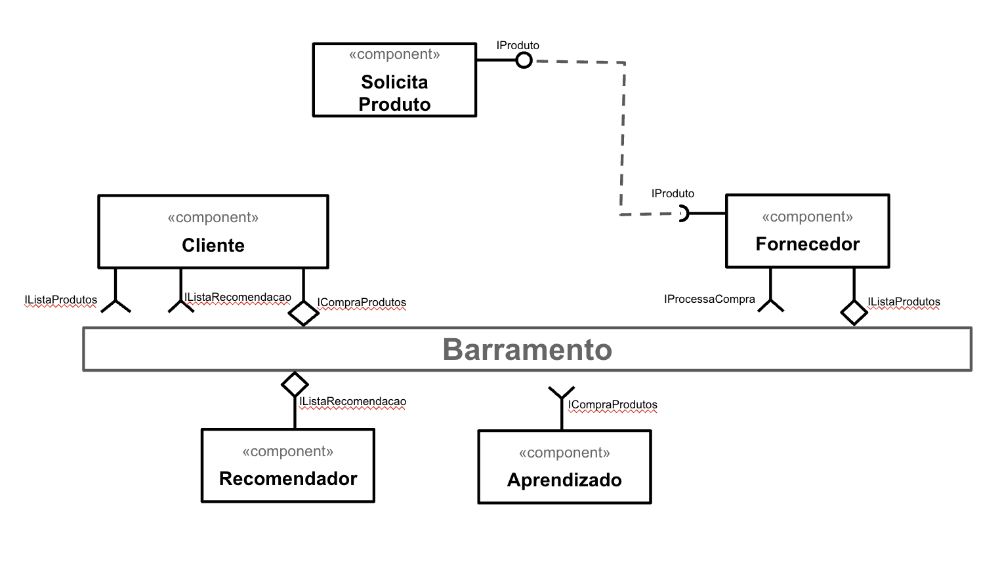

# Aluno

* Edivilson França - RG: 35.165.045-3

## Tarefa 1 - Dados para Treinamento e Recomendação

### Treinamento

* Produto
  * nome
  * descrição
  * estadoProduto
  * valor
  * quantidade
  * prazoEntrega
  * valorFrete
  * formasPagamento

* Cliente
  * nome
  * idade
  * cidade
  * estado
  * sexo

* Fornecedor
  * nome
  * cidade
  * estado
  * avaliação

### Recomendação

* Recomendador
  * nomeProduto
  * cidadeCliente
  * estadoCliente
  * sexoCliente
  * idadeCliente

* Aprendizado
  * nomeProduto
  * cidadeCliente
  * estadoCliente
  * sexoCliente
  * idadeCliente

## Tarefa 2 - Breve descrição de Composições Dinâmica e Estática

### Composição Dinâmica

> Como composição dinâmica foi considerado uma visão em escala de alto nível onde cada componente pode ser considerado vários clientes e vários fornecedores consumindo um único barramento, dessa forma temos clientes e fornecedores entrando e saindo dinamicamente do barramento.

### Composição Estática

> Como composição estática foi considerado a visão de um modelo em uma escala um pouco mais detalhada onde se tem componentes sendo considerados como módulo, dessa forma temos a representação de modo estático do modelo sendo necessário cada um dos blocos informados sem a possibilidade de alterações.

## Tarefa 3 - Composição para Treinamento e Recomendação

