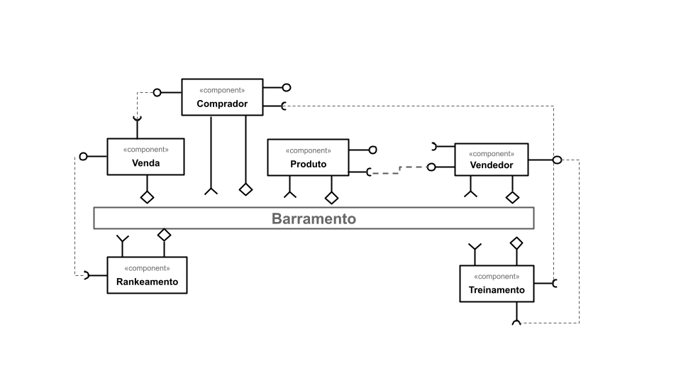

# Modelo para Apresentação do Lab01 - Estilos Arquiteturais

Estrutura de pastas:

~~~
├── README.md  <- arquivo apresentando a tarefa
│
└── images     <- arquivos de imagens usadas no documento
~~~

# Aluno
* `Estevan Luis Gregori`

## Tarefa 1 - Dados para Treinamento e Recomendação

### Treinamento
* Entidade Comprador
  * campo tipos de itens visitados
  * campo tipos de produtos comprados
  * campo endereço
  * campo idade
  * campo sexo
  * campo estado civil
  * campo média de preços dos produtos comprados
  * campo itens presentes no carrinho

* Entidade Vendedor
  * campo tipos de produtos comercializados
  * campo endereço
  * campo quantidade de produtos vendidas
  * campo tempo desde cadastro na plataforma
  * campo média de satisfação dos clientes

### Recomendação
* Entidade Produto
  * campo tipo do produto
  * campo Vendedor
  * campo valor unitário
  * campo desconto
  * campo qtd de iterações de clientes (likes, comentários, marcações de favoritos)
  * campo de data de postagem da publicação do produto
  * campo frete

* Entidade Venda
  * campo tipo de produto vendido
  * campo data
  * campo Comprador
  * valor da venda

## Tarefa 2 - Breve descrição de Composições Dinâmica e Estática

### Composição Dinâmica
> A parte que representa as iterações do cliente sobre um produto pode ser modelada como uma parte dinâmica já que elas são 
>registradas de forma assíncrona e de várias fontes diferentes (likes, favoritos, comentários, acessos, presença no carrinho, etc). 
### Composição Estática
> Já na parte estática podemos especificar informações obtidas de uma venda que irá alimentar o sistema de recomendações, já que 
>as informações devem ser registradas no ato da mesma.

## Tarefa 3 - Composição para Treinamento e Recomendação

