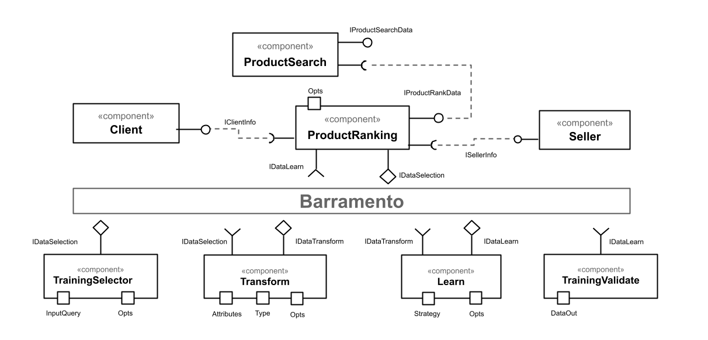

# Aluno
* `Guilherme Cavassan - RA: 2022601122`

## Tarefa 1 - Dados para Treinamento e Recomendação

### Treinamento
* Cliente
  * Data de nascimento
  * Sexo
  * Localização geogŕafica
* Produto
  * Nome
  * Categoria
  * Valor
  * Frete
  * Qualidade fotos
* Compras
  * Produto
  * Frete
  * Tempo entrega
  * Cupom
* Vendedor
  * Localização geogŕafica
  * Qualificação

### Recomendação
* Pesquisa
  * Palavra chave
  * Categorias
  * Valor
  * Frete
* Cliente
  * Data de nascimento
  * Sexo
  * Localização geogŕafica
* Vendedor
  * Localização geogŕafica
  * Qualificação
* Produto
  * Nome
  * Categoria
  * Valor
  * Frete
  * Qualidade fotos

## Tarefa 2 - Breve descrição de Composições Dinâmica e Estática

### Composição Dinâmica
A composição dinâmica de componentes é altamente desejável em processos onde os componentes possam ser intercambiáveis, um exemplo de aplicação neste contexto é o processo de aprendizado de máquina onde os componentes, nas etapas de preparação, múltiplas transformação e múltiplos processamento não  precisam necessariamente de uma ordem pré definida para execução.

### Composição Estática
A composição estática de componentes deve ser aplicada em tarefas que necessitam uma ordem pré estabelecida de passos. Neste caso, componentes relacionados ao Vendedor utilizariam deste método de composição estática, um exemplo é que não é possível obter um código de postagem de um produto se ele não foi primeiramente vendido.

## Tarefa 3 - Composição para Treinamento e Recomendação

