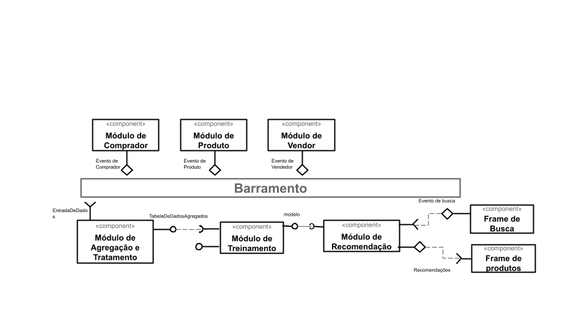

# Aluno
* João Igor dos Santos Pereira

## Tarefa 1 - Dados para Treinamento e Recomendação

### Treinamento

* Comprador
  * Id
  * Nome
  * Historico de Compras
  * Gênero
  * Histórico de Produtos Abertos
  * Histórico de Pesquisa
  * Cep  
	
* Vendedor
  * id
  * Produtos vendidos
  * Avaliação dos usuários
  * Tempo médio de despacho de item
  * Cep

* Produto
 * id
 * Nome
 * Categoria
 * Vendedor
 * Avaliação
 * Taxa de Devolução
 * Taxa de entrega dentro do prazo
 * Quantidade de vendas
 * Estado
 

### Recomendação
* Pagina de Produtos recomendados
  * Produtos
  * Quantidade Total de páginas
  * Pagina Atual
  * Produtos por página
  * Vendedores
  * Cliente

## Tarefa 2 - Breve descrição de Composições Dinâmica e Estática

### Composição Dinâmica
> Como composição dinamica penso em todas as entradas do treinamento, com a utilização de um módulo que trate e agrege essas entradas é possível faze-las tão dinamicas quanto possível
### Composição Estática
> Como composição estática, penso nos módulos de agregação/tratamento, de treinamento e o de recomendação.

## Tarefa 3 - Composição para Treinamento e Recomendação

