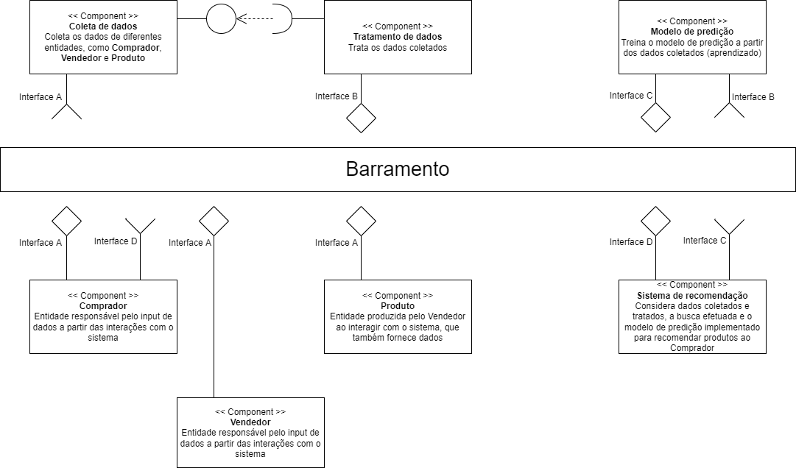

# Modelo para Apresentação do Lab01 - Estilos Arquiteturais

# Aluno
* `Julio Cesar Souto Filho`

## Tarefa 1 - Dados para Treinamento e Recomendação

> Coloque a lista de campos como itens e subitens, conforme exemplo a seguir:
>
### Treinamento
* Entidade Comprador
  * gênero
  * idade
  * cidade
  * estado
  * formasDePagamento
  * quantidadeDevolucoes
* Entidade Vendedor
  * cidade
  * estado
  * avaliação
  * quantidadeVendas
  * quantidadeDevolucoes
  * prazoEntrega
  * freteGratis
  * formasDePagamento
* Entidade Produto
  * nome
  * descrição
  * preço
  * categoria
  * marca
  * modelo
  * estado
  * tempoGarantia
  * quantidadeVendas
  * quantidadeDevolucoes

### Recomendação
* Entidade Comprador
  * gênero
  * idade
  * cidade
  * estado
  * formasDePagamento
  * quantidadeDevolucoes
* Entidade Vendedor
  * cidade
  * estado
  * avaliação
  * quantidadeVendas
  * quantidadeDevolucoes
  * prazoEntrega
  * freteGratis
  * formasDePagamento
* Entidade Produto
  * nome
  * descrição
  * preço
  * categoria
  * marca
  * modelo
  * estado
  * tempoGarantia
  * quantidadeVendas
  * quantidadeDevolucoes

## Tarefa 2 - Breve descrição de Composições Dinâmica e Estática

> Escreva duas breves descrições, conforme exemplos a seguir:
>
### Composição Dinâmica
> Compradores: os dados são fornecidos de forma assíncrona
> Vendedores: os dados são fornecidos de forma assíncrona
> Produtos: os dados são fornecidos de forma assíncrona, cada vez que um novo anúncio é adicionado por um vendedor
> Modelo de predição: assíncrono e modular, baseados em dados fornecidos de forma também assíncrona por compradores, vendedores e produtos
> Sistema de recomendação: assíncrono e modular. é ativado quando um comprador realiza uma busca, por exemplo, e é baseado no modelo de predição

### Composição Estática
> Coleta de dados: os dados vão sendo coletados e tratados conforme são adicionados.
> Tratamento de dados: os dados coletados são tratados de forma síncrona.

## Tarefa 3 - Composição para Treinamento e Recomendação

> Coloque a imagem PNG do diagrama, conforme exemplo a seguir:
>

