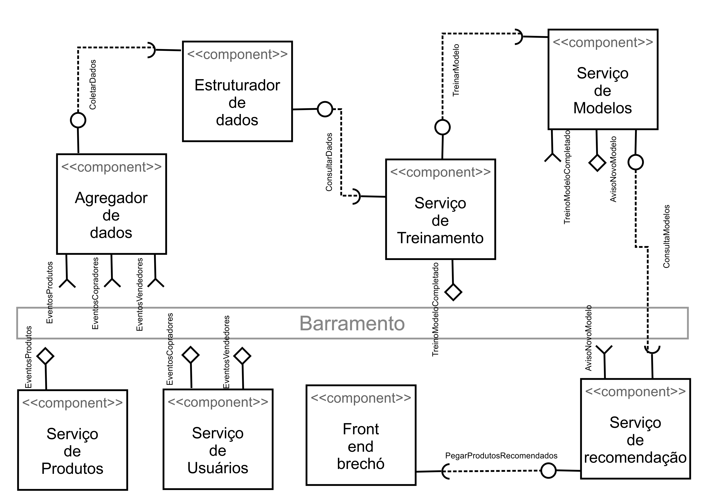

# Aluno
* `Luís Filipe Menten Gomes de Soutello`

## Tarefa 1 - Dados para Treinamento e Recomendação

### Treinamento
* Produtos Vendidos
  * id
  * categoria
  * estado de conservação
  * preço
  * avaliação
  * foi devolvido
  * vendedor
  * comprador
  * data de compra
  * marca (se houver)
  * tempo de uso
  * tempo desde o anúncio até a venda

* Vendedor
  * id
  * produtos vendidos
  * taxa de entregas dentro do prazo
  * avaliação media dos produtos

* Comprador
  * id
  * produtos comprados
  * taxa de devoluções
  * ticket médio

* Modelo de recomendação
  * id
  * data de criação
  * dados usados nesse treinamento

### Recomendação
* Produtos à venda
  * id
  * categoria
  * estado de conservação
  * preço
  * vendedor
  * marca (se houver)
  * tempo de uso

* Lista de recomendação
  * id
  * data de criação
  * usuário comprador em potencial
  * produtos à venda
  * modelo usado

## Tarefa 2 - Breve descrição de Composições Dinâmica e Estática

### Composição Dinâmica
> A parte dinâmica da composição é composta por 3 partes:
> 
> O envio de eventos de negócio dos serviços de usuário e
> produto para um componente agregador de dados brutos. Esse eventos incluem novos produtos à venda, produtos vendidos,
> criação de usuário, publicação de produto por um usuário, compra de produto por um usuário.
> 
> O serviço de treinamento avisando para o serviço de modelos que um treinamento foi concluído.
> Como um treinamento pode demorar, fica inviável para o serviço de modelos esperar a resposta do serviço de treinamento
> de forma estática.
> 
> O serviço de modelos evia um evento de novo modelo para o serviço de recomendação toda vez que a esquipe de dados
> da plataforma do brechó online desejar alterar o comportamento de produção, seja usar o mesmo modelo com
> diferentes dados de treinamento ou usar um novo modelo completamente diferente do anterior.
### Composição Estática
> A parte estática da composição é composta por 4 partes:
> 
> A busca de dados pelo estruturador no agregador e pelo serviço de treinamento no estruturador. Nessa composição,
> supõe-se que o serviço de treinamento utiliza apenas dados estruturados. Como os dados são armazenados de forma
> dinâmica pelo agregador, as duas buscas são implentadas de forma estática para não sobrecarregar o estruturador e o
> serviço de treinamento, dando a eles a liberdade de determinar seu próprio ritmo de consumo de dados.
> 
> Uma interface para solicitção de treinamento de modelo. O serviço de modelos faz uma requisição para o serviço
> de treinamento pedidondo para o modelo ser treinado. O serviço de treinamento recebe essa requisição mas não dá
> o resultado de forma síncrona, ele penas responde que a requisição foi recebida, treina o modelo em background e
> avisa o fim do treinamento de forma dinâmica como foi descrito anteriormente.
> 
> Uma interface para o front-end do sistema pedir uma lista de recomendação de produtos para um usuário.
> 
> E, por último, uma interface para que o sistema de recomendação consulte detalhes dos modelos e consiga por exemplo
> colocar dois modelos em produção ao mesmo tempo para um teste A/B.

## Tarefa 3 - Composição para Treinamento e Recomendação

> Coloque a imagem PNG do diagrama, conforme exemplo a seguir:
>

